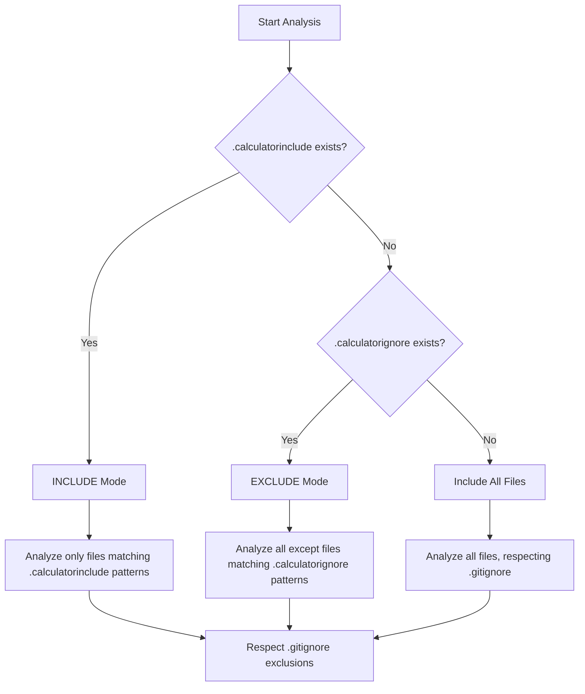
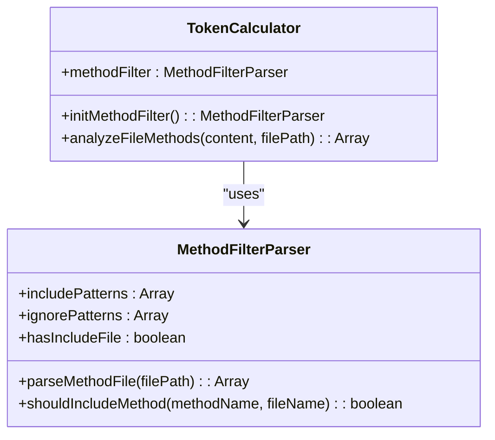
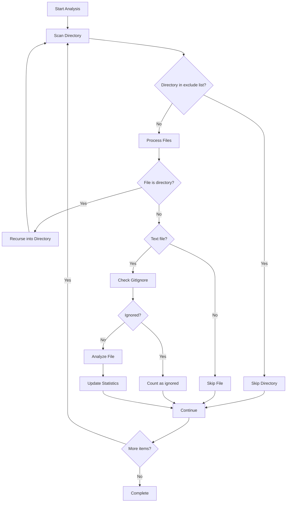
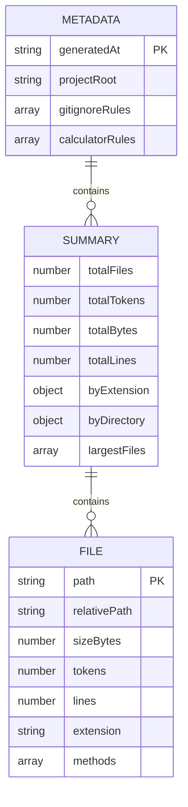

# Advanced Configuration

<cite>
**Referenced Files in This Document**   
- [README.md](file://README.md)
- [context-manager.js](file://context-manager.js)
</cite>

## Table of Contents
1. [Introduction](#introduction)
2. [Configuration File Priority](#configuration-file-priority)
3. [Custom Filter Patterns](#custom-filter-patterns)
4. [Advanced Pattern Syntax](#advanced-pattern-syntax)
5. [Performance Optimization](#performance-optimization)
6. [Integration and Scripting](#integration-and-scripting)
7. [Best Practices](#best-practices)
8. [Troubleshooting](#troubleshooting)

## Introduction

The context-manager tool provides sophisticated configuration options for controlling which files and methods are included in token analysis and LLM context generation. This document details advanced configuration techniques for specialized use cases, focusing on custom filter patterns, priority hierarchies, and performance optimization strategies.

**Section sources**
- [README.md](file://README.md#L1-L891)

## Configuration File Priority

The context-manager tool implements a well-defined priority hierarchy for configuration files that determines how files are included or excluded from analysis. This hierarchy ensures predictable behavior when multiple configuration files are present.

The priority order from highest to lowest is:

1. **`.calculatorinclude`** - INCLUDE mode (highest priority)
2. **`.calculatorignore`** - EXCLUDE mode 
3. **`.gitignore`** - Standard git exclusions (always respected)

When `.calculatorinclude` exists, the tool operates in INCLUDE mode, meaning only files matching the patterns in this file will be analyzed, and `.calculatorignore` is completely ignored. When only `.calculatorignore` exists, the tool operates in EXCLUDE mode, analyzing all files except those matching the ignore patterns. The `.gitignore` file is always respected regardless of the mode.



**Diagram sources**
- [context-manager.js](file://context-manager.js#L124-L229)
- [context-manager.js](file://context-manager.js#L231-L800)

**Section sources**
- [README.md](file://README.md#L1-L891)
- [context-manager.js](file://context-manager.js#L124-L229)

## Custom Filter Patterns

The context-manager tool supports creating custom filter patterns for specialized use cases through both file-level and method-level filtering mechanisms.

### File-Level Filtering

File-level filtering is controlled through `.calculatorinclude` and `.calculatorignore` files. These files support glob patterns for flexible file selection:

- `**/*.md` - Exclude all markdown files recursively
- `infrastructure/**` - Exclude entire infrastructure directory
- `utility-mcp/src/**/*.js` - Include all JavaScript files in src directory
- `!utility-mcp/src/testing/**` - Negation pattern to exclude testing files

For focusing on specific feature areas, create a `.calculatorinclude` file with patterns targeting the desired directories:

```bash
# Include only authentication-related files
src/auth/**/*.js
src/middleware/auth.js
config/auth-config.json
```

For excluding legacy code, use negation patterns in `.calculatorinclude`:

```bash
# Include all core files but exclude legacy modules
src/**/*.js
!src/legacy/**
!src/deprecated/**
```

### Method-Level Filtering

Method-level filtering allows even more granular control through `.methodinclude` and `.methodignore` files. These support pattern matching for method names:

- `*Handler` - Include all methods ending with 'Handler'
- `*Validator` - Include all methods ending with 'Validator' 
- `TokenCalculator.*` - Include all methods in TokenCalculator class
- `server.printStatus` - Include specific file method
- `*test*` - Exclude all methods containing 'test'



**Diagram sources**
- [context-manager.js](file://context-manager.js#L75-L115)
- [context-manager.js](file://context-manager.js#L231-L800)

**Section sources**
- [README.md](file://README.md#L1-L891)
- [context-manager.js](file://context-manager.js#L75-L115)

## Advanced Pattern Syntax

The context-manager tool implements sophisticated pattern syntax for both file and method filtering, supporting complex negation rules, directory-specific patterns, and combined include/exclude logic.

### Pattern Conversion and Matching

The `convertToRegex` method in GitIgnoreParser converts glob patterns to regular expressions with specific rules:

- `**` is converted to `.*` (matches any number of directories)
- `*` is converted to `[^/]*` (matches any characters except path separators)
- `?` is converted to `[^/]` (matches any single character except path separator)
- Patterns starting with `/` are anchored to the root directory
- Directory patterns ending with `/` match the directory and all contents

```mermaid
flowchart TD
A[Raw Pattern] --> B{Process Pattern}
B --> C[Remove leading /!]
B --> D[Remove trailing /]
C --> E[Escape special chars]
D --> E
E --> F[Replace ** with .*]
F --> G[Replace * with [^/]*]
G --> H[Replace ? with [^/]]
H --> I{Starts with /?}
I --> |Yes| J[Anchor to ^]
I --> |No| K[Add (^|/) prefix]
J --> L{Ends with /?}
K --> L
L --> |Yes| M[Add (/.*?)?$ suffix]
L --> |No| N[Add $ suffix]
M --> O[Complete Regex]
N --> O
```

**Diagram sources**
- [context-manager.js](file://context-manager.js#L159-L179)

**Section sources**
- [context-manager.js](file://context-manager.js#L159-L179)

### Complex Negation Rules

The tool handles negation patterns (`!pattern`) with specific precedence rules. In INCLUDE mode, negation patterns exclude files from otherwise broad inclusion patterns. In EXCLUDE mode, negation patterns can re-include files that would otherwise be excluded.

When multiple negation patterns exist, they are processed in order, with later patterns taking precedence over earlier ones. This allows for sophisticated filtering logic:

```bash
# Include all JS files but exclude test and legacy code
src/**/*.js
!src/**/*.test.js
!src/legacy/**
!src/deprecated/**
```

## Performance Optimization

The context-manager tool includes several performance optimization techniques to improve analysis speed and reduce resource usage.

### Directory-Specific Analysis

The tool searches for configuration files in two locations: the tool directory (`__dirname`) and the project root (`this.projectRoot`). This allows for both global and project-specific configurations without requiring configuration files in every project.

```javascript
findConfigFile(filename) {
    const locations = [
        path.join(__dirname, filename),
        path.join(this.projectRoot, filename)
    ];
    return locations.find(loc => fs.existsSync(loc));
}
```

### Result Caching and Efficient Processing

While the current implementation doesn't include explicit caching, it optimizes performance through:

- **Efficient file scanning**: Skips common directories like `node_modules`, `.git`, and `dist`
- **Batch processing**: Processes all files in a directory before moving to subdirectories
- **Minimal I/O operations**: Reads configuration files only once at initialization

For large projects, consider limiting analysis to specific directories by configuring `.calculatorinclude` to target only the relevant areas:

```bash
# Focus analysis on core modules only
src/core/**/*.js
src/services/**/*.js
src/api/**/*.js
```



**Diagram sources**
- [context-manager.js](file://context-manager.js#L272-L278)
- [context-manager.js](file://context-manager.js#L380-L400)

**Section sources**
- [context-manager.js](file://context-manager.js#L272-L278)

## Integration and Scripting

The context-manager tool provides multiple integration points for use in automated workflows and custom scripts.

### Programmatic Usage

The tool can be used programmatically by importing the TokenAnalyzer class:

```javascript
const { TokenAnalyzer } = require('@hakkisagdic/context-manager');

const analyzer = new TokenAnalyzer('./src', {
    methodLevel: true,
    saveReport: true,
    verbose: true
});

analyzer.run();
```

### Export Formats

The tool supports multiple export formats for different use cases:

- **Detailed JSON report**: Comprehensive analysis data for CI/CD pipelines
- **LLM context file**: Optimized file list for AI assistants
- **Clipboard export**: Direct copying of context for immediate use

The `saveDetailedReport` method generates a structured JSON report containing metadata, summary statistics, and detailed file information:



**Diagram sources**
- [context-manager.js](file://context-manager.js#L784-L799)

**Section sources**
- [context-manager.js](file://context-manager.js#L784-L799)

## Best Practices

### Configuration File Management

- **Use descriptive pattern comments**: Add comments to explain the purpose of complex patterns
- **Organize by category**: Group related patterns together (e.g., all test exclusions)
- **Test configurations**: Use verbose mode to verify that the expected files are included/excluded
- **Version control**: Include configuration files in version control to ensure consistency across environments

### Performance Considerations

- **Limit scope**: Use `.calculatorinclude` to focus on relevant code areas
- **Avoid overly broad patterns**: Specific patterns are more efficient than broad ones with many negations
- **Regular maintenance**: Periodically review and update patterns as the codebase evolves
- **Cache results**: For CI/CD pipelines, consider caching analysis results when source files haven't changed

## Troubleshooting

### Common Issues

- **Patterns not working**: Ensure no inline comments in pattern files and use proper glob syntax
- **Wrong files included**: Check if `.calculatorinclude` exists (takes priority over `.calculatorignore`)
- **Performance issues**: Limit analysis to specific directories using targeted include patterns
- **Missing expected files**: Verify files are not excluded by `.gitignore` (always respected)

### Debugging Tips

- Use `--verbose` flag to see which files are being included/excluded
- Check the console output for configuration mode (INCLUDE/EXCLUDE)
- Verify pattern syntax using glob pattern testers
- Test patterns with small, isolated codebases before applying to large projects