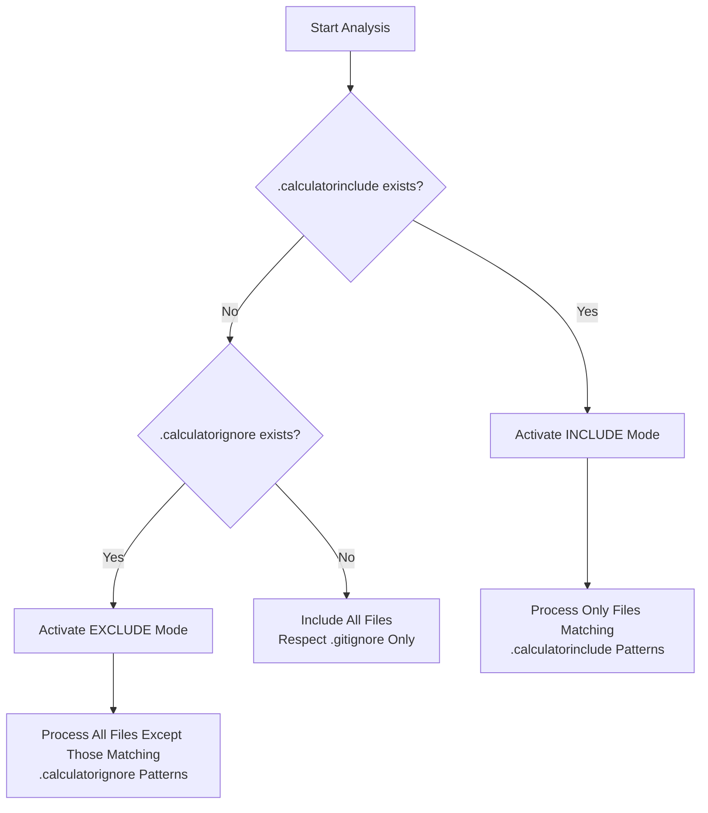
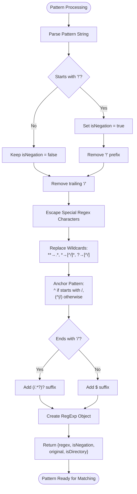
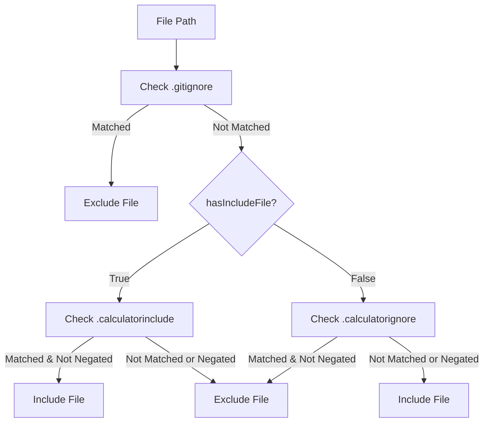
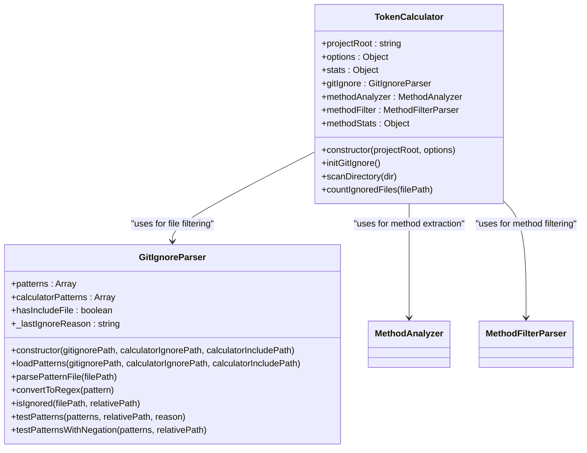

# File Filtering

<cite>
**Referenced Files in This Document**   
- [context-manager.js](file://context-manager.js)
- [README.md](file://README.md)
</cite>

## Table of Contents
1. [Introduction](#introduction)
2. [Dual-Mode Filtering System](#dual-mode-filtering-system)
3. [Pattern Syntax and Examples](#pattern-syntax-and-examples)
4. [Precedence Rules and Configuration Priority](#precedence-rules-and-configuration-priority)
5. [Implementation Details](#implementation-details)
6. [Common Issues and Troubleshooting](#common-issues-and-troubleshooting)
7. [Best Practices](#best-practices)

## Introduction

The context-manager tool implements a sophisticated file filtering mechanism designed to optimize code analysis for LLM (Large Language Model) context generation. This system enables precise control over which files are included or excluded from analysis through a dual-mode approach using `.calculatorignore` and `.calculatorinclude` configuration files. The filtering system respects existing `.gitignore` rules while providing additional layers of control for focused analysis of specific code components. This documentation details the implementation, usage, and best practices for configuring the file filtering system to achieve optimal results in code analysis and token calculation.

**Section sources**
- [README.md](file://README.md#L544-L610)
- [context-manager.js](file://context-manager.js#L124-L270)

## Dual-Mode Filtering System

The context-manager tool employs a dual-mode filtering system that operates through two complementary configuration files: `.calculatorignore` for EXCLUDE mode and `.calculatorinclude` for INCLUDE mode. These modes provide flexible approaches to file selection based on project requirements.

### EXCLUDE Mode (.calculatorignore)

EXCLUDE mode functions as a traditional ignore system, where all files are included by default except those matching patterns specified in the `.calculatorignore` file. This mode is ideal for projects where most files should be analyzed, but specific types or directories need to be excluded. The configuration follows gitignore-style syntax, allowing users to specify patterns that match files to be filtered out from analysis.

### INCLUDE Mode (.calculatorinclude)

INCLUDE mode operates on the principle of inclusion by specification, where only files matching patterns in the `.calculatorinclude` file are processed. This mode provides precise control over analysis scope, ensuring that only explicitly defined files are included. It is particularly useful for focusing analysis on core application components while excluding peripheral files like documentation, tests, or configuration files.

The system automatically determines which mode to use based on the presence of configuration files. When both `.calculatorinclude` and `.calculatorignore` exist, INCLUDE mode takes precedence, ensuring that the more restrictive inclusion rules are applied.



**Diagram sources**
- [context-manager.js](file://context-manager.js#L134-L149)
- [README.md](file://README.md#L544-L610)

**Section sources**
- [context-manager.js](file://context-manager.js#L134-L149)
- [README.md](file://README.md#L544-L610)

## Pattern Syntax and Examples

The filtering system supports a comprehensive pattern syntax that enables flexible and precise file selection. Patterns are processed using glob-style matching with additional features for negation and directory traversal.

### Supported Pattern Syntax

The system recognizes several key pattern elements:

- `**` - Matches any number of directories and subdirectories (recursive)
- `*` - Matches any sequence of characters within a single directory level
- `?` - Matches any single character
- `!` - Negation operator that excludes files matching the subsequent pattern
- `/` - Directory separator that anchors patterns to specific directory levels

Patterns can be specified as relative paths from the project root or as file extensions to match across the entire codebase.

### Practical Configuration Examples

The README provides concrete examples of effective configuration patterns:

For INCLUDE mode focusing on core JavaScript files while excluding test and workflow components:
```bash
# Include only core JavaScript files
utility-mcp/src/**/*.js
!utility-mcp/src/testing/**
!utility-mcp/src/workflows/**
```

For EXCLUDE mode to filter out documentation, configuration, and test files:
```bash
# Exclude documentation and config
**/*.md
**/*.json
node_modules/**
test/
**/*.test.js
**/*.spec.js
```

These examples demonstrate how to create focused analysis scopes by combining inclusion patterns with negation rules to refine the selection.



**Diagram sources**
- [context-manager.js](file://context-manager.js#L159-L179)
- [README.md](file://README.md#L544-L610)

**Section sources**
- [context-manager.js](file://context-manager.js#L159-L179)
- [README.md](file://README.md#L544-L610)

## Precedence Rules and Configuration Priority

The file filtering system implements a clear hierarchy of precedence to resolve potential conflicts between different configuration sources. This ensures predictable behavior when multiple filtering rules are defined.

### Priority Order

The system follows a strict priority order when evaluating file inclusion:

1. **`.gitignore`** - Standard git exclusions are always respected and form the baseline for file filtering
2. **`.calculatorinclude`** - INCLUDE mode rules take highest priority for file selection
3. **`.calculatorignore`** - EXCLUDE mode rules are applied when no INCLUDE mode configuration exists

This hierarchy ensures that git-ignored files are never included in analysis, while providing the flexibility to either include only specific files (via `.calculatorinclude`) or exclude specific files (via `.calculatorignore`).

### Implementation of Precedence Logic

The precedence rules are implemented in the `loadPatterns` method of the `GitIgnoreParser` class. When both `.calculatorinclude` and `.calculatorignore` files exist, the system prioritizes the INCLUDE mode configuration. The `hasIncludeFile` flag is set to true when a `.calculatorinclude` file is detected, which subsequently influences the filtering behavior in the `isIgnored` method.

The implementation ensures that INCLUDE mode rules completely override EXCLUDE mode rules, preventing any ambiguity in file selection. This design choice emphasizes precision over breadth, allowing users to create tightly focused analysis scopes when needed.



**Diagram sources**
- [context-manager.js](file://context-manager.js#L181-L206)
- [context-manager.js](file://context-manager.js#L134-L149)

**Section sources**
- [context-manager.js](file://context-manager.js#L134-L149)
- [context-manager.js](file://context-manager.js#L181-L206)

## Implementation Details

The file filtering mechanism is implemented through the `GitIgnoreParser` class, which handles pattern loading, parsing, and file exclusion logic. The system integrates with the main `TokenCalculator` class to provide seamless filtering during code analysis.

### Pattern Loading and Initialization

The filtering system initializes through the `initGitIgnore` method in the `TokenCalculator` class, which locates and loads the appropriate configuration files. The system searches for `.calculatorignore` and `.calculatorinclude` files in both the tool directory and project root, allowing for flexible configuration placement.

When configuration files are found, their patterns are parsed into regular expressions for efficient matching. The `parsePatternFile` method processes each line of the configuration file, ignoring comments and empty lines, then converts each pattern into a regex object using the `convertToRegex` method.

### File Exclusion Logic

The core filtering logic resides in the `isIgnored` method, which determines whether a given file should be excluded from analysis. For INCLUDE mode, the method first checks if the file matches any pattern in the `.calculatorinclude` file. If no matching pattern is found (or if a negation pattern matches), the file is excluded. For EXCLUDE mode, files are excluded if they match any pattern in the `.calculatorignore` file.

The system also handles directory traversal efficiently by checking if directories should be traversed based on INCLUDE mode patterns, preventing unnecessary file system exploration.



**Diagram sources**
- [context-manager.js](file://context-manager.js#L124-L270)

**Section sources**
- [context-manager.js](file://context-manager.js#L124-L270)

## Common Issues and Troubleshooting

Users may encounter several common issues when configuring the file filtering system. Understanding these issues and their solutions helps ensure effective configuration.

### Incorrect Pattern Syntax

One frequent issue is incorrect pattern syntax, particularly with wildcards and negation. Users should ensure that patterns use the correct glob syntax and that negation patterns start with an exclamation mark (`!`). Inline comments within pattern files can also cause issues, as only line comments (starting at the beginning of a line) are properly ignored.

### Unexpected File Inclusions

Unexpected file inclusions often occur due to precedence rule misunderstandings. When both `.calculatorinclude` and `.calculatorignore` files exist, only the INCLUDE mode rules are applied. Users expecting EXCLUDE mode behavior may be surprised to find files included or excluded contrary to their `.calculatorignore` rules. Checking the console output for the active mode can help diagnose this issue.

### Performance Impacts

Broad patterns, particularly recursive wildcards (`**`), can impact performance by requiring extensive file system traversal. Users should be specific with their patterns and avoid overly broad rules that force the system to examine large portions of the codebase unnecessarily.

## Best Practices

To create efficient and maintainable filter configurations, follow these best practices:

### Use Specific Patterns

Prefer specific patterns over broad wildcards when possible. Instead of using `**/*.js` to include all JavaScript files, specify the exact directories that contain relevant code, such as `src/**/*.js` or `lib/**/*.js`. This reduces processing time and focuses analysis on relevant components.

### Leverage Negation Effectively

Use negation patterns to refine broad inclusion rules. For example, include all JavaScript files in a source directory but exclude test files:
```bash
src/**/*.js
!src/**/*.test.js
!src/**/*.spec.js
```

### Document Configuration Intent

Add comments to configuration files explaining the purpose of each pattern. This helps team members understand the filtering strategy and maintain consistency across the project.

### Test Configurations

Verify configurations by running the tool in verbose mode to see which files are included or excluded. This immediate feedback helps identify issues with pattern matching and ensures the intended files are processed.

### Balance Inclusion and Exclusion

Choose between INCLUDE and EXCLUDE modes based on project needs. Use INCLUDE mode for focused analysis of core components and EXCLUDE mode for comprehensive analysis with selective exclusions.