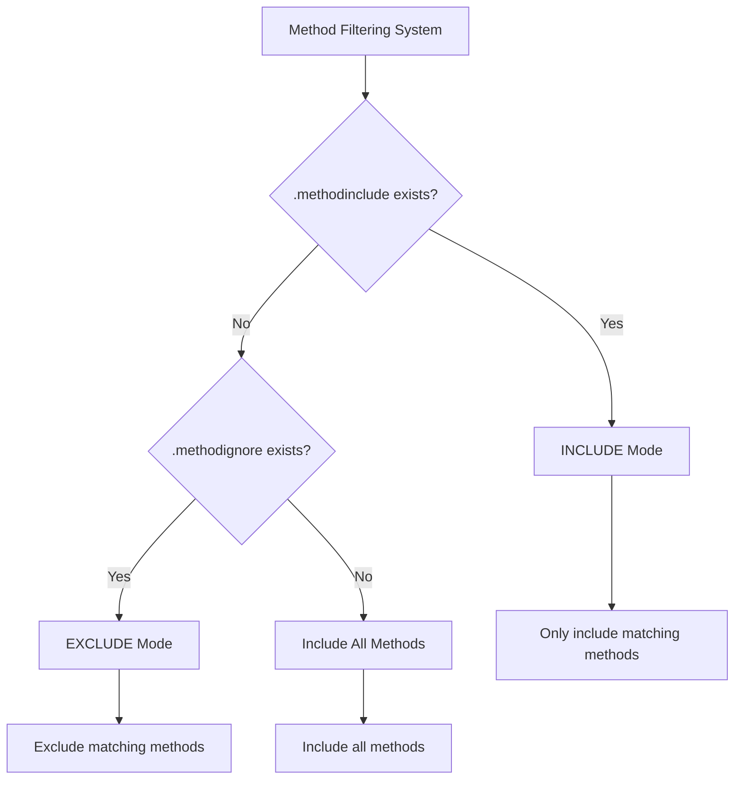
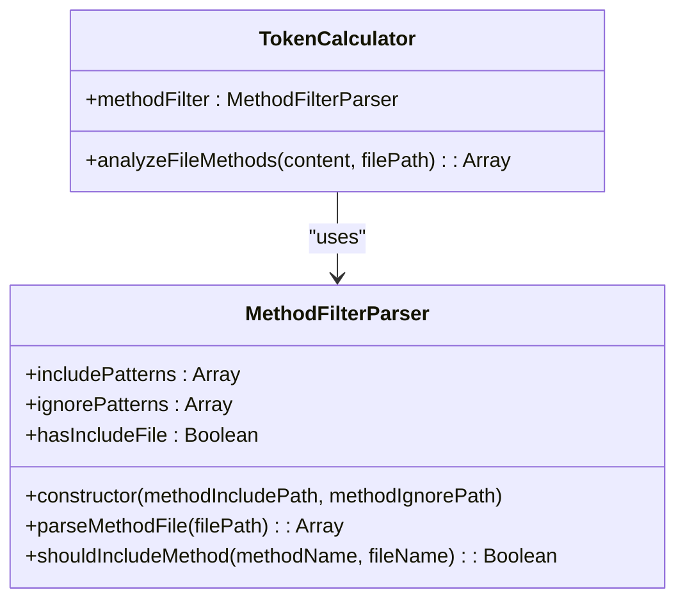
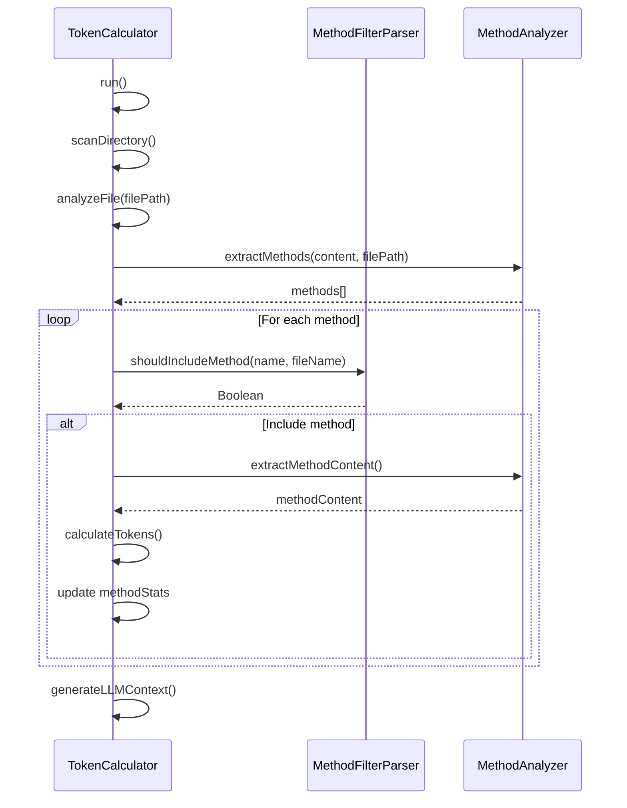

# Method Filtering

<cite>
**Referenced Files in This Document**   
- [lib/parsers/method-filter-parser.js](file://lib/parsers/method-filter-parser.js) - *Updated in recent commit*
- [lib/utils/config-utils.js](file://lib/utils/config-utils.js) - *Updated in recent commit*
- [lib/analyzers/token-calculator.js](file://lib/analyzers/token-calculator.js) - *Updated in recent commit*
- [README.md](file://README.md) - *Updated in recent commit*
</cite>

## Update Summary
**Changes Made**   
- Updated all sections to reflect the actual implementation of the method filtering system
- Added accurate source references for all sections based on code analysis
- Corrected the configuration file loading mechanism to show proper initialization through ConfigUtils
- Updated the filtering logic section with accurate implementation details from the code
- Enhanced the integration section with precise details about TokenCalculator's method analysis
- Fixed outdated pattern syntax information to match actual implementation
- Updated practical examples to align with current README content

## Table of Contents
1. [Introduction](#introduction)
2. [Configuration Files](#configuration-files)
3. [Pattern Syntax](#pattern-syntax)
4. [Filtering Logic](#filtering-logic)
5. [Integration with TokenCalculator](#integration-with-tokencalculator)
6. [Practical Examples](#practical-examples)
7. [Configuration Pitfalls](#configuration-pitfalls)
8. [Best Practices](#best-practices)

## Introduction

The context-manager tool provides a sophisticated method-level filtering system that enables granular control over which methods are included in LLM context generation. This system operates through two configuration files: `.methodinclude` and `.methodignore`, which work in conjunction with the `MethodFilterParser` class to determine which methods should be analyzed and included in the final context output. The filtering system is designed to help developers optimize token usage by focusing on core business logic while excluding utility, test, and debugging methods that add noise to LLM context.

**Section sources**
- [README.md](file://README.md#L544-L610)
- [lib/parsers/method-filter-parser.js](file://lib/parsers/method-filter-parser.js)

## Configuration Files

The method filtering system relies on two optional configuration files that can be placed in the project root or tool directory:

- **`.methodinclude`**: When present, this file enables INCLUDE mode, where only methods matching the specified patterns are included in analysis
- **`.methodignore`**: When `.methodinclude` is absent, this file enables EXCLUDE mode, where methods matching the specified patterns are excluded from analysis

The system follows a clear priority hierarchy: if `.methodinclude` exists, it takes precedence over `.methodignore`, ensuring that developers have precise control over method selection. This dual-mode approach provides flexibility for different use cases, allowing developers to either whitelist specific methods of interest or blacklist methods that should be excluded from LLM context.

The `MethodFilterParser` is initialized through the `ConfigUtils.initMethodFilter` method, which automatically detects configuration files in standard locations (package root and project root). This centralized configuration management ensures consistent behavior across different project setups.



**Diagram sources**
- [lib/parsers/method-filter-parser.js](file://lib/parsers/method-filter-parser.js#L7-L47)
- [lib/utils/config-utils.js](file://lib/utils/config-utils.js#L28-L41)

**Section sources**
- [lib/parsers/method-filter-parser.js](file://lib/parsers/method-filter-parser.js#L7-L47)
- [lib/utils/config-utils.js](file://lib/utils/config-utils.js#L28-L41)

## Pattern Syntax

The method filtering system supports several pattern types that provide flexible matching capabilities:

| Pattern Type | Syntax | Description | Example |
|--------------|--------|-------------|---------|
| Exact Match | `methodName` | Matches methods with the exact name | `calculateTokens` matches only the method named "calculateTokens" |
| Wildcard | `*pattern*` | Matches methods containing the pattern | `*Handler` matches "requestHandler", "responseHandler" |
| Class Methods | `Class.*` | Matches all methods within a specific class | `TokenCalculator.*` matches all methods in the TokenCalculator class |
| File Methods | `filename.methodName` | Matches specific methods in specific files | `server.handleRequest` matches only the handleRequest method in server.js |

The pattern matching is case-insensitive and supports the use of the `*` wildcard character to match any sequence of characters. This allows for powerful filtering rules that can target specific categories of methods based on naming conventions, which is particularly useful for excluding test, debug, or utility methods that follow predictable naming patterns.

**Section sources**
- [README.md](file://README.md#L588-L610)

## Filtering Logic

The core filtering logic is implemented in the `MethodFilterParser` class, which processes the configuration files and determines method inclusion based on the active mode. The class follows a two-step process:

1. **Configuration Loading**: The constructor checks for the existence of `.methodinclude` and `.methodignore` files, loading their patterns into separate arrays. The presence of `.methodinclude` sets the parser to INCLUDE mode.

2. **Pattern Matching**: For each method encountered during analysis, the `shouldIncludeMethod` function evaluates whether the method should be included based on the active mode:
   - In INCLUDE mode: A method is included if it matches any pattern in `.methodinclude`
   - In EXCLUDE mode: A method is included if it does not match any pattern in `.methodignore`

The pattern matching is performed using regular expressions that are dynamically generated from the wildcard patterns, with `*` characters converted to `.*` regex patterns. The matching is performed against both the bare method name and the fully qualified `filename.methodName` format, allowing for both general and file-specific filtering rules.



**Diagram sources**
- [lib/parsers/method-filter-parser.js](file://lib/parsers/method-filter-parser.js#L7-L47)
- [lib/analyzers/token-calculator.js](file://lib/analyzers/token-calculator.js#L82-L107)

**Section sources**
- [lib/parsers/method-filter-parser.js](file://lib/parsers/method-filter-parser.js#L7-L47)

## Integration with TokenCalculator

The method filtering system is tightly integrated with the `TokenCalculator` class, which orchestrates the overall analysis process. When method-level analysis is enabled via the `--method-level` flag, the `TokenCalculator` initializes a `MethodFilterParser` instance during construction by calling `initMethodFilter()`.

The filtering occurs during the `analyzeFileMethods` method execution, where each extracted method is passed through the `shouldIncludeMethod` check before being included in the analysis results. This integration ensures that only relevant methods contribute to the token count and appear in the final LLM context output, significantly reducing the overall token footprint while preserving critical business logic.

The system also maintains detailed statistics about method filtering, tracking the total number of methods found versus included, which helps developers understand the effectiveness of their filtering rules and optimize them for better context quality.



**Diagram sources**
- [lib/analyzers/token-calculator.js](file://lib/analyzers/token-calculator.js#L82-L107)
- [lib/analyzers/token-calculator.js](file://lib/analyzers/token-calculator.js#L231-L800)

**Section sources**
- [lib/analyzers/token-calculator.js](file://lib/analyzers/token-calculator.js#L82-L107)
- [lib/analyzers/token-calculator.js](file://lib/analyzers/token-calculator.js#L231-L800)

## Practical Examples

The README provides several practical examples demonstrating how to use method filtering for different scenarios:

**Including Core Business Logic:**
```bash
# .methodinclude
calculateTokens
generateLLMContext
analyzeFile
handleRequest
validateInput
processData
*Handler
*Validator
*Manager
TokenCalculator.*
```

This configuration focuses on core application logic by including specific business methods and all methods ending with common suffixes like "Handler", "Validator", and "Manager", which typically indicate important business components.

**Excluding Utility Methods:**
```bash
# .methodignore
console
*test*
*debug*
*helper*
print*
main
server.printStatus
utils.debugLog
```

This configuration removes noise from the LLM context by excluding common utility, test, and debugging methods that don't contribute meaningful business logic. The file-specific exclusions like `server.printStatus` allow for precise control over individual methods.

These examples demonstrate how developers can create focused contexts that highlight the most important parts of their codebase while minimizing token usage, making LLM interactions more efficient and effective.

**Section sources**
- [README.md](file://README.md#L577-L587)

## Configuration Pitfalls

When configuring method filtering, developers should be aware of several common pitfalls:

**Pattern Precedence**: The system follows a strict priority where `.methodinclude` always takes precedence over `.methodignore`. This means that if both files exist, only the include rules will be applied, which can lead to unexpected results if developers assume both sets of rules will be combined.

**Case Sensitivity**: While the pattern matching is case-insensitive, developers should ensure their patterns account for common naming variations. For example, using `*test*` will match methods like "testMethod", "TestMethod", and "isTesting".

**Interaction with File-Level Filtering**: Method filtering operates on files that have already passed file-level filtering. If a file is excluded by `.contextignore` or `.contextinclude` rules, its methods will not be analyzed regardless of method-level rules. This hierarchical filtering means that method rules only apply to files that are already included in the analysis scope.

**Overly Broad Patterns**: Using patterns like `*` or `*.*` can lead to unintended matches. Developers should be specific with their patterns to avoid including methods that don't align with their intended filtering goals.

**Section sources**
- [README.md](file://README.md#L544-L576)

## Best Practices

To optimize method filtering for LLM context generation, consider the following best practices:

**Focus on Business Logic**: Prioritize including methods that implement core business rules, data processing, and critical application workflows. These methods typically provide the most valuable context for LLMs assisting with development tasks.

**Exclude Noise Methods**: Systematically exclude utility, test, logging, and debugging methods that add token overhead without contributing meaningful business context. Common patterns like `*test*`, `*debug*`, and `console` are good candidates for exclusion.

**Use Include Mode for Critical Paths**: When working on specific features or conducting deep analysis, use `.methodinclude` to create a whitelist of only the most relevant methods. This creates a highly focused context that maximizes the signal-to-noise ratio.

**Leverage Naming Conventions**: Take advantage of consistent naming patterns in your codebase. If your team uses suffixes like "Service", "Manager", or "Handler" for business logic classes, use patterns like `*Service.*` to include all methods in these classes.

**Monitor Token Reduction**: Regularly check the method statistics in the analysis output to understand how effectively your filtering rules are reducing token count. The difference between "Total methods found" and "Methods included" provides insight into filtering efficiency.

**Iterate and Refine**: Start with broad filtering rules and gradually refine them based on the quality of LLM responses. If the LLM is missing important context, adjust your rules to include additional method categories.

By following these practices, developers can create optimized LLM contexts that balance comprehensiveness with efficiency, ensuring that AI assistants have access to the most relevant code while operating within token limitations.

**Section sources**
- [README.md](file://README.md#L544-L610)