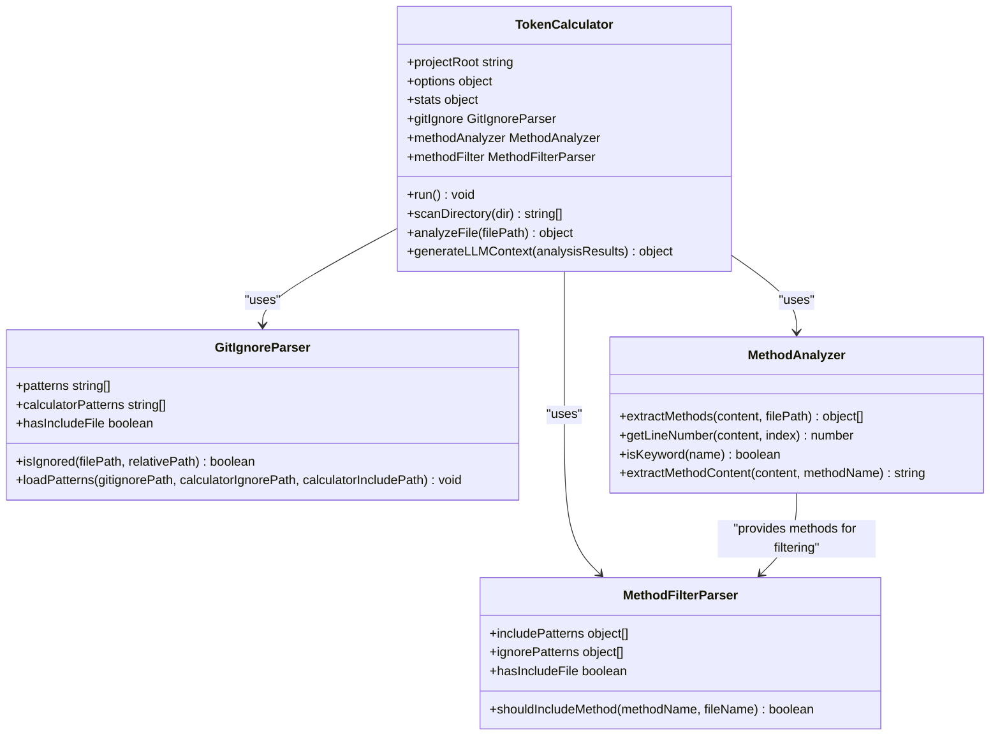
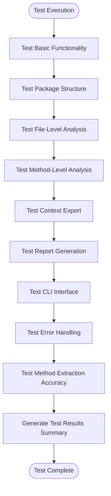

# Contributing Guide

<cite>
**Referenced Files in This Document**   
- [README.md](file://README.md)
- [context-manager.js](file://context-manager.js)
- [index.js](file://index.js)
- [bin/cli.js](file://bin/cli.js)
- [test/test.js](file://test/test.js)
- [test/test-suite.js](file://test/test-suite.js)
- [package.json](file://package.json)
</cite>

## Table of Contents
1. [Introduction](#introduction)
2. [Development Workflow](#development-workflow)
3. [Code Structure and Architecture](#code-structure-and-architecture)
4. [Testing Strategy](#testing-strategy)
5. [Contribution Guidelines](#contribution-guidelines)
6. [Coding Standards](#coding-standards)
7. [Extending the Tool](#extending-the-tool)
8. [Conclusion](#conclusion)

## Introduction
The context-manager project is an LLM context optimization tool with method-level filtering and token analysis capabilities. This guide provides comprehensive information for contributors to understand the development workflow, code structure, testing strategy, and contribution guidelines. The tool is designed to help developers analyze codebases and generate optimized context for AI assistants by calculating exact token counts using tiktoken (GPT-4 compatible).

**Section sources**
- [README.md](file://README.md#L0-L891)

## Development Workflow

### Setting Up the Local Environment
To set up the local development environment for context-manager, follow these steps:

1. Clone the repository from GitHub
2. Install dependencies using `npm install`
3. Install tiktoken for exact token counting: `npm install tiktoken`

The tool can be used both as a global CLI tool and programmatically. The package is configured to work with Node.js version 14.0.0 or higher.

### Running Tests
The project includes a comprehensive testing suite that can be executed using npm scripts:

```bash
npm test           # Run basic tests
npm run test:all   # Run comprehensive test suite
```

The test suite validates core functionality including file-level analysis, method-level analysis, context export to file and clipboard, detailed report generation, and various CLI options.

### Submitting Pull Requests
When submitting pull requests, ensure that:
- All tests pass successfully
- Code follows the established coding standards
- New features are accompanied by appropriate tests
- Documentation is updated to reflect changes
- The prepublishOnly script runs successfully, which executes tests before publishing

**Section sources**
- [package.json](file://package.json#L0-L55)
- [test/test.js](file://test/test.js#L0-L61)
- [test/test-suite.js](file://test/test-suite.js#L0-L280)

## Code Structure and Architecture

### Modular, Class-Based Design
The context-manager project follows a modular, class-based design pattern with clear separation of concerns. The architecture consists of several core components that work together to provide the tool's functionality.



**Diagram sources **
- [context-manager.js](file://context-manager.js#L231-L800)
- [context-manager.js](file://context-manager.js#L124-L229)
- [context-manager.js](file://context-manager.js#L14-L73)
- [context-manager.js](file://context-manager.js#L75-L115)

### Core Components
The main components of the system are:

- **TokenCalculator**: The primary orchestrator that manages the analysis process, coordinates file scanning, token counting, and report generation
- **GitIgnoreParser**: Handles pattern matching for .gitignore, .contextignore, and .contextinclude files to determine which files to include or exclude from analysis
- **MethodAnalyzer**: Extracts methods from JavaScript/TypeScript files using regex patterns and calculates token counts for individual methods
- **MethodFilterParser**: Filters methods based on rules defined in .methodinclude and .methodignore configuration files

These components are exposed through the index.js file, which serves as the module entry point and exports all core classes for programmatic usage.

**Section sources**
- [context-manager.js](file://context-manager.js#L14-L864)
- [index.js](file://index.js#L0-L7)

## Testing Strategy

### Test Directory Structure
The test directory contains two primary test files:

- **test.js**: Basic functionality tests that verify the core components can be instantiated and basic operations work correctly
- **test-suite.js**: Comprehensive test suite that validates various aspects of the tool's functionality through integration tests

### Test Coverage
The testing strategy focuses on several key areas:

1. **Basic functionality**: Verifies that the core classes can be instantiated and basic operations work
2. **Package structure**: Ensures the module exports are correctly configured
3. **File-level analysis**: Tests the ability to analyze files and generate reports
4. **Method-level analysis**: Validates method extraction and analysis capabilities
5. **Context export**: Tests both file and clipboard export functionality
6. **Report generation**: Verifies detailed JSON reports are generated correctly
7. **CLI interface**: Validates command-line interface options and behavior
8. **Error handling**: Tests how the tool handles invalid inputs and edge cases
9. **Method extraction accuracy**: Ensures methods are correctly identified and extracted from code

The test suite uses child process execution to test the CLI interface and verifies output contains expected strings to confirm functionality.



**Diagram sources **
- [test/test.js](file://test/test.js#L0-L61)
- [test/test-suite.js](file://test/test-suite.js#L0-L280)

**Section sources**
- [test/test.js](file://test/test.js#L0-L61)
- [test/test-suite.js](file://test/test-suite.js#L0-L280)

## Contribution Guidelines

### Bug Reports
When reporting bugs, please include:
- A clear description of the issue
- Steps to reproduce the problem
- Expected behavior vs. actual behavior
- Environment information (Node.js version, operating system)
- Any relevant error messages or stack traces
- Screenshots if applicable

### Feature Requests
For feature requests, provide:
- A detailed description of the desired functionality
- Use cases and scenarios where the feature would be beneficial
- Any relevant examples or references
- Potential implementation approaches if known
- Expected benefits to users

### Code Contributions
When contributing code:
1. Fork the repository and create a feature branch
2. Ensure your code follows the established coding standards
3. Write appropriate tests for new functionality
4. Update documentation as needed
5. Submit a pull request with a clear description of changes
6. Reference any related issues in the pull request description

The project maintains a high test coverage to ensure reliability and prevent regressions. All contributions should maintain or improve this coverage.

**Section sources**
- [README.md](file://README.md#L0-L891)
- [package.json](file://package.json#L0-L55)

## Coding Standards

### Code Style
The project follows these coding standards:
- ES6 class syntax for core components
- Regex-based parsing (no AST dependencies)
- Graceful fallbacks (tiktoken optional, clipboard fallback to file)
- Minimal dependencies (only tiktoken as optional)
- No TypeScript, pure JavaScript for maximum portability
- Consistent naming conventions
- Comprehensive commenting for complex logic
- Error handling with appropriate fallbacks

### Commit Message Conventions
The project follows conventional commit message formatting:
- Use imperative mood ("fix", "add", "remove", "update")
- Limit the first line to 72 characters
- Include a blank line between subject and body
- Use the body to explain what and why vs. how
- Reference issues and pull requests when applicable

### Code Review Process
The code review process includes:
1. Automated testing via the prepublishOnly script
2. Manual review of code quality and adherence to standards
3. Verification of test coverage
4. Assessment of documentation updates
5. Testing of functionality in different environments
6. Security review for potential vulnerabilities

**Section sources**
- [context-manager.js](file://context-manager.js#L14-L864)
- [package.json](file://package.json#L0-L55)

## Extending the Tool

### Adding New Features
To extend the tool with new features:
1. Identify the appropriate component for the new functionality
2. Follow the existing design patterns and coding standards
3. Implement the feature with comprehensive tests
4. Update documentation to reflect the new capabilities
5. Ensure backward compatibility when possible

### Adding New Output Formats
To add new output formats:
1. Extend the generateLLMContext method in the TokenCalculator class
2. Create a new method for the specific format
3. Add appropriate CLI options to enable the new format
4. Implement tests for the new output format
5. Update documentation with examples of the new format

The tool currently supports multiple output formats including detailed JSON reports, LLM context files, and clipboard integration. New formats should follow the same principles of providing structured, machine-readable output that is useful for AI assistants.

**Section sources**
- [context-manager.js](file://context-manager.js#L231-L800)
- [bin/cli.js](file://bin/cli.js#L0-L66)

## Conclusion
The context-manager project provides a robust foundation for analyzing codebases and generating optimized context for AI assistants. By following the guidelines outlined in this document, contributors can effectively participate in the development of the tool, ensuring high-quality contributions that align with the project's architecture and goals. The modular, class-based design makes it relatively straightforward to extend the tool with new features or output formats while maintaining code quality and test coverage.