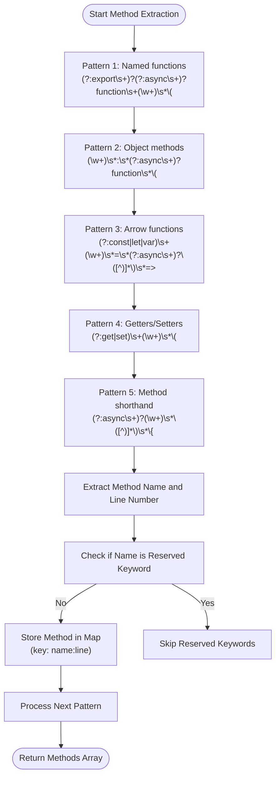
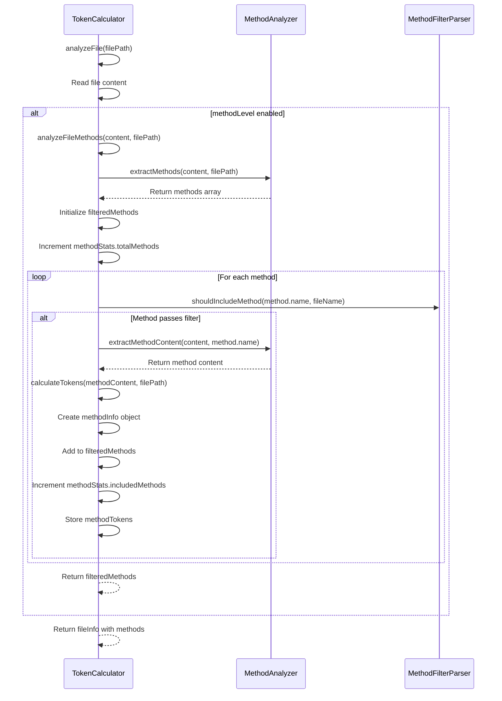
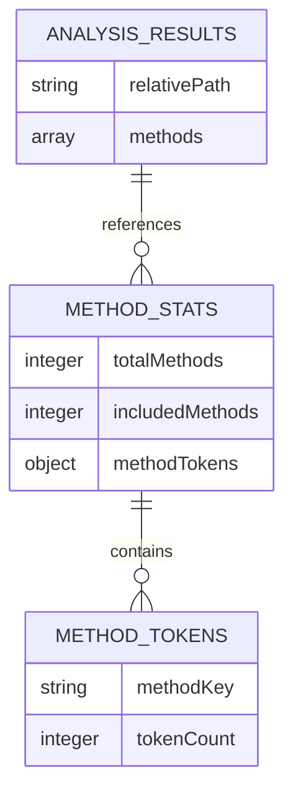
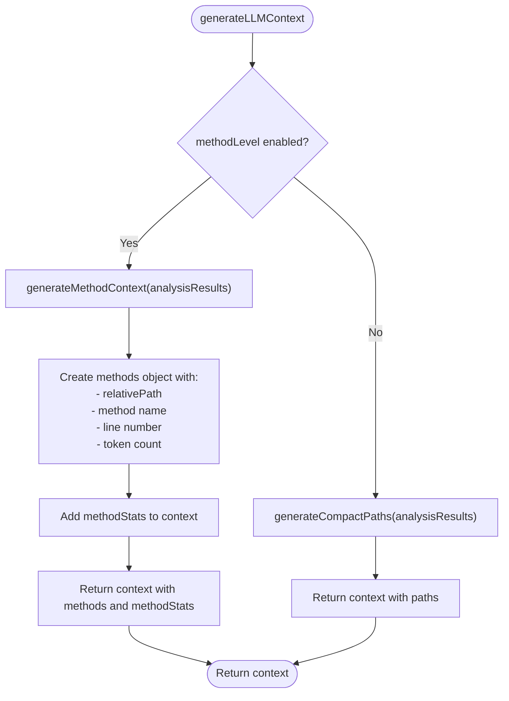

# Method-Level Analysis

<cite>
**Referenced Files in This Document**   
- [context-manager.js](file://context-manager.js)
- [README.md](file://README.md)
- [CLAUDE.md](file://CLAUDE.md)
- [index.js](file://index.js)
- [bin/cli.js](file://bin/cli.js)
</cite>

## Table of Contents
1. [Introduction](#introduction)
2. [Method Extraction Process](#method-extraction-process)
3. [Method Analysis Integration](#method-analysis-integration)
4. [Method Filtering Mechanism](#method-filtering-mechanism)
5. [Method Statistics and Reporting](#method-statistics-and-reporting)
6. [LLM Context Generation](#llm-context-generation)
7. [Common Issues and Best Practices](#common-issues-and-best-practices)

## Introduction

The context-manager tool provides method-level analysis capabilities that enable granular examination of JavaScript and TypeScript codebases. This feature allows developers to extract, analyze, and filter individual methods from source files, creating optimized representations for LLM context generation. The method-level analysis is controlled through the `methodLevel` option and integrates with the TokenCalculator to process method content and generate detailed statistics.

**Section sources**
- [context-manager.js](file://context-manager.js#L234-L238)
- [bin/cli.js](file://bin/cli.js#L17-L18)

## Method Extraction Process

The MethodAnalyzer class is responsible for extracting JavaScript/TypeScript methods from source code using regex patterns. It identifies methods through multiple patterns that match different function declaration styles:



The extraction process begins with the `extractMethods` function, which applies five regex patterns to identify different method declaration styles in JavaScript/TypeScript code. For each match, the analyzer captures the method name and calculates its line number by counting newlines from the beginning of the file to the match index. The analyzer filters out reserved JavaScript keywords to prevent false positives.

To retrieve the complete content of a method, the `extractMethodContent` function uses dynamically constructed regex patterns that match the full method body, including nested braces. This allows the tool to extract not just the method signature but the entire implementation for token calculation.

**Diagram sources**
- [context-manager.js](file://context-manager.js#L15-L45)
- [context-manager.js](file://context-manager.js#L61-L72)

**Section sources**
- [context-manager.js](file://context-manager.js#L14-L73)

## Method Analysis Integration

The analyzeFileMethods function integrates method extraction with the TokenCalculator to process method content and calculate tokens. This integration occurs when the `methodLevel` option is enabled in the TokenCalculator constructor.



The integration process begins in the `analyzeFile` method of TokenCalculator, which checks if method-level analysis is enabled. If so, it calls `analyzeFileMethods` to process the file content. This function first extracts all methods using the MethodAnalyzer, then iterates through each method to determine if it should be included based on filtering rules.

For each included method, the system extracts the method content and calculates tokens using the same mechanism as for entire files. The token calculation uses the tiktoken library for exact GPT-4 compatible counts when available, falling back to estimation based on character counts per file type when tiktoken is not installed.

**Diagram sources**
- [context-manager.js](file://context-manager.js#L323-L383)
- [context-manager.js](file://context-manager.js#L234-L238)

**Section sources**
- [context-manager.js](file://context-manager.js#L323-L383)

## Method Filtering Mechanism

The method filtering mechanism uses the MethodFilterParser class to determine which methods should be included in the analysis based on rules defined in `.methodinclude` and `.methodignore` files. This filtering system provides fine-grained control over method selection.

```mermaid
classDiagram
class MethodFilterParser {
+includePatterns : Array
+ignorePatterns : Array
+hasIncludeFile : boolean
-methodIncludePath : string
-methodIgnorePath : string
+constructor(methodIncludePath, methodIgnorePath)
+parseMethodFile(filePath) Array
+shouldIncludeMethod(methodName, fileName) boolean
}
class MethodAnalyzer {
+extractMethods(content, filePath) Array
+extractMethodContent(content, methodName) string
+getLineNumber(content, index) number
+isKeyword(name) boolean
}
class TokenCalculator {
+methodFilter : MethodFilterParser
+methodStats : Object
+analyzeFileMethods(content, filePath) Array
+generateMethodContext(analysisResults) Object
}
TokenCalculator --> MethodFilterParser : "uses for filtering"
TokenCalculator --> MethodAnalyzer : "uses for extraction"
MethodFilterParser --> "methodinclude file" : "reads"
MethodFilterParser --> "methodignore file" : "reads"
```

The MethodFilterParser reads patterns from `.methodinclude` and `.methodignore` files, converting each line into a case-insensitive regex pattern. The filtering behavior depends on whether an include file exists:

- When `.methodinclude` exists: Only methods matching the include patterns are included (INCLUDE mode)
- When only `.methodignore` exists: Methods matching ignore patterns are excluded (EXCLUDE mode)

The `shouldIncludeMethod` function evaluates both the method name and the fully qualified name (filename.method) against the patterns. This allows for both general pattern matching (e.g., `*Handler` to match all methods ending with "Handler") and specific method targeting (e.g., `server.handleRequest`).

The system searches for these configuration files in two locations: the script directory and the project root, with the project root taking precedence. This allows for both global and project-specific configuration.

**Diagram sources**
- [context-manager.js](file://context-manager.js#L75-L115)
- [context-manager.js](file://context-manager.js#L14-L73)
- [context-manager.js](file://context-manager.js#L231-L800)

**Section sources**
- [context-manager.js](file://context-manager.js#L75-L115)
- [README.md](file://README.md#L481-L500)

## Method Statistics and Reporting

The method analysis feature aggregates statistics in the methodStats object, which tracks key metrics about the methods processed during analysis. These statistics are included in the final report to provide insights into the codebase structure.



The methodStats object contains three properties:
- `totalMethods`: The total number of methods found across all analyzed files
- `includedMethods`: The number of methods that passed the filtering criteria
- `methodTokens`: An object mapping method identifiers (filename.methodname) to their token counts

These statistics are updated during the method analysis process. The `totalMethods` counter is incremented with the number of methods extracted from each file, while `includedMethods` is incremented for each method that passes the filter. The `methodTokens` object stores the token count for each included method, enabling detailed analysis of method complexity.

The statistics are incorporated into the final LLM context when method-level analysis is enabled, providing a summary of the method analysis results alongside the detailed method information.

**Diagram sources**
- [context-manager.js](file://context-manager.js#L239-L239)
- [context-manager.js](file://context-manager.js#L491-L519)

**Section sources**
- [context-manager.js](file://context-manager.js#L239-L239)
- [context-manager.js](file://context-manager.js#L491-L519)

## LLM Context Generation

The method-level analysis directly supports LLM context generation by creating compact representations of methods that can be efficiently consumed by language models. When method-level analysis is enabled, the generateLLMContext function produces a different output structure.



When method-level analysis is enabled, the generated context includes a `methods` property that organizes methods by their relative file path. Each method is represented with its name, line number, and token count, providing essential information without including the full method content. This creates a compact representation that preserves the structure and relative complexity of the codebase.

The context also includes `methodStats` with aggregate information about the total methods found, included methods, and total method tokens. This summary helps users understand the scope of the analysis and the proportion of methods that were included in the final context.

The compact representation significantly reduces the token count of the context while preserving important structural information, making it ideal for LLM consumption where context window size is limited.

**Diagram sources**
- [context-manager.js](file://context-manager.js#L491-L519)
- [context-manager.js](file://context-manager.js#L614-L643)

**Section sources**
- [context-manager.js](file://context-manager.js#L491-L519)

## Common Issues and Best Practices

### Common Issues

**Inaccurate Method Extraction**: The regex-based extraction may fail with complex syntax such as:
- Methods with template literals in parameters
- Methods with complex destructuring patterns
- Minified or obfuscated code
- Unconventional formatting that breaks pattern matching

**Pattern Matching Issues**: Users may encounter problems with filter patterns due to:
- Case sensitivity (patterns are case-insensitive but exact matching may be needed)
- Special characters in method names
- Conflicting include/exclude rules
- Incorrect file paths in fully qualified method names

### Best Practices for Method Filter Patterns

**Effective Include Patterns**:
- Use specific method names for critical business logic: `calculateTokens`, `handleRequest`
- Use wildcards for method categories: `*Handler`, `*Validator`, `*Manager`
- Use class-based patterns: `TokenCalculator.*` to include all methods in a class
- Combine multiple patterns in `.methodinclude` to capture related functionality

**Effective Ignore Patterns**:
- Exclude test methods: `*test*`, `*spec*`
- Exclude debug methods: `*debug*`, `console`, `logger`
- Exclude utility methods: `*helper*`, `*util*`
- Exclude lifecycle methods if not needed: `componentDidMount`, `ngOnInit`

**Configuration Management**:
- Place `.methodinclude` and `.methodignore` in the project root for project-specific rules
- Use comments (lines starting with #) to document pattern purposes
- Test patterns with a small codebase before applying to large projects
- Use the verbose mode to verify which methods are being included/excluded

The method-level analysis feature provides powerful capabilities for optimizing LLM context generation, but requires careful configuration to ensure accurate and useful results. By following these best practices, users can create effective filter patterns that capture the most important methods while excluding noise and boilerplate code.

**Section sources**
- [README.md](file://README.md#L481-L500)
- [CLAUDE.md](file://CLAUDE.md#L101-L127)