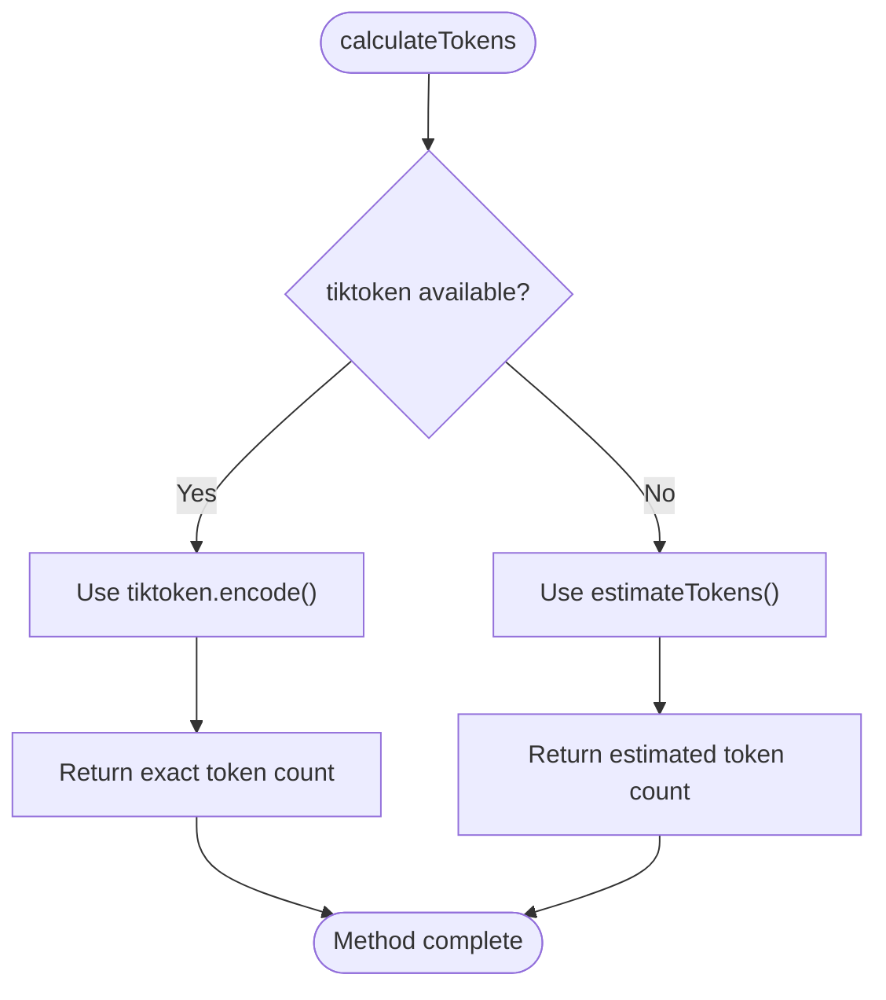
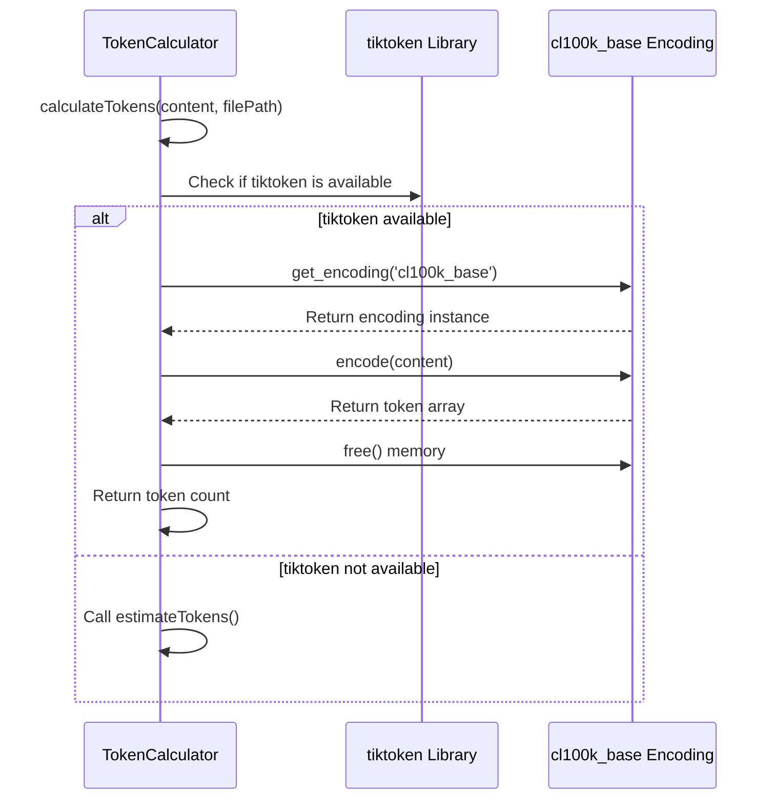
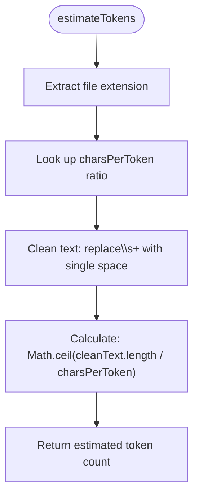
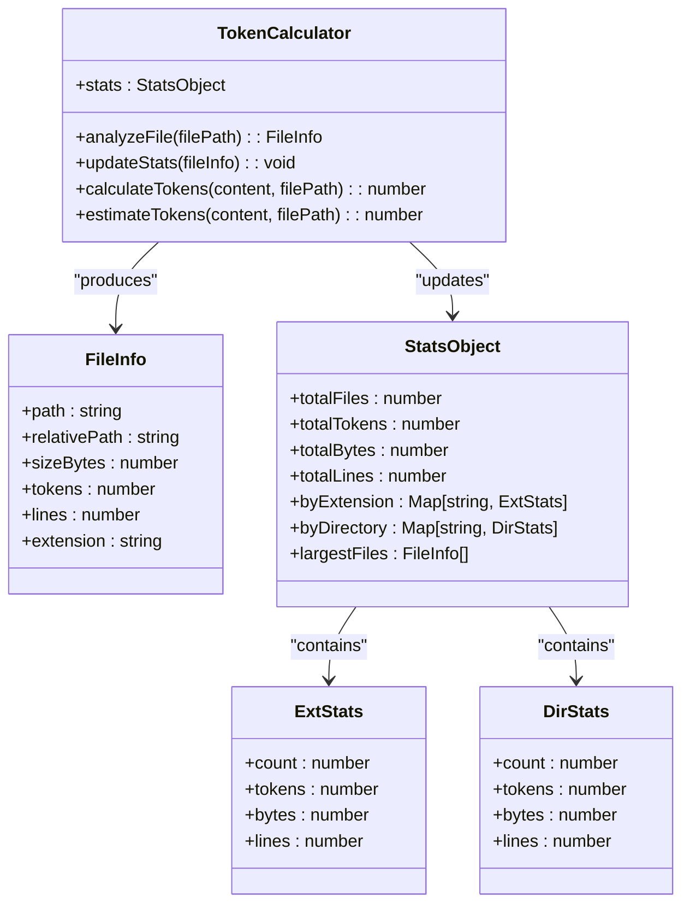

# Token Counting

<cite>
**Referenced Files in This Document**   
- [context-manager.js](file://context-manager.js)
- [package.json](file://package.json)
- [README.md](file://README.md)
</cite>

## Table of Contents
1. [Introduction](#introduction)
2. [Token Calculation Methods](#token-calculation-methods)
3. [Exact Token Counting with tiktoken](#exact-token-counting-with-tiktoken)
4. [Estimated Token Counting Implementation](#estimated-token-counting-implementation)
5. [File Type Specific Examples](#file-type-specific-examples)
6. [Integration with File and Project Statistics](#integration-with-file-and-project-statistics)
7. [LLM Context Generation](#llm-context-generation)
8. [Performance Implications](#performance-implications)
9. [Common Issues and Troubleshooting](#common-issues-and-troubleshooting)
10. [Installation and Configuration](#installation-and-configuration)

## Introduction

The context-manager tool provides sophisticated token counting functionality to support LLM context management and code analysis. The system implements a dual approach to token counting, combining exact GPT-4 compatible calculations with intelligent estimation methods. This documentation details the implementation, usage, and integration of the token counting system within the context-manager tool.

**Section sources**
- [context-manager.js](file://context-manager.js#L7-L8)
- [README.md](file://README.md#L294-L356)

## Token Calculation Methods

The token counting system in context-manager implements two complementary methods for determining token counts: exact counting using the tiktoken library and estimated counting using character-per-token ratios. The system automatically selects the appropriate method based on library availability and performance requirements.

The primary entry point for token calculation is the `calculateTokens` method in the `TokenCalculator` class, which serves as a dispatcher between the exact and estimated counting methods. When tiktoken is available, the system uses exact counting; otherwise, it falls back to estimation.



**Diagram sources**
- [context-manager.js](file://context-manager.js#L280-L292)

**Section sources**
- [context-manager.js](file://context-manager.js#L280-L292)

## Exact Token Counting with tiktoken

The context-manager tool uses the tiktoken library to provide exact GPT-4 compatible token counts when available. The implementation follows a graceful degradation pattern, attempting to load tiktoken at initialization and falling back to estimation if the library is not present.

The exact token counting process uses the cl100k_base encoding, which is the tokenizer used by GPT-4, GPT-3.5-Turbo, and other models. This ensures that token counts are accurate representations of how these models would process the text.



**Diagram sources**
- [context-manager.js](file://context-manager.js#L280-L292)
- [package.json](file://package.json#L35-L38)

**Section sources**
- [context-manager.js](file://context-manager.js#L280-L292)
- [package.json](file://package.json#L35-L38)

## Estimated Token Counting Implementation

When the tiktoken library is unavailable, the context-manager tool falls back to an estimation method that uses extension-specific character-per-token ratios. This approach provides reasonably accurate estimates (~95% accuracy) while maintaining performance and reducing dependencies.

The estimation algorithm follows these steps:
1. Determine the file extension from the filePath parameter
2. Look up the appropriate characters-per-token ratio based on the extension
3. Clean the text by normalizing whitespace
4. Calculate the estimated token count using the character ratio



The implementation includes specific character-per-token ratios for common file types:
- JavaScript/TypeScript: 3.2 characters per token
- JSON: 2.5 characters per token  
- Markdown/Text: 4.0 characters per token
- YAML: 3.5 characters per token
- HTML/XML: 2.8 characters per token

**Diagram sources**
- [context-manager.js](file://context-manager.js#L294-L304)

**Section sources**
- [context-manager.js](file://context-manager.js#L294-L304)

## File Type Specific Examples

The token counting system handles different file types appropriately through the extension-specific character-per-token ratios in the estimation method. When exact counting is available via tiktoken, the system provides accurate counts regardless of file type.

For JavaScript files (.js, .ts, .jsx, .tsx), the system uses a ratio of 3.2 characters per token, reflecting the typical density of code in these languages. Markdown and plain text files use a more generous 4.0 characters per token, accounting for the higher proportion of spaces and formatting in documentation.

Configuration files like JSON, YAML, and XML have their own specific ratios that reflect their structural characteristics. JSON uses 2.5 characters per token due to its compact syntax with braces, brackets, and quotes, while XML and HTML use 2.8 characters per token to account for tag verbosity.

The system determines if a file should be analyzed as a text file through the `isTextFile` method, which checks both file extensions and common text file names like "readme", "license", and "changelog".

**Section sources**
- [context-manager.js](file://context-manager.js#L294-L304)
- [context-manager.js](file://context-manager.js#L306-L321)

## Integration with File and Project Statistics

Token counts are integrated throughout the file and project statistics system, providing comprehensive analysis of codebase size and complexity. The `analyzeFile` method calls `calculateTokens` for each file and incorporates the results into detailed statistics.

The system maintains multiple levels of statistical aggregation:
- Per-file statistics including token count, size in bytes, and line count
- Extension-level statistics aggregating counts across all files of the same type
- Directory-level statistics showing token distribution by top-level directory
- Project-level summary statistics

These statistics are updated in the `updateStats` method, which processes the file information and accumulates totals for the entire project. The statistics include both raw counts and derived metrics like average tokens per file.



**Diagram sources**
- [context-manager.js](file://context-manager.js#L323-L351)
- [context-manager.js](file://context-manager.js#L455-L480)

**Section sources**
- [context-manager.js](file://context-manager.js#L323-L351)
- [context-manager.js](file://context-manager.js#L455-L480)

## LLM Context Generation

Token counts directly influence LLM context generation through the `generateLLMContext` method, which creates optimized file lists for AI consumption. The context generation process uses token statistics to prioritize files and methods that are most relevant for LLM processing.

When method-level analysis is enabled, the system generates detailed method context including token counts for individual methods. This allows for fine-grained control over which code elements are included in the LLM context.

The context generation supports two formats:
- Compact format: Organized file paths without token counts (~2.3k characters)
- Detailed format: Full method-level information with token counts (~8.6k characters)

The choice of format affects how token counts are presented in the output, with the compact format focusing on file organization and the detailed format providing comprehensive token information for each method.

**Section sources**
- [context-manager.js](file://context-manager.js#L482-L503)

## Performance Implications

The token counting system balances accuracy and performance through its dual-method approach. Exact counting with tiktoken provides precise GPT-4 compatible results but incurs additional overhead from library loading and encoding operations. Estimated counting is faster and has no external dependencies but provides approximate results.

The performance implications of each method are:
- **Exact counting**: Higher accuracy (100%), slower performance, requires tiktoken dependency
- **Estimated counting**: Lower accuracy (~95%), faster performance, no external dependencies

The system is designed to prefer exact counting when available, as indicated by the startup message that shows "✅ Exact (using tiktoken)" when the library is loaded successfully. When tiktoken is not available, the system falls back to estimation with a "⚠️ Estimated" indicator.

For large codebases, the performance difference becomes more significant, making estimated counting preferable when absolute precision is not required. The estimation method's O(n) complexity for text cleaning and simple division makes it highly efficient even for large files.

**Section sources**
- [context-manager.js](file://context-manager.js#L659-L659)
- [README.md](file://README.md#L294-L356)

## Common Issues and Troubleshooting

Common issues with token counting in the context-manager tool typically relate to inaccurate estimates for non-standard file types or problems with tiktoken installation. The most frequent issues include:

1. **Inaccurate estimates for non-standard file types**: When a file has an uncommon extension not included in the predefined mapping, the system uses a default ratio of 3.5 characters per token. This may lead to inaccurate estimates for specialized file formats.

2. **tiktoken not installed**: If the tiktoken library is not properly installed, the system falls back to estimation mode. This can be identified by the "⚠️ Estimated" message during execution.

3. **Permission issues**: On some systems, installing native dependencies like tiktoken may require elevated permissions or specific build tools.

4. **Version compatibility**: The package.json specifies tiktoken version ^1.0.0, and version mismatches could cause loading failures.

To troubleshoot token counting issues, users should first verify tiktoken installation and check the startup message to confirm whether exact or estimated counting is being used.

**Section sources**
- [package.json](file://package.json#L35-L38)
- [README.md](file://README.md#L294-L356)

## Installation and Configuration

To ensure exact token counting, the tiktoken library must be properly installed. The context-manager tool lists tiktoken as both a dependency and optionalDependency in package.json, allowing the tool to function without it while encouraging installation for exact counting.

Installation is performed via npm:
```bash
npm install tiktoken
```

The implementation uses a try-catch block to load tiktoken, allowing graceful degradation when the library is not available:

```javascript
let tiktoken = null;
try { tiktoken = require('tiktoken'); } catch {}
```

This pattern ensures that the tool remains functional even if tiktoken installation fails or is not performed, while still providing the option for exact counting when desired. The startup sequence displays the token calculation method being used, helping users verify their installation status.

**Section sources**
- [context-manager.js](file://context-manager.js#L7-L9)
- [package.json](file://package.json#L35-L38)
- [README.md](file://README.md#L294-L356)