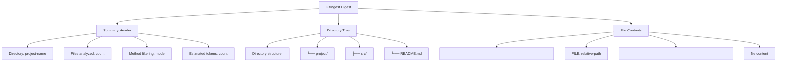
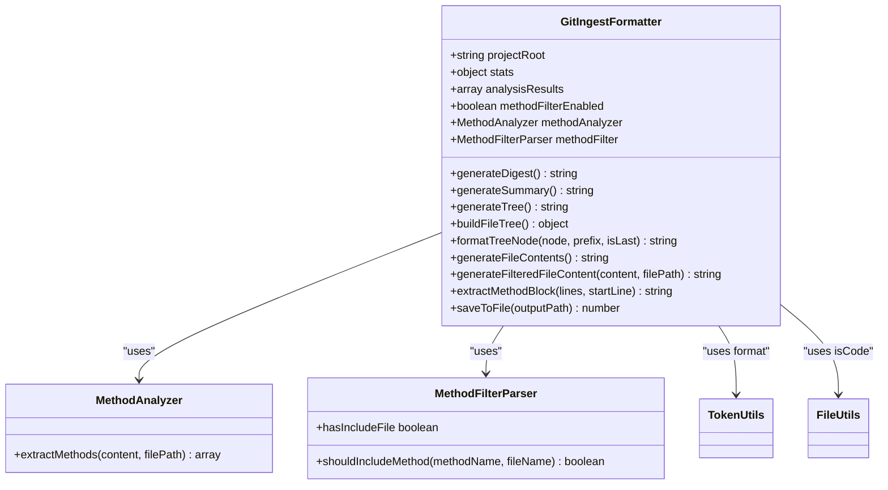
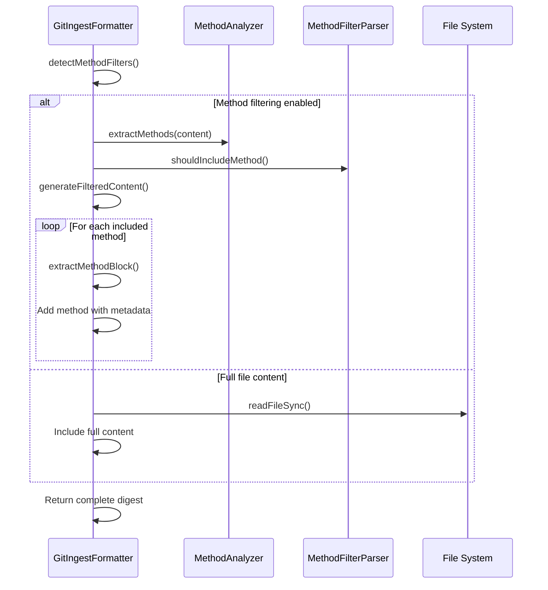
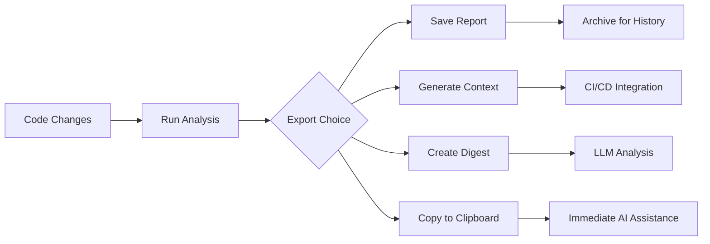

# GitIngest Format Specification

<cite>
**Referenced Files in This Document**   
- [GitIngestFormatter](file://lib/formatters/gitingest-formatter.js)
- [context-manager.js](file://context-manager.js)
- [GITINGEST_VERSION.md](file://docs/GITINGEST_VERSION.md)
- [README.md](file://README.md)
- [test-gitingest.js](file://test/test-gitingest.js)
- [test-gitingest-json.js](file://test/test-gitingest-json.js)
</cite>

## Table of Contents
1. [Introduction](#introduction)
2. [Purpose and Use Cases](#purpose-and-use-cases)
3. [Format Structure](#format-structure)
4. [Versioning System](#versioning-system)
5. [Implementation Details](#implementation-details)
6. [Method-Level Filtering](#method-level-filtering)
7. [Practical Examples](#practical-examples)
8. [LLM Consumption Guidelines](#llm-consumption-guidelines)
9. [Troubleshooting](#troubleshooting)
10. [Integration Workflows](#integration-workflows)

## Introduction

The GitIngest format specification defines a standardized text-based digest format for codebase representation optimized for Large Language Model (LLM) consumption. This format enables developers to consolidate entire project contexts into a single, structured text file that can be efficiently processed by AI assistants like ChatGPT, Claude, or other LLMs.

The implementation in the context-manager tool provides a JavaScript-based solution that generates GitIngest-style digests from codebases, incorporating project metadata, directory structure visualization, and complete file contents in a prompt-friendly format.

**Section sources**
- [README.md](file://README.md#L150-L170)
- [GITINGEST_VERSION.md](file://docs/GITINGEST_VERSION.md#L1-L10)

## Purpose and Use Cases

The GitIngest format serves as a bridge between complex codebases and LLM context windows, addressing the fundamental limitation of finite context sizes in language models. By consolidating essential project information into a single, well-structured text file, it enables comprehensive code understanding and analysis.

Key purposes include:
- **LLM Context Provision**: Deliver complete project context within token limits
- **Codebase Snapshotting**: Create archival representations of project states
- **Collaboration Facilitation**: Share complete project context with team members or AI assistants
- **Analysis Enablement**: Support deep code analysis, refactoring suggestions, and documentation generation

Primary use cases:
- **AI-Assisted Development**: Provide full context for code generation, debugging, and optimization
- **Code Reviews**: Share complete project snapshots for thorough review
- **Onboarding**: Accelerate new developer integration with comprehensive project overviews
- **Documentation Generation**: Serve as input for automated documentation systems
- **Architecture Analysis**: Enable holistic assessment of code structure and patterns

**Section sources**
- [README.md](file://README.md#L150-L200)
- [GITINGEST_VERSION.md](file://docs/GITINGEST_VERSION.md#L1-L10)

## Format Structure

The GitIngest format follows a hierarchical structure designed for maximum readability and efficient parsing by both humans and LLMs. The format consists of three main sections: summary header, directory tree, and file contents.

### Summary Header
The header provides essential project metadata:
- Directory name
- Number of files analyzed
- Method filtering status (when applicable)
- Estimated token count

### Directory Tree
A visual representation of the project structure using ASCII characters, showing the hierarchical organization of files and directories. The tree follows standard directory listing conventions with appropriate connectors.

### File Contents
The core of the digest, containing complete file contents separated by clear delimiters. Files are sorted by token count (largest first) to prioritize important files within LLM context windows.



**Diagram sources**
- [gitingest-formatter.js](file://lib/formatters/gitingest-formatter.js#L35-L50)
- [GITINGEST_VERSION.md](file://docs/GITINGEST_VERSION.md#L15-L30)

## Versioning System

The context-manager implementation follows a version tracking system that aligns with the reference GitIngest format while maintaining its own versioning for compatibility and feature tracking.

### Current Implementation
- **GitIngest Version Reference**: v0.3.1 (2025-07-31)
- **Implementation Date**: October 13, 2025
- **Source Repository**: https://github.com/coderamp-labs/gitingest

### Version History
| Date | GitIngest Version | Notes |
|------|-------------------|-------|
| 2025-10-13 | v0.3.1 | Initial implementation based on GitIngest format |

The versioning system ensures compatibility with the evolving GitIngest specification while allowing for JavaScript-specific optimizations and feature additions. The implementation maintains a snapshot of the reference implementation in the documentation directory for audit purposes.

**Section sources**
- [GITINGEST_VERSION.md](file://docs/GITINGEST_VERSION.md#L1-L79)

## Implementation Details

The GitIngest format is implemented through the `GitIngestFormatter` class, which orchestrates the generation of the digest file from analyzed codebase data. The implementation is designed to be dependency-free and compatible with the core context-manager analysis pipeline.

### Core Components
- **GitIngestFormatter Class**: Main formatter that generates the digest
- **Token Count Formatting**: Converts raw token counts to human-readable formats (k/M)
- **Tree Structure Generator**: Creates visual directory representations
- **File Content Processor**: Handles file reading and content inclusion

### Processing Pipeline
1. **Initialization**: Accepts project root, statistics, and analysis results
2. **Method Filter Detection**: Automatically detects method-level filtering configuration
3. **Digest Generation**: Combines summary, tree, and file contents
4. **Output**: Saves the complete digest to a text file



**Diagram sources**
- [gitingest-formatter.js](file://lib/formatters/gitingest-formatter.js#L13-L264)
- [context-manager.js](file://context-manager.js#L4-L5)

## Method-Level Filtering

The GitIngest implementation supports optional method-level filtering, allowing for more granular control over the content included in the digest. This feature enables developers to focus on specific methods of interest while excluding boilerplate or utility functions.

### Filter Configuration
- **.methodinclude**: INCLUDE mode - only specified methods are included
- **.methodignore**: EXCLUDE mode - specified methods are excluded

### Filter Syntax
| Pattern | Description |
|---------|-------------|
| `methodName` | Exact method name match |
| `*pattern*` | Wildcard matching (contains pattern) |
| `Class.*` | All methods in a specific class |
| `file.method` | Specific method in a specific file |
| `!pattern` | Negation (exclude pattern) |

When method filtering is active, the digest includes only the filtered methods within each file, accompanied by metadata indicating which methods were included. This selective inclusion significantly reduces token usage while maintaining focus on critical functionality.



**Diagram sources**
- [gitingest-formatter.js](file://lib/formatters/gitingest-formatter.js#L200-L225)
- [gitingest-formatter.js](file://lib/formatters/gitingest-formatter.js#L226-L257)

## Practical Examples

The GitIngest format can be generated through multiple workflows, providing flexibility for different use cases and performance requirements.

### Direct Generation
Generate a digest directly from codebase analysis:
```bash
context-manager --gitingest
context-manager -g
```

### JSON-Based Generation
Generate digest from existing JSON reports (faster, no re-scan):
```bash
# From detailed analysis report
context-manager --gitingest-from-report token-analysis-report.json

# From LLM context file
context-manager --gitingest-from-context llm-context.json

# Using default filenames
context-manager --gitingest-from-report
context-manager --gitingest-from-context
```

### Combined Workflows
Combine digest generation with other outputs:
```bash
# Generate both digest and detailed report
context-manager -g -s

# Two-step workflow for repeated digest generation
context-manager --save-report
context-manager --gitingest-from-report
```

The output `digest.txt` file contains the complete formatted digest, ready for LLM consumption or archival purposes.

**Section sources**
- [README.md](file://README.md#L170-L200)
- [test-gitingest-json.js](file://test/test-gitingest-json.js#L1-L225)

## LLM Consumption Guidelines

To maximize the effectiveness of GitIngest format for LLM interactions, follow these best practices:

### Optimal Usage Patterns
- **Context Provisioning**: Paste the entire digest at the beginning of your conversation with the LLM
- **Focused Queries**: After providing context, ask specific questions about architecture, implementation, or improvements
- **Incremental Analysis**: For very large codebases, consider generating multiple digests focused on specific subsystems

### Recommended Query Types
- **Architecture Questions**: "Based on the directory structure, what appears to be the main architectural pattern?"
- **Code Understanding**: "Explain the purpose of the [file] based on its content and position in the project structure"
- **Improvement Suggestions**: "Identify potential improvements to the error handling pattern in this codebase"
- **Documentation Generation**: "Create API documentation based on the exported methods in these files"

### Performance Considerations
- **Token Efficiency**: The digest format is optimized to provide maximum context within token limits
- **File Ordering**: Files are sorted by size (largest first) to prioritize important files in context windows
- **Method Filtering**: Use method-level filtering to further reduce token usage when focusing on specific functionality

**Section sources**
- [README.md](file://README.md#L190-L200)
- [GITINGEST_VERSION.md](file://docs/GITINGEST_VERSION.md#L1-L79)

## Troubleshooting

Common issues and their solutions when working with the GitIngest format:

### File Generation Issues
- **Digest not created**: Ensure the output directory is writable and you have sufficient permissions
- **Missing files**: Verify that files are not excluded by `.gitignore`, `.contextignore`, or other filter rules
- **Empty digest**: Check that the analysis found files matching the inclusion criteria

### Method Filtering Problems
- **Filter not applied**: Ensure `.methodinclude` or `.methodignore` files exist in the project root
- **Unexpected methods included**: Review pattern syntax and consider using negation patterns
- **No methods shown**: Verify method extraction patterns match your code style (function declarations, arrow functions, etc.)

### Content Quality Issues
- **Truncated methods**: The implementation limits method extraction to 100 lines for safety; very long methods are truncated
- **Encoding issues**: Ensure files are saved in UTF-8 encoding to prevent reading errors
- **Large digest size**: Use method-level filtering or adjust include/exclude patterns to reduce output size

### JSON Source Problems
- **Invalid JSON format**: Ensure source JSON files follow the expected structure for reports or context files
- **Missing fields**: Verify that required fields (project, paths, files) are present in source JSON
- **Path resolution issues**: Ensure relative paths in JSON files are correct and files exist at specified locations

**Section sources**
- [test-gitingest-json.js](file://test/test-gitingest-json.js#L150-L180)
- [context-manager.js](file://context-manager.js#L20-L50)

## Integration Workflows

The GitIngest format supports various integration workflows that enhance development productivity and AI-assisted coding.

### Development Workflow Integration


### CI/CD Pipeline Integration
Integrate GitIngest generation into automated workflows:
```bash
# In CI/CD script
npm run analyze -- --save-report
npm run gitingest -- --gitingest-from-report

# Upload digest as artifact
aws s3 cp digest.txt s3://project-artifacts/${GIT_COMMIT}/digest.txt
```

### Interactive Development Loop
1. Make code changes
2. Run `context-manager --gitingest` 
3. Copy digest content
4. Paste into LLM interface with query
5. Implement suggestions
6. Repeat

This tight feedback loop enables rapid iteration and continuous improvement with AI assistance.

**Section sources**
- [README.md](file://README.md#L200-L220)
- [context-manager.js](file://context-manager.js#L100-L150)