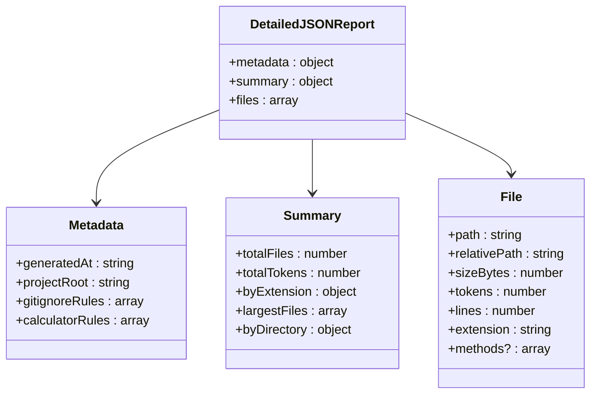
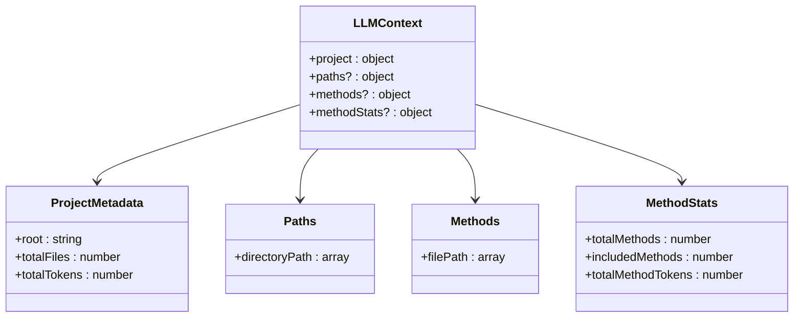
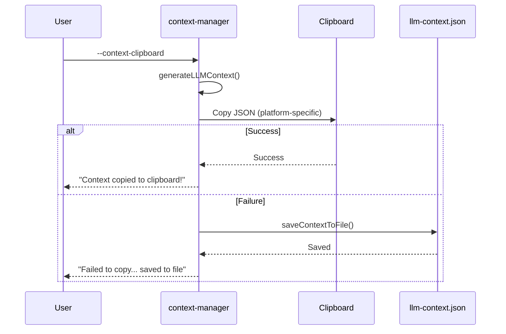

# Output Formats

<cite>
**Referenced Files in This Document**   
- [README.md](file://README.md) - *Updated with GitIngest format details*
- [context-manager.js](file://context-manager.js) - *Added GitIngest generation functions*
- [lib/formatters/gitingest-formatter.js](file://lib/formatters/gitingest-formatter.js) - *New GitIngest formatter implementation*
</cite>

## Table of Contents
1. [Introduction](#introduction)
2. [Detailed JSON Report](#detailed-json-report)
3. [LLM Context Formats](#llm-context-formats)
4. [Clipboard Format](#clipboard-format)
5. [GitIngest Format](#gitingest-format)
6. [Use Cases and Performance](#use-cases-and-performance)
7. [Parsing Strategies](#parsing-strategies)

## Introduction

The context-manager tool provides three primary output formats for different use cases in AI-assisted development workflows. These formats serve distinct purposes in code analysis, LLM context optimization, and project documentation. The tool generates a detailed JSON report for comprehensive analysis, creates LLM context files in both compact and detailed formats, and supports clipboard integration for quick sharing. All export formats maintain consistent structure between file and clipboard outputs, ensuring reliability across different usage scenarios.

**Section sources**
- [README.md](file://README.md#L1-L891)

## Detailed JSON Report

The detailed JSON report provides comprehensive analysis of the codebase with complete metadata, summary statistics, file-level details, and method-level data when applicable. This format is generated when using the `--save-report` flag or selecting the appropriate option in interactive mode.

The report structure consists of three main sections:
- **metadata**: Contains generation timestamp, project root path, and configuration rules from .gitignore and calculator configuration files
- **summary**: Includes comprehensive statistics such as total files analyzed, token counts, file type distribution, and largest files/directories
- **files**: Contains detailed information for each analyzed file including path, token count, size, lines, and extension

When method-level analysis is enabled with the `--method-level` flag, additional method-specific data is included in the file objects, providing granular insights into individual functions and their token usage.



**Diagram sources**
- [context-manager.js](file://context-manager.js#L784-L799)

**Section sources**
- [README.md](file://README.md#L1-L891)
- [context-manager.js](file://context-manager.js#L784-L799)

## LLM Context Formats

The context-manager tool offers two distinct LLM context formats optimized for different use cases: an ultra-compact format used by default and a detailed format activated with the `--detailed-context` flag. Both formats are designed to provide essential project context for AI assistants while minimizing token usage.

### Compact Format (~2.3k characters)

The default compact format provides a minimal yet structured representation of the codebase, containing approximately 2.3k characters in JSON format. This format includes:
- Project metadata (root directory, total files, total tokens)
- Organized file paths grouped by directory with common prefix compression
- Removal of file extensions to save space
- Directory grouping to minimize redundancy

The compact format prioritizes efficiency and is ideal for frequent AI interactions where token economy is crucial. It maintains the complete JSON structure identical to the llm-context.json file.

### Detailed Format (~8.6k characters)

The detailed format, activated with `--detailed-context`, provides a more comprehensive context at approximately 8.6k characters. This format includes:
- Full file paths with extensions
- Importance scores based on token count and project structure
- Directory statistics and file categorization
- Method-level data when method analysis is enabled
- Additional metadata for project understanding

The detailed format is suitable for initial project analysis, comprehensive documentation, and situations requiring deeper context understanding.



**Diagram sources**
- [context-manager.js](file://context-manager.js#L482-L503)
- [context-manager.js](file://context-manager.js#L521-L545)
- [context-manager.js](file://context-manager.js#L505-L519)

**Section sources**
- [README.md](file://README.md#L1-L891)
- [context-manager.js](file://context-manager.js#L482-L545)

## Clipboard Format

The clipboard format in context-manager maintains identical structure to the file-based exports, ensuring consistency across different output methods. When using the `--context-clipboard` flag, the tool copies the same JSON structure that would be saved to llm-context.json directly to the system clipboard.

The implementation handles cross-platform clipboard operations:
- **macOS**: Uses `pbcopy` command
- **Linux**: Attempts `xclip` first, falls back to `xsel` if unavailable
- **Windows**: Uses `clip` command
- **Other platforms**: Provides fallback to file saving if clipboard operation fails

If the clipboard operation fails for any reason, the tool automatically saves the context to llm-context.json as a fallback, ensuring the user always receives the output regardless of platform limitations.



**Diagram sources**
- [context-manager.js](file://context-manager.js#L547-L579)

**Section sources**
- [README.md](file://README.md#L1-L891)
- [context-manager.js](file://context-manager.js#L547-L579)

## GitIngest Format

The context-manager tool now supports a new output format: GitIngest-style digest files. This format consolidates the entire codebase analysis into a single, prompt-friendly text file that is ideal for LLM consumption.

### GitIngest Format Overview

The GitIngest format provides a comprehensive, human-readable summary of the codebase with the following components:
- Project summary and statistics
- Visual directory tree structure
- Complete file contents with clear separators
- Token count estimates
- Method-level filtering when enabled

This format is inspired by [GitIngest](https://github.com/coderamp-labs/gitingest) and is implemented in pure JavaScript with zero additional dependencies.

### Generation Methods

The GitIngest digest can be generated through multiple pathways:

**Direct Generation**
```bash
# Generate digest directly from codebase analysis
context-manager --gitingest
context-manager -g
```

**JSON-Based Generation**
```bash
# Generate digest from existing JSON report (instant, no re-scan)
context-manager --gitingest-from-report token-analysis-report.json

# Generate digest from LLM context file
context-manager --gitingest-from-context llm-context.json
```

**Two-Step Workflow**
```bash
# Step 1: Create analysis report
context-manager --save-report

# Step 2: Generate digest from report (instant)
context-manager --gitingest-from-report token-analysis-report.json
```

### Output Structure

The generated `digest.txt` file follows this structure:

```
Directory: my-project
Files analyzed: 42
Method filtering: INCLUDE mode active

Estimated tokens: 15.2k
Directory structure:
└── my-project/
    ├── src/
    │   ├── index.js
    │   └── utils.js
    └── README.md


================================================
FILE: src/index.js
================================================
[complete file contents here]

================================================
FILE: src/utils.js
================================================
[complete file contents here]
```

### Key Features

- **Single File Output**: Everything consolidated into one file for easy LLM ingestion
- **Tree Visualization**: Clear directory structure with proper indentation
- **Token Estimates**: Formatted as "1.2k" or "1.5M" for readability
- **Sorted Output**: Files sorted by token count (largest first)
- **Filter Compatibility**: Respects all `.gitignore` and context ignore rules
- **Method-Level Filtering**: When enabled, only includes methods that match filter criteria
- **Performance Optimized**: JSON-based generation is instant with no re-scanning

### Method-Level Filtering

When method-level analysis is enabled, the GitIngest formatter applies method filtering based on `.methodinclude` and `.methodignore` configuration files:

- **INCLUDE Mode**: Only methods specified in `.methodinclude` are included
- **EXCLUDE Mode**: Methods specified in `.methodignore` are excluded

For code files, only the filtered methods are included in the digest, with clear annotations:

```
// File contains 15 methods, showing 5 filtered methods

// Method: calculateTokens (line 45)
function calculateTokens(content) {
    // method implementation
}

// Method: validateInput (line 89)
function validateInput(data) {
    // method implementation
}
```

### Implementation Details

The GitIngest format is implemented through the `GitIngestFormatter` class in `lib/formatters/gitingest-formatter.js`. This class handles:
- Project summary generation
- Directory tree construction
- File content extraction
- Method-level filtering
- Output formatting and file saving

The formatter automatically detects method filtering configuration and applies it when processing code files.

```mermaid
classDiagram
class GitIngestFormatter {
+projectRoot : string
+stats : object
+analysisResults : array
+methodFilterEnabled : boolean
+generateDigest() : string
+generateSummary() : string
+generateTree() : string
+generateFileContents() : string
+saveToFile(outputPath) : number
}
class GitIngestFormatter --|> MethodAnalyzer
class GitIngestFormatter --|> MethodFilterParser
class GitIngestFormatter --|> ConfigUtils
class GitIngestFormatter --|> TokenUtils
class GitIngestFormatter --|> FileUtils
```

**Diagram sources**
- [lib/formatters/gitingest-formatter.js](file://lib/formatters/gitingest-formatter.js#L13-L264)

**Section sources**
- [README.md](file://README.md#L1-L891)
- [context-manager.js](file://context-manager.js#L16-L127)
- [lib/formatters/gitingest-formatter.js](file://lib/formatters/gitingest-formatter.js#L13-L264)

## Use Cases and Performance

The different output formats serve specific use cases in development workflows:

**Compact Format Use Cases:**
- **LLM Integration**: Structured data for AI assistants with complete project context
- **Programmatic Processing**: JSON format for automated tools and scripts
- **Context Sharing**: Identical format in clipboard and file exports
- **Development Workflows**: Consistent structure for CI/CD and automation

**Detailed Format Use Cases:**
- **Architecture Planning**: Comprehensive project overview for major decisions
- **New Team Member Onboarding**: Complete codebase understanding
- **Documentation Generation**: Full project structure analysis
- **Code Review Preparation**: Detailed file relationships and importance

**GitIngest Format Use Cases:**
- **LLM Context Windows**: Paste entire codebase as single context
- **Code Reviews**: Share complete project snapshot
- **Documentation**: Single-file project reference
- **AI Analysis**: Perfect for ChatGPT, Claude, or other LLMs
- **Archival**: Simple project snapshot format
- **Performance-Critical Workflows**: Instant digest generation from existing JSON

**Performance Considerations:**
- The compact format reduces context size by approximately 89% compared to the full codebase
- Token counting uses tiktoken for GPT-4 compatibility when available, with estimation fallback
- Directory grouping and common prefix compression optimize space usage
- Method-level analysis adds overhead but provides granular context for focused debugging
- JSON-based digest generation provides instant output without re-scanning the codebase

**Section sources**
- [README.md](file://README.md#L1-L891)

## Parsing Strategies

Downstream processing of context-manager outputs can leverage the consistent JSON structure across formats:

**For Detailed JSON Reports:**
- Extract metadata for audit trails and version tracking
- Analyze file-level statistics for codebase health monitoring
- Process method-level data for focused analysis of critical functions
- Generate visualizations from extension and directory statistics

**For LLM Context Formats:**
- Parse project metadata to understand scope and scale
- Traverse path groups to reconstruct directory structure
- Utilize method information for targeted code analysis
- Integrate with AI tools that accept structured project context

**For GitIngest Format:**
- Parse directory tree to understand project structure
- Extract file contents for code analysis
- Process method-level content when filtering is applied
- Use token estimates for context window management

**General Parsing Recommendations:**
- Validate JSON structure before processing
- Handle optional fields (methods, methodStats) gracefully
- Use streaming parsers for large reports
- Cache parsed results to avoid repeated processing
- Implement error handling for malformed or incomplete data

**Section sources**
- [README.md](file://README.md#L1-L891)
- [context-manager.js](file://context-manager.js#L482-L545)