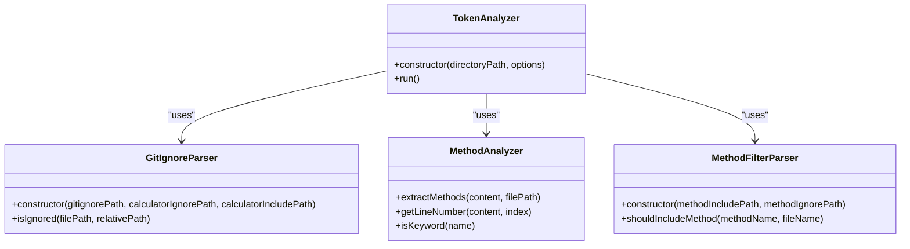
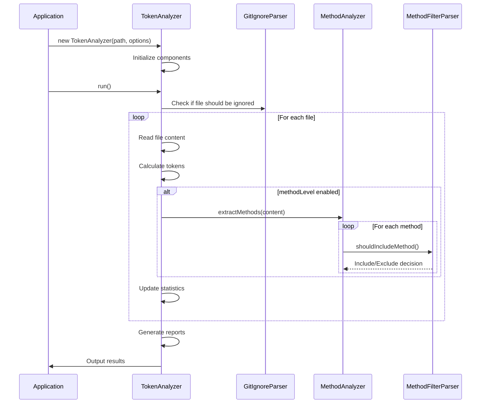

# Programmatic API

<cite>
**Referenced Files in This Document**   
- [context-manager.js](file://context-manager.js)
- [index.js](file://index.js)
- [README.md](file://README.md)
</cite>

## Table of Contents
1. [Introduction](#introduction)
2. [Core Components](#core-components)
3. [TokenAnalyzer Class](#tokenanalyzer-class)
4. [Configuration Options](#configuration-options)
5. [Data Models](#data-models)
6. [Usage Examples](#usage-examples)
7. [Error Handling](#error-handling)
8. [Performance Considerations](#performance-considerations)
9. [Migration Guidance](#migration-guidance)

## Introduction

The context-manager tool provides a programmatic interface for analyzing codebases and generating optimized context for LLM (Large Language Model) consumption. The primary entry point is the TokenAnalyzer class, which enables developers to integrate token analysis capabilities directly into Node.js applications. This API allows for automated analysis of project files, method-level extraction, and generation of context-optimized outputs for AI-assisted development workflows.

The tool is designed to help developers understand their codebase complexity, optimize LLM context usage, and automate analysis tasks within development pipelines. It supports both file-level and method-level analysis, with flexible configuration options for filtering and output formats.

**Section sources**
- [README.md](file://README.md#L1-L100)

## Core Components

The context-manager tool is built around several core components that work together through composition to provide comprehensive analysis capabilities. The TokenAnalyzer class serves as the primary interface, orchestrating interactions between specialized components for different aspects of the analysis process.

The architecture follows a modular design where each component has a specific responsibility:
- GitIgnoreParser handles file exclusion based on .gitignore and custom ignore rules
- MethodAnalyzer extracts method definitions from code files
- MethodFilterParser applies inclusion/exclusion rules to methods
- TokenCalculator performs the core analysis and token counting

These components are composed within the TokenAnalyzer (implemented as TokenCalculator) to provide a cohesive analysis experience. This design allows for independent development and testing of each component while maintaining a simple interface for end users.



**Diagram sources**
- [context-manager.js](file://context-manager.js#L14-L109)
- [context-manager.js](file://context-manager.js#L118-L223)

**Section sources**
- [context-manager.js](file://context-manager.js#L14-L223)

## TokenAnalyzer Class

The TokenAnalyzer class is the primary entry point for the context-manager tool's programmatic interface. It provides a simple yet powerful API for analyzing codebases and generating optimized context for LLM consumption.

### Constructor Parameters

The TokenAnalyzer constructor accepts two parameters:

```javascript
const analyzer = new TokenAnalyzer(directoryPath, options);
```

- `directoryPath` (string): The path to the directory that should be analyzed. This is typically the root of your project or a specific subdirectory you want to analyze.
- `options` (object): Configuration options that control the behavior of the analysis. See the Configuration Options section for details.

### run() Method

The `run()` method executes the complete analysis process and generates the results. When called, it performs the following steps:

1. Scans the specified directory and its subdirectories
2. Applies ignore rules from .gitignore and custom configuration files
3. Analyzes each file to calculate token counts
4. Optionally performs method-level analysis when enabled
5. Generates comprehensive reports and exports
6. Outputs results to console and/or files based on configuration

The method is designed to be asynchronous in nature, though it doesn't return a Promise directly. Instead, it handles asynchronous operations internally, particularly when dealing with file system operations and clipboard integration.



**Diagram sources**
- [context-manager.js](file://context-manager.js#L225-L790)

**Section sources**
- [context-manager.js](file://context-manager.js#L225-L790)
- [index.js](file://index.js#L1-L8)

## Configuration Options

The TokenAnalyzer class accepts various options through the options object parameter in its constructor. These options control the behavior of the analysis process and allow for customization based on specific use cases.

### Available Options

| Option | Type | Default | Description |
|--------|------|---------|-------------|
| methodLevel | boolean | false | Enables method-level analysis, extracting individual methods from code files |
| verbose | boolean | false | Controls whether detailed information is displayed during analysis |
| saveReport | boolean | false | Saves a detailed JSON report of the analysis to token-analysis-report.json |
| contextExport | boolean | false | Generates an LLM context file (llm-context.json) with optimized file listings |
| contextClipboard | boolean | false | Copies the LLM context directly to the system clipboard |

### Option Interactions

These options can be combined to achieve different analysis workflows:

- Using `methodLevel: true` enables extraction of individual methods from JavaScript/TypeScript files, providing more granular analysis
- Combining `saveReport: true` with other options allows for both immediate feedback and persistent storage of analysis results
- Using `contextExport: true` or `contextClipboard: true` generates optimized context for LLM consumption, either saving to a file or copying to clipboard
- The `verbose` option controls the amount of information displayed during analysis, with more details shown when enabled

When no export options are specified, the tool will prompt the user to select an export option after completing the analysis.

**Section sources**
- [README.md](file://README.md#L100-L300)
- [context-manager.js](file://context-manager.js#L225-L232)

## Data Models

The context-manager tool uses specific data models to represent files and methods during analysis. These models are used internally and form the structure of the generated reports and context exports.

### FileInfo Model

The FileInfo model represents information about an analyzed file:

```typescript
interface FileInfo {
    path: string;           // Absolute path to the file
    relativePath: string;   // Path relative to the project root
    sizeBytes: number;      // File size in bytes
    tokens: number;         // Calculated token count
    lines: number;          // Number of lines in the file
    extension: string;      // File extension
    methods?: MethodInfo[]; // Array of methods (when methodLevel is enabled)
}
```

### MethodInfo Model

The MethodInfo model represents information about an extracted method:

```typescript
interface MethodInfo {
    name: string;           // Method name
    line: number;           // Line number where the method is defined
    tokens: number;         // Token count for the method content
    file: string;           // Relative path to the file containing the method
}
```

These models are used to structure the analysis results and are serialized in the generated JSON reports. When method-level analysis is enabled, the tool creates a hierarchical structure where files contain arrays of their methods, allowing for detailed analysis of code complexity at both file and method levels.

The data models are designed to be lightweight and focused on the essential information needed for token analysis and LLM context optimization.

**Section sources**
- [context-manager.js](file://context-manager.js#L400-L420)
- [context-manager.js](file://context-manager.js#L480-L500)

## Usage Examples

The context-manager tool can be integrated into Node.js applications for automated analysis. The following examples demonstrate common usage patterns.

### Basic Integration

```javascript
const { TokenAnalyzer } = require('@hakkisagdic/context-manager');

// Basic file-level analysis
const analyzer = new TokenAnalyzer('./src', {
    verbose: true,
    saveReport: true
});

analyzer.run();
```

### Method-Level Analysis

```javascript
// Method-level analysis with all outputs
const methodAnalyzer = new TokenAnalyzer('./src', {
    methodLevel: true,
    saveReport: true,
    contextExport: true,
    verbose: true
});

methodAnalyzer.run();
```

### LLM-Optimized Context Generation

```javascript
// Generate context optimized for LLM consumption
const llmAnalyzer = new TokenAnalyzer('./src', {
    methodLevel: true,
    contextClipboard: true
});

llmAnalyzer.run();
```

### CI/CD Integration

```javascript
// Integration in CI/CD pipeline
const ciAnalyzer = new TokenAnalyzer('./src', {
    saveReport: true,
    contextExport: true
});

ciAnalyzer.run();
```

These examples show how the TokenAnalyzer can be configured for different use cases, from basic analysis to LLM-optimized context generation. The flexibility of the options allows developers to tailor the analysis to their specific needs, whether for development, debugging, or automated workflows.

**Section sources**
- [README.md](file://README.md#L700-L800)

## Error Handling

The context-manager tool includes comprehensive error handling to ensure robust operation in various environments. The analysis process is designed to gracefully handle file system errors and other exceptions that may occur during execution.

When a file cannot be read or analyzed, the tool creates an error entry in the results with the error message, allowing the analysis to continue with other files. This prevents a single problematic file from stopping the entire analysis process.

The tool also handles platform-specific issues, particularly with clipboard operations. On unsupported platforms, it falls back to saving the context to a file instead of attempting clipboard operations that would fail.

For configuration issues, the tool provides clear feedback about which configuration files are being used and in what mode (INCLUDE or EXCLUDE). This helps users understand why certain files might be included or excluded from the analysis.

The error handling strategy prioritizes completing the analysis over stopping at the first error, ensuring that users receive as much information as possible even when some parts of the process encounter issues.

**Section sources**
- [context-manager.js](file://context-manager.js#L400-L415)
- [context-manager.js](file://context-manager.js#L700-L730)

## Performance Considerations

When using the context-manager API programmatically, several performance considerations should be taken into account:

### Token Counting Methods

The tool supports two methods for token counting:
- **Exact counting** using the tiktoken library (requires installation)
- **Estimation** using character-based heuristics (fallback when tiktoken is not available)

For optimal accuracy, install the tiktoken package:
```bash
npm install tiktoken
```

### Analysis Scope

The performance of the analysis is directly related to the size of the codebase being analyzed. To optimize performance:
- Limit the analysis to specific directories when possible
- Use configuration files (.calculatorignore, .calculatorinclude) to exclude irrelevant files
- Consider the trade-off between analysis depth and execution time

### Method-Level Analysis

Enabling method-level analysis significantly increases processing time as it requires parsing code to identify individual methods. This feature should be used when method-level insights are needed, but disabled for simple file-level analysis.

### Asynchronous Operations

While the `run()` method doesn't return a Promise, it performs several asynchronous operations internally, particularly for file system access and clipboard operations. In automated workflows, consider the execution time required for large codebases.

The tool is optimized for performance with caching and efficient file system operations, but very large codebases may still require significant processing time.

**Section sources**
- [context-manager.js](file://context-manager.js#L300-L350)
- [README.md](file://README.md#L500-L600)

## Migration Guidance

When upgrading or migrating to newer versions of the context-manager tool, consider the following guidance:

### Version Compatibility

The tool maintains backward compatibility for its core API. The TokenAnalyzer class interface has remained stable across versions, ensuring that existing integrations continue to work.

### Configuration Changes

Check the release notes for any changes to configuration file formats or option parameters. While the core options remain consistent, new options may be added in newer versions.

### Dependency Management

Ensure that required dependencies are properly installed, particularly tiktoken for exact token counting. The tool will fall back to estimation if tiktoken is not available, but with reduced accuracy.

### Testing

After upgrading, test the analysis with your typical codebases to ensure expected behavior. Pay particular attention to:
- File inclusion/exclusion patterns
- Token count accuracy
- Export functionality
- Method-level analysis (if used)

The tool's output format for JSON reports and context exports is designed to be stable, minimizing the impact of upgrades on downstream processes that consume these outputs.

**Section sources**
- [README.md](file://README.md#L800-L891)