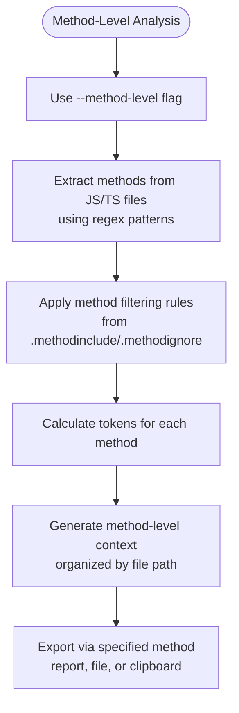

# Quick Start Guide

<cite>
**Referenced Files in This Document**   
- [README.md](file://README.md)
- [context-manager.js](file://context-manager.js)
- [bin/cli.js](file://bin/cli.js)
</cite>

## Table of Contents
1. [Introduction](#introduction)
2. [Basic Workflow](#basic-workflow)
3. [Running the Tool Interactively](#running-the-tool-interactively)
4. [Understanding the Analysis Output](#understanding-the-analysis-output)
5. [Export Options and Selection](#export-options-and-selection)
6. [Common Usage Patterns](#common-usage-patterns)
7. [Method-Level Analysis](#method-level-analysis)
8. [Clipboard Integration](#clipboard-integration)
9. [Configuration and Pattern Files](#configuration-and-pattern-files)
10. [Troubleshooting Common Issues](#troubleshooting-common-issues)

## Introduction

The context-manager CLI tool is designed to optimize LLM context by providing exact token counting, method-level filtering, and intelligent file selection. This quick start guide will help you get up and running with the tool, understand its core functionality, and effectively use its features for AI-assisted development workflows.

**Section sources**
- [README.md](file://README.md#L0-L891)

## Basic Workflow

The context-manager tool follows a simple three-step workflow: analysis, output interpretation, and export selection. The tool analyzes your codebase to calculate exact token counts, presents detailed information about file composition and token distribution, and provides multiple options for exporting the results in formats suitable for LLM consumption.

The default behavior is interactive, guiding users through the process and prompting for export preferences when no specific export option is specified via command line flags. This ensures users can always choose the most appropriate output format for their current needs.


**Diagram sources**
- [context-manager.js](file://context-manager.js#L793-L813)
- [README.md](file://README.md#L0-L891)

**Section sources**
- [context-manager.js](file://context-manager.js#L793-L813)
- [README.md](file://README.md#L0-L891)

## Running the Tool Interactively

To run the context-manager tool interactively, simply execute the command without any flags:

```bash
context-manager
```

This will initiate the analysis process, scan your project directory while respecting .gitignore rules and any calculator-specific ignore/include patterns, calculate token counts for all relevant files, and display a comprehensive report. After the analysis completes, if no export option was specified, the tool will prompt you to select an export method.

The interactive mode is ideal for first-time users and those who want to explore different export options based on the analysis results. The tool provides clear guidance throughout the process, making it easy to understand what files were analyzed and how the token counts were calculated.

**Section sources**
- [README.md](file://README.md#L0-L891)
- [context-manager.js](file://context-manager.js#L793-L813)

## Understanding the Analysis Output

When you run the context-manager tool, it produces a detailed analysis report that includes several key pieces of information. The output begins with metadata about the analysis process, including the project root directory, configuration mode (INCLUDE or EXCLUDE), and token calculation method (exact using tiktoken or estimated).

The main report includes:
- Total files analyzed and total token count
- Total size in MB and total lines of code
- Average tokens per file
- Number of files ignored by .gitignore and calculator rules
- Breakdown by file type (extension), showing files, tokens, size, and lines
- Top 5 largest files by token count
- Top 5 largest directories by token count

Understanding token counts is crucial for LLM context management. The tool uses tiktoken for GPT-4 compatible exact counting when available, falling back to estimation with approximately 95% accuracy if tiktoken is not installed. The verbose output (enabled by default) shows all included files, providing transparency into what contributes to your token count.


**Diagram sources**
- [context-manager.js](file://context-manager.js#L683-L703)
- [README.md](file://README.md#L0-L891)

**Section sources**
- [context-manager.js](file://context-manager.js#L683-L703)
- [README.md](file://README.md#L0-L891)

## Export Options and Selection

The context-manager tool provides multiple export options to accommodate different use cases. When no export option is specified via command line flags, the tool enters interactive export mode, prompting the user to select from four options:

1. Save detailed JSON report (token-analysis-report.json)
2. Generate LLM context file (llm-context.json)
3. Copy LLM context to clipboard
4. Skip export

The interactive export selection ensures that users never miss the opportunity to export their analysis results in the format they need. This feature is particularly helpful for beginners who may not be familiar with all the available export options.

For automated workflows, you can specify export options directly via command line flags, bypassing the interactive prompt. The available flags are:
- `--save-report` or `-s`: Save a detailed JSON report
- `--context-export`: Generate an LLM context file
- `--context-clipboard`: Copy context directly to clipboard


**Diagram sources**
- [context-manager.js](file://context-manager.js#L575-L616)
- [bin/cli.js](file://bin/cli.js#L4-L25)

**Section sources**
- [context-manager.js](file://context-manager.js#L575-L616)
- [bin/cli.js](file://bin/cli.js#L4-L25)

## Common Usage Patterns

The context-manager tool supports several common usage patterns that cater to different development workflows. The most basic pattern is running the tool interactively without any flags, which provides a complete analysis and prompts for export options:

```bash
context-manager
```

For users who want to quickly generate LLM context and copy it to the clipboard, the `--context-clipboard` flag provides a streamlined workflow:

```bash
context-manager --context-clipboard
```

This command analyzes the codebase and copies the optimized context directly to the clipboard in JSON format, ready for pasting into an LLM interface.

Another common pattern is method-level analysis, which focuses on extracting and analyzing specific methods from JavaScript/TypeScript files rather than entire files:

```bash
context-manager --method-level
```

You can also combine multiple flags to create more complex workflows. For example, to perform method-level analysis and save both a detailed report and export the context to a file:

```bash
context-manager --method-level --save-report --context-export
```

The tool also supports verbose output (enabled by default) which shows all included files, or quiet mode with `--no-verbose` which suppresses the file listing.

**Section sources**
- [README.md](file://README.md#L0-L891)
- [context-manager.js](file://context-manager.js#L793-L813)

## Method-Level Analysis

Method-level analysis is a powerful feature that allows you to focus on specific methods within your codebase rather than analyzing entire files. This is particularly useful for LLM context optimization, as it enables you to include only the most relevant code sections while excluding boilerplate and utility methods.

To enable method-level analysis, use the `--method-level` flag:

```bash
context-manager --method-level
```

When method-level analysis is enabled, the tool extracts methods from JavaScript/TypeScript files using pattern matching for function declarations, method assignments, and arrow functions. The analysis includes information about each method's name, line number, and token count.

The tool supports method filtering through configuration files:
- `.methodinclude`: Include only specified methods (takes priority)
- `.methodignore`: Exclude specified methods

These files use pattern matching syntax where you can specify exact method names, patterns with wildcards (*), or class.method notation. For example:

```
# .methodinclude - include only these methods
calculateTokens
*Handler
*Validator
TokenCalculator.*
```

Method-level analysis produces a different output format that organizes context by methods rather than files, making it easier to manage LLM context when you need to focus on specific functionality.



**Diagram sources**
- [context-manager.js](file://context-manager.js#L14-L67)
- [context-manager.js](file://context-manager.js#L118-L223)

**Section sources**
- [context-manager.js](file://context-manager.js#L14-L67)
- [context-manager.js](file://context-manager.js#L118-L223)

## Clipboard Integration

The context-manager tool provides seamless clipboard integration, allowing you to copy the generated LLM context directly to your system clipboard with the `--context-clipboard` flag:

```bash
context-manager --context-clipboard
```

This feature works across platforms (macOS, Linux, and Windows) using the appropriate system commands (pbcopy, xclip/xsel, or clip). The tool copies the context in JSON format, identical to what would be saved in the llm-context.json file, ensuring consistency between clipboard and file exports.

The clipboard integration is particularly useful for quickly sharing context with LLMs without having to save and manually copy from a file. The output is optimized for LLM consumption, using a compact format by default that minimizes character count while preserving essential information.

If the clipboard operation fails (e.g., due to missing system utilities), the tool automatically falls back to saving the context to llm-context.json as a safeguard, ensuring you don't lose the generated context.


**Diagram sources**
- [context-manager.js](file://context-manager.js#L541-L567)
- [README.md](file://README.md#L0-L891)

**Section sources**
- [context-manager.js](file://context-manager.js#L541-L567)
- [README.md](file://README.md#L0-L891)

## Configuration and Pattern Files

The context-manager tool uses several configuration files to control which files and methods are included in the analysis. Understanding these files is essential for customizing the tool to your specific needs.

The primary configuration files for file-level filtering are:
- `.calculatorinclude`: Include only files matching the specified patterns (takes priority)
- `.calculatorignore`: Exclude files matching the specified patterns

The tool follows a priority order for configuration files:
1. `.gitignore` (always respected)
2. `.calculatorinclude` (highest priority for files)
3. `.calculatorignore` (used when no include file exists)

When `.calculatorinclude` exists, the tool operates in INCLUDE mode, meaning only files matching the include patterns are analyzed (except those excluded by .gitignore). When only `.calculatorignore` exists, the tool operates in EXCLUDE mode, analyzing all files except those matching the ignore patterns.

For method-level analysis, the tool uses:
- `.methodinclude`: Include only specified methods
- `.methodignore`: Exclude specified methods

These files support pattern matching with wildcards (*) and can specify exact method names, patterns, or class.method notation. The syntax is straightforward, with each line representing a pattern and lines starting with # treated as comments.


**Diagram sources**
- [context-manager.js](file://context-manager.js#L118-L223)
- [README.md](file://README.md#L0-L891)

**Section sources**
- [context-manager.js](file://context-manager.js#L118-L223)
- [README.md](file://README.md#L0-L891)

## Troubleshooting Common Issues

When getting started with the context-manager tool, you may encounter a few common issues. Understanding these and their solutions will help you use the tool more effectively.

**Understanding verbose output**: The tool's verbose output (enabled by default) can be overwhelming for beginners. It shows all included files, token counts, and detailed statistics. To reduce output, use the `--no-verbose` flag, though this is not recommended as it reduces transparency about what files are being analyzed.

**Interpreting token counts**: The tool uses tiktoken for exact token counting when available. If you haven't installed tiktoken, the tool falls back to estimation mode. To ensure exact counts, install tiktoken:
```bash
npm install tiktoken
```

**Configuration file issues**: A common source of confusion is the interaction between `.calculatorinclude` and `.calculatorignore`. Remember that `.calculatorinclude` takes priority - if it exists, the tool operates in INCLUDE mode and ignores `.calculatorignore`. If you're not seeing expected files, check whether a `.calculatorinclude` file exists.

**Pattern matching problems**: When creating patterns in configuration files, ensure there are no inline comments and that patterns use the correct syntax. Use `**` for recursive matching and `*` for single-level matching. Test patterns with verbose output to verify they work as expected.

**Method-level analysis issues**: When using method-level analysis, ensure your `.methodinclude` or `.methodignore` files are in the correct location (project root or tool directory) and use proper pattern syntax. The tool will indicate which mode is active in the output.

**Section sources**
- [README.md](file://README.md#L0-L891)
- [context-manager.js](file://context-manager.js#L793-L813)