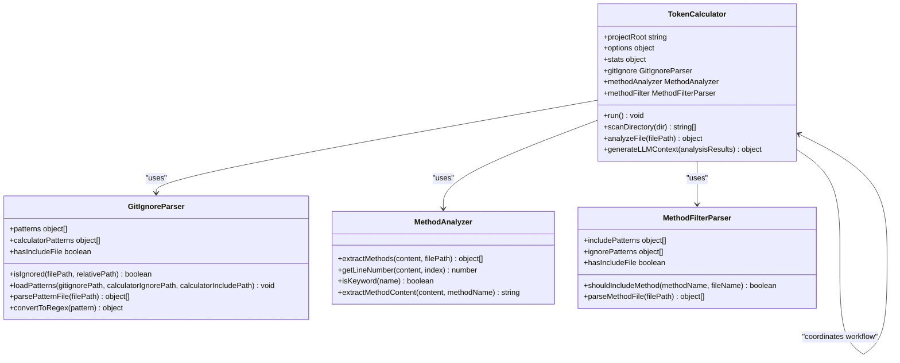
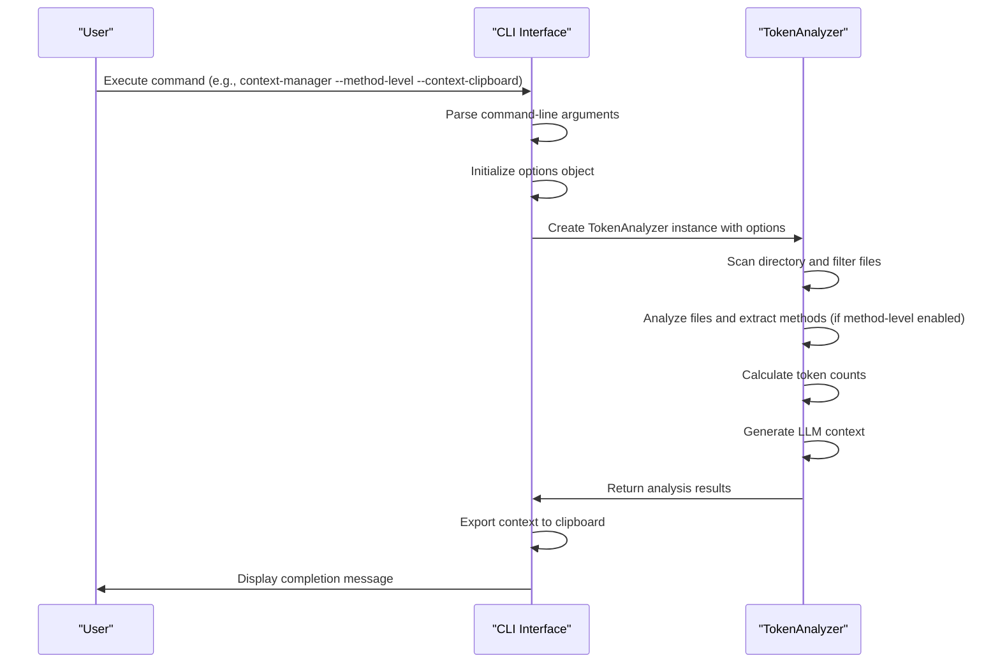
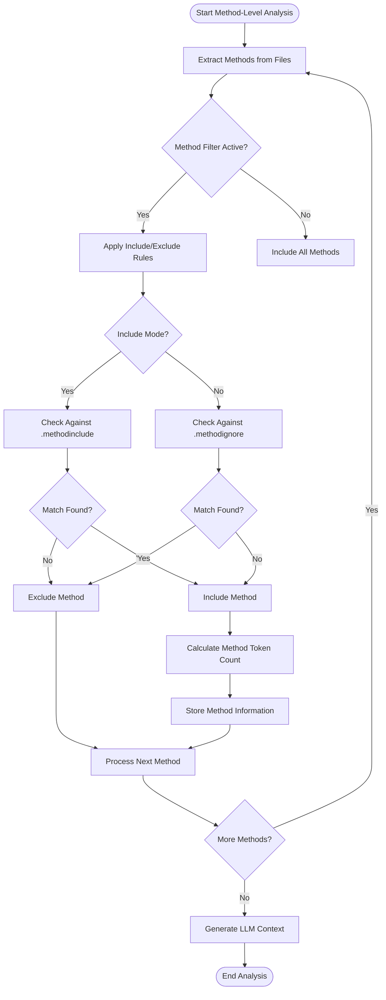
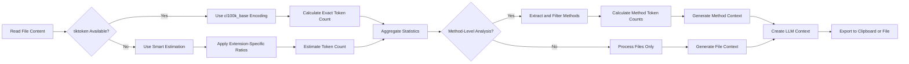
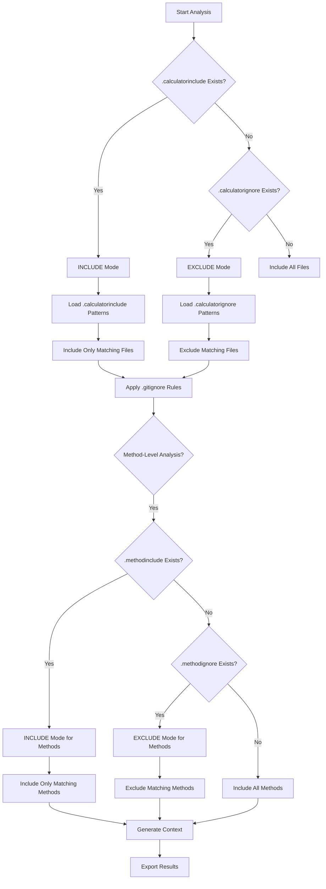

# Araç Genel Bakış ve Temel Değer

<cite>
**Bu Belgede Referans Verilen Dosyalar**
- [context-manager.js](file://context-manager.js)
- [bin/cli.js](file://bin/cli.js)
- [index.js](file://index.js)
- [README.md](file://README.md)
</cite>

## İçindekiler
1. [Araç Genel Bakış ve Temel Değer](#arac-genel-bakis-ve-temel-deger)
2. [Mimari ve Bileşen İlişkileri](#mimari-ve-bilesen-iliskileri)
3. [CLI Arayüzü ve İş Akışı Düzenlemesi](#cli-arayuzu-ve-is-akisi-duzenlemesi)
4. [Metod Seviyesi Analiz ve Filtreleme](#metod-seviyesi-analiz-ve-filtreleme)
5. [Token Sayımı ve Context Oluşturma](#token-sayimi-ve-context-olusturma)
6. [Yapılandırma ve Filtreleme Modları](#yapilandirma-ve-filtreleme-modlari)
7. [Pratik Kullanım Örnekleri](#pratik-kullanim-ornekleri)

## Araç Genel Bakış ve Temel Değer

context-manager CLI aracı, hassas token sayımı, metod seviyesi filtreleme ve compact context temsilleri oluşturma yoluyla Large Language Model'ler (LLM'ler) için kod context'ini optimize etmek üzere tasarlanmış özel bir yardımcı programdır. Birincil amacı, geliştiricilerin kesin token sayıları sağlayarak ve kod tabanlarının odaklanmış analizini mümkün kılarak LLM context pencerelerini verimli bir şekilde yönetmelerine yardımcı olmaktır. Araç, dual filtreleme modlarını (include/exclude) destekler ve birden fazla çıktı formatı sunar, bu da onu AI destekli geliştirme iş akışları, kod tabanı analizi ve CI/CD entegrasyonu için ideal hale getirir.

Aracın temel değeri, temel bilgileri LLM tüketimi için korurken tam kod tabanlarından %89 daha küçük ultra-compact context temsilleri oluşturma yeteneğinde yatmaktadır. Bunu metod seviyesi analiz, akıllı dosya seçimi ve ortak önek sıkıştırması ile dizin gruplandırması yoluyla başarır. context-manager, geliştiricilerin belirli iş mantığı metodlarına odaklanmalarına veya tüm kod tabanlarını analiz etmelerine olanak tanıyan hem dosya seviyesi hem de metod seviyesi analizini destekler.

**Bölüm kaynakları**
- [README.md](file://README.md#L1-L891)
- [context-manager.js](file://context-manager.js#L1-L855)

## Mimari ve Bileşen İlişkileri

context-manager, modüler, sınıf tabanlı bir JavaScript uygulaması olarak uygulanmıştır ve temel bileşenleri arasında net bir endişe ayrımı vardır. Mimari, özelleşmiş sınıfların analiz iş akışının belirli yönlerini ele aldığı ve merkezi bir orkestratörün etkileşimlerini koordine ettiği temiz bir bağımlılık hiyerarşisini takip eder.

Ana bileşenler şunları içerir:
- **TokenCalculator**: Analiz iş akışını yöneten merkezi orkestratör
- **GitIgnoreParser**: .gitignore ve özel ignore/include kurallarına dayalı dosya seviyesi filtrelemeyi yönetir
- **MethodAnalyzer**: Regex desenleri kullanarak JavaScript/TypeScript dosyalarından metodları çıkarır
- **MethodFilterParser**: Yapılandırma dosyalarına dayalı metodları filtrelemek için include/exclude kuralları uygular

Bu bileşenler koordineli bir şekilde birlikte çalışır: GitIgnoreParser analize hangi dosyaların dahil edileceğini belirler, TokenCalculator bu dosyaları işler ve metod çıkarmayı MethodAnalyzer'a devreder, ve MethodFilterParser yapılandırma kurallarına göre çıkarılan metodları filtreler. Bu modüler tasarım, tutarlı bir analiz iş akışını sürdürürken her bileşenin bağımsız geliştirme ve testine olanak tanır.



**Diagram kaynakları**
- [context-manager.js](file://context-manager.js#L14-L109)
- [context-manager.js](file://context-manager.js#L118-L223)
- [context-manager.js](file://context-manager.js#L225-L790)

**Bölüm kaynakları**
- [context-manager.js](file://context-manager.js#L14-L109)
- [context-manager.js](file://context-manager.js#L118-L223)
- [context-manager.js](file://context-manager.js#L225-L790)

## CLI Arayüzü ve İş Akışı Düzenlemesi

context-manager aracının CLI arayüzü, kullanıcılar için birincil giriş noktası olarak hizmet eder ve tüm analiz iş akışını düzenler. bin/cli.js dosyasında uygulanan CLI, analiz sürecini kontrol etmek için çeşitli seçenekler sunan kullanıcı dostu bir arayüz sağlar. Arayüz net bir yürütme akışını takip eder: komut satırı argümanlarını ayrıştırma, TokenAnalyzer'ı uygun seçeneklerle başlatma ve analizini yürütme.

CLI, analiz davranışını kontrol eden çeşitli önemli seçenekleri destekler:
- `--save-report` veya `-s`: Analizin detaylı bir JSON raporunu kaydeder
- `--verbose` veya `-v`: Analiz sırasında dahil edilen dosyaları ve dizinleri gösterir
- `--context-export`: Bir LLM context dosya listesi oluşturur
- `--context-clipboard`: Context'i doğrudan panoya kopyalar
- `--method-level` veya `-m`: Metod seviyesi analizini etkinleştirir
- `--help` veya `-h`: Yardım bilgilerini görüntüler

Export seçenekleri belirtilmediğinde, araç interaktif moda girer ve analizi tamamladıktan sonra kullanıcıdan bir export seçeneği seçmesini ister. Bu, kullanıcıların analiz sonuçlarını istenen formatta export etme fırsatını asla kaçırmamasını sağlar. CLI ayrıca, proje kök dizini olarak mevcut çalışma dizini ile TokenAnalyzer'ın başlatılmasını yönetir ve analiz seçeneklerini yapılandırmak için komut satırı argümanlarını işler.



**Diagram kaynakları**
- [bin/cli.js](file://bin/cli.js#L1-L67)
- [context-manager.js](file://context-manager.js#L225-L790)

**Bölüm kaynakları**
- [bin/cli.js](file://bin/cli.js#L1-L67)
- [context-manager.js](file://context-manager.js#L225-L790)

## Metod Seviyesi Analiz ve Filtreleme

context-manager aracı, geliştiricilerin kod tabanlarındaki belirli metodlara odaklanmalarını sağlayan sofistike metod seviyesi analiz yetenekleri sağlar. Bu özellik, özellikle LLM context optimizasyonu için değerlidir, çünkü yardımcı, test ve debug metodlarını hariç tutarken yalnızca en alakalı iş mantığı metodlarının çıkarılmasını sağlar.

Metod seviyesi analiz, `--method-level` bayrağı tarafından kontrol edilir ve iki ana bileşen aracılığıyla uygulanır: MethodAnalyzer ve MethodFilterParser sınıfları. MethodAnalyzer, fonksiyon bildirimleri, nesne metodları, arrow fonksiyonlar ve sınıf metodları dahil olmak üzere çeşitli sözdizimi desenlerini destekleyerek JavaScript/TypeScript dosyalarındaki metodları tanımlamak için bir dizi düzenli ifade kullanır. Metod adlarını, satır numaralarını ve dosya yollarını çıkararak kod tabanındaki metodların kapsamlı bir envanterini oluşturur.

MethodFilterParser, yapılandırma dosyalarına (.methodinclude ve .methodignore) dayalı metodları filtrelemek için include/exclude kuralları uygular. Bu dosyalar, tam eşleşmeleri, joker karakterleri (*pattern*), sınıfa özgü metodları (Class.*) ve dosyaya özgü metodları (file.method) destekleyen desen eşleştirme sözdizimini kullanır. Filtreleme sistemi hem include modunu (yalnızca belirtilen metodlar dahil edilir) hem de exclude modunu (belirtilen metodlar hariç tutulur) destekler; her iki yapılandırma dosyası da mevcut olduğunda include modu önceliklidir.



**Diagram kaynakları**
- [context-manager.js](file://context-manager.js#L14-L67)
- [context-manager.js](file://context-manager.js#L69-L109)

**Bölüm kaynakları**
- [context-manager.js](file://context-manager.js#L14-L67)
- [context-manager.js](file://context-manager.js#L69-L109)
- [README.md](file://README.md#L499-L542)

## Token Sayımı ve Context Oluşturma

context-manager aracı, LLM context optimizasyonu için gerekli olan doğru token sayımı yetenekleri sağlar. GPT-4 ile uyumlu kesin token sayımı için tiktoken kütüphanesini kullanır, tiktoken mevcut olmadığında akıllı tahmini yönteme geri döner. Token sayım sistemi, tiktoken bağımlılığı olmadan bile ~%95 doğruluk sağlayacak şekilde tasarlanmıştır ve çeşitli geliştirme ortamları için erişilebilir hale getirir.

Token sayım süreci, dosya içeriğini okumayı, dosya uzantılarına özgü karakter-token oranlarına dayalı token hesaplamayı ve kod tabanı genelinde istatistikleri toplamayı içerir. Kesin sayım için araç, GPT-4 tarafından kullanılan aynı encoding olan tiktoken'dan cl100k_base encoding'ini kullanır ve hassas context penceresi yönetimini sağlar. Tahmin sistemi, güvenilir yaklaşımlar sağlamak için farklı dosya tipleri için önceden tanımlanmış token başına karakter oranlarını (örneğin, JavaScript için 3.2, Markdown için 4.0) kullanır.

Context oluşturma, LLM tüketimi için iki formatta optimize edilmiş dosya listeleri üreten önemli bir özelliktir: ultra-compact (varsayılan) ve detailed. Ultra-compact format, token sayıları olmadan proje metadata'sı ve organize edilmiş dosya yollarını içeren ~2.3k karakter yapılandırılmış JSON temsili oluştururken, detailed format tam yollar, kategoriler, önem puanları ve dizin istatistikleri dahil olmak üzere ~8.6k karakter kapsamlı bilgi üretir. Her iki format da aynı JSON yapılarını kullanır ve pano ile dosya export'ları arasında tutarlılığı sağlar.



**Diagram kaynakları**
- [context-manager.js](file://context-manager.js#L253-L286)
- [context-manager.js](file://context-manager.js#L639-L665)

**Bölüm kaynakları**
- [context-manager.js](file://context-manager.js#L253-L286)
- [context-manager.js](file://context-manager.js#L639-L665)
- [README.md](file://README.md#L499-L542)

## Yapılandırma ve Filtreleme Modları

context-manager aracı, hangi dosya ve metodların analize dahil edileceği üzerinde hassas kontrol sağlayan dual filtreleme modları (include/exclude) ile esnek bir yapılandırma sistemini destekler. Bu sistem, geliştiricilerin yalnızca temel uygulama mantığını analiz etmek veya belirli dosya ve dizinleri dahil etmek istemeleri olsun, özel ihtiyaçlarına göre uyarlanmış odaklanmış analiz setleri oluşturmalarına olanak tanır.

Dosya seviyesi filtreleme sistemi, net bir öncelik hiyerarşisi ile üç yapılandırma dosyası kullanır:
1. `.gitignore` (proje kök dizini) - Standart git hariç tutmaları (her zaman geçerlidir)
2. `.calculatorinclude` - INCLUDE modu (dosyalar için en yüksek öncelik)
3. `.calculatorignore` - EXCLUDE modu (include dosyası yokken kullanılır)

`.calculatorinclude` mevcut olduğunda, araç INCLUDE modunda çalışır, yalnızca bu dosyadaki desenlere uyan dosyaları dahil eder ve `.calculatorignore`'u göz ardı eder. Yalnızca `.calculatorignore` mevcut olduğunda, araç EXCLUDE modunda çalışır ve ignore desenlerine uyan dosyalar hariç tüm dosyaları dahil eder. Bu dual-mod sistemi, kapsamlı kod tabanı analizinden belirli bileşenlerin odaklanmış incelemesine kadar farklı kullanım durumları için esneklik sağlar.

Metod seviyesi filtreleme, analize hangi metodların dahil edileceğini kontrol eden `.methodinclude` ve `.methodignore` dosyalarıyla benzer bir deseni takip eder. Bu dosyalar, tam eşleşmeler, joker karakterler (*pattern*), sınıfa özgü metodlar (Class.*) ve dosyaya özgü metodlar (file.method) dahil olmak üzere desen eşleştirme sözdizimini destekler. Desen sözdizimi ayrıca geniş desenlerden belirli öğeleri hariç tutmak için olumsuzlama (!pattern) destekler.



**Diagram kaynakları**
- [README.md](file://README.md#L294-L356)
- [context-manager.js](file://context-manager.js#L253-L286)

**Bölüm kaynakları**
- [README.md](file://README.md#L294-L356)
- [context-manager.js](file://context-manager.js#L253-L286)

## Pratik Kullanım Örnekleri

context-manager aracı, AI destekli geliştirme iş akışlarını geliştiren geniş bir pratik kullanım örneği yelpazesini destekler. Bu kullanım örnekleri, aracın LLM context'ini optimize etme, kod tabanlarını analiz etme ve geliştirme süreçleriyle entegre olma konusundaki çok yönlülüğünü gösterir.

LLM context optimizasyonu için geliştiriciler, `context-manager --method-level --context-clipboard` gibi komutlar kullanarak AI asistanları için minimal context oluşturabilir. Bu, tam kod tabanına kıyasla context boyutunu %89'a kadar azaltan, temel iş mantığı metodlarına odaklanan kod tabanının ultra-compact bir temsilini oluşturur. `*Handler`, `*Validator` ve `*Manager` gibi desenlerle bir `.methodinclude` dosyası oluşturarak geliştiriciler, context'e yalnızca alakalı metodların dahil edilmesini sağlayabilir.

Kod tabanı analizi, aracın proje karmaşıklığını ve yapısını anlamaya yardımcı olduğu bir diğer önemli kullanım örneğidir. `context-manager --save-report --verbose` çalıştırmak, geçmiş takip ve CI/CD entegrasyonu için kullanılabilecek detaylı bir JSON raporu oluşturur. Bu rapor, dosya tipleri, en büyük dosyalar ve dizin kompozisyonu hakkında kapsamlı istatistikler içerir ve kod tabanı sağlığı ve organizasyonu hakkında değerli içgörüler sağlar.

Araç ayrıca geliştiricilerin belirli sorunlu metodlara odaklanmasına olanak tanıyarak metod seviyesi debugging'i destekler. Örneğin, authentication metodlarını debug etmek için bir geliştirici `*auth*`, `*login*` ve `*validate*` gibi desenlerle bir `.methodinclude` dosyası oluşturabilir, ardından `context-manager --method-level --context-clipboard` çalıştırabilir. Bu, alakalı metodları izole eder ve debugging için odaklanmış bir context sağlar.

CI/CD entegrasyonu, kod tabanı büyümesini ve karmaşıklığını izlemek için otomatik token analizi aracılığıyla kolaylaştırılır. Script'ler, token sayılarını takip etmek ve LLM context limitleri etkilemeden önce potansiyel sorunları tespit etmek için günlük olarak `context-manager --save-report` çalıştırabilir. Kod tabanının token bütçelerini aşıp aşmadığını kontrol ederek kod kalitesi geçitleri uygulanabilir ve projelerin AI destekli geliştirme için yönetilebilir limitler içinde kalması sağlanır.

```mermaid
erDiagram
USER_REQUIREMENT {
string useCase PK
string description
string command
string configuration
string outputFormat
}
USER_REQUIREMENT ||--o{ CONFIG_FILE : "uses"
USER_REQUIREMENT ||--o{ OUTPUT_FORMAT : "produces"
CONFIG_FILE {
string filename PK
string patternSyntax
string mode
}
OUTPUT_FORMAT {
string formatType PK
string size
string content
string useCase
}
USER_REQUIREMENT {
"LLM Context Optimization" "Generate minimal context for AI assistants" "context-manager --method-level --context-clipboard" ".methodinclude with *Handler, *Validator" "Ultra-compact JSON (~2.3k chars)"
"Codebase Analysis" "Understand project complexity and structure" "context-manager --save-report --verbose" ".calculatorinclude with core JS files" "Detailed JSON report (~8.6k chars)"
"Method-Level Debugging" "Focus on specific problematic methods" "context-manager --method-level --verbose" ".methodinclude with *auth*, *login*" "Method context with line numbers"
"CI/CD Integration" "Monitor codebase growth and complexity" "context-manager --save-report" ".calculatorignore with test/ and docs/" "Detailed analysis for historical tracking"
"Code Quality Gates" "Ensure code stays within token budgets" "context-manager --method-level --save-report" ".methodinclude with core business logic" "Token count validation"
}
CONFIG_FILE {
".calculatorinclude" "**/*.js, !test/**, !docs/**" "INCLUDE"
".calculatorignore" "**/*.md, **/*.json, node_modules/**" "EXCLUDE"
".methodinclude" "*Handler, *Validator, *Manager" "INCLUDE"
".methodignore" "*test*, *debug*, console" "EXCLUDE"
}
OUTPUT_FORMAT {
"Ultra-compact JSON" "~2.3k chars" "Project metadata, organized file paths" "LLM context optimization"
"Detailed JSON" "~8.6k chars" "Full paths, categories, importance scores" "Codebase analysis"
"Method context" "~4.5k chars" "Method names, line numbers, token counts" "Method-level debugging"
"Detailed report" "~12k chars" "Comprehensive statistics, largest files" "CI/CD integration"
}
```

**Diagram kaynakları**
- [README.md](file://README.md#L499-L542)
- [README.md](file://README.md#L801-L879)

**Bölüm kaynakları**
- [README.md](file://README.md#L499-L542)
- [README.md](file://README.md#L801-L879)
