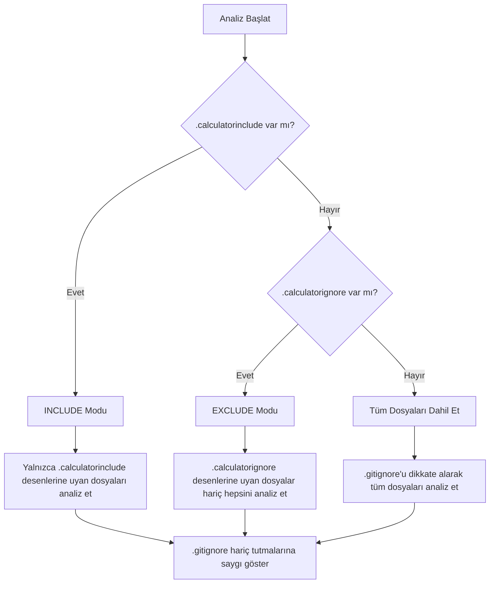
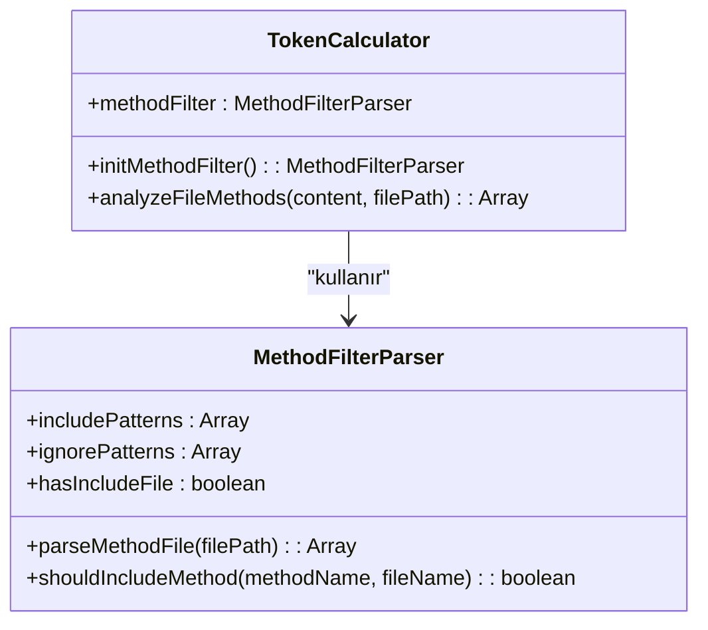
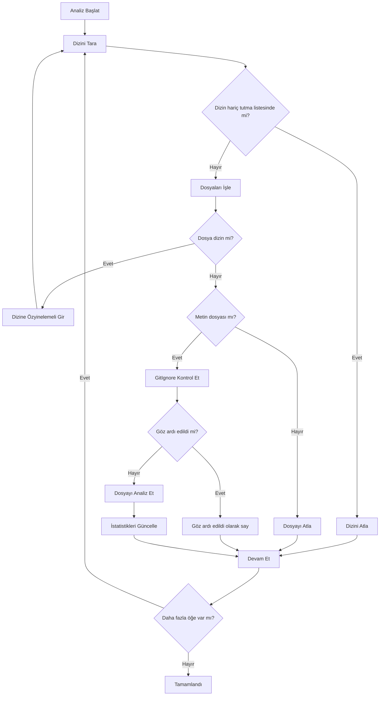
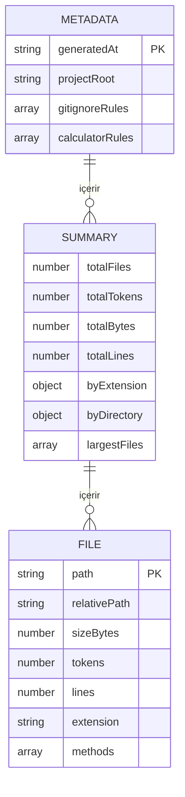

# Gelişmiş Yapılandırma

<cite>
**Bu Dokümanda Referans Verilen Dosyalar**
- [README.md](file://README.md)
- [context-manager.js](file://context-manager.js)
</cite>

## İçindekiler
1. [Giriş](#giriş)
2. [Konfigürasyon Dosyası Önceliği](#konfigürasyon-dosyası-önceliği)
3. [Özel Filtre Desenleri](#özel-filtre-desenleri)
4. [Gelişmiş Desen Sözdizimi](#gelişmiş-desen-sözdizimi)
5. [Performans Optimizasyonu](#performans-optimizasyonu)
6. [Entegrasyon ve Scripting](#entegrasyon-ve-scripting)
7. [En İyi Uygulamalar](#en-iyi-uygulamalar)
8. [Sorun Giderme](#sorun-giderme)

## Giriş

context-manager aracı, token analizi ve LLM context oluşturmaya hangi dosya ve methodların dahil edileceğini kontrol etmek için sofistike konfigürasyon seçenekleri sağlar. Bu doküman, özel kullanım senaryoları için gelişmiş konfigürasyon tekniklerini detaylandırır, özel filtre desenlerine, öncelik hiyerarşilerine ve performans optimizasyon stratejilerine odaklanır.

**Bölüm kaynakları**
- [README.md](file://README.md#L1-L891)

## Konfigürasyon Dosyası Önceliği

context-manager aracı, birden fazla konfigürasyon dosyası mevcut olduğunda dosyaların analize nasıl dahil edildiğini veya hariç tutulduğunu belirleyen iyi tanımlanmış bir öncelik hiyerarşisi uygular. Bu hiyerarşi, öngörülebilir davranış sağlar.

En yüksekten en düşüğe öncelik sırası:

1. **`.calculatorinclude`** - INCLUDE modu (en yüksek öncelik)
2. **`.calculatorignore`** - EXCLUDE modu
3. **`.gitignore`** - Standart git hariç tutmaları (her zaman saygı gösterilir)

`.calculatorinclude` mevcut olduğunda, araç INCLUDE modunda çalışır, yani yalnızca bu dosyadaki desenlere uyan dosyalar analiz edilecektir ve `.calculatorignore` tamamen göz ardı edilir. Yalnızca `.calculatorignore` mevcut olduğunda, araç EXCLUDE modunda çalışır, göz ardı desenlerine uyan dosyalar hariç tüm dosyaları analiz eder. `.gitignore` dosyası moddan bağımsız olarak her zaman saygı gösterilir.



**Diyagram kaynakları**
- [context-manager.js](file://context-manager.js#L124-L229)
- [context-manager.js](file://context-manager.js#L231-L800)

**Bölüm kaynakları**
- [README.md](file://README.md#L1-L891)
- [context-manager.js](file://context-manager.js#L124-L229)

## Özel Filtre Desenleri

context-manager aracı, hem dosya seviyesinde hem de method seviyesinde filtreleme mekanizmaları aracılığıyla özel kullanım senaryoları için özel filtre desenleri oluşturmayı destekler.

### Dosya Seviyesinde Filtreleme

Dosya seviyesinde filtreleme, `.calculatorinclude` ve `.calculatorignore` dosyaları aracılığıyla kontrol edilir. Bu dosyalar esnek dosya seçimi için glob desenlerini destekler:

- `**/*.md` - Tüm markdown dosyalarını özyinelemeli olarak hariç tut
- `infrastructure/**` - Tüm infrastructure dizinini hariç tut
- `utility-mcp/src/**/*.js` - src dizinindeki tüm JavaScript dosyalarını dahil et
- `!utility-mcp/src/testing/**` - Test dosyalarını hariç tutmak için negasyon deseni

Belirli özellik alanlarına odaklanmak için, istenen dizinleri hedefleyen desenlerle bir `.calculatorinclude` dosyası oluşturun:

```bash
# Yalnızca authentication ile ilgili dosyaları dahil et
src/auth/**/*.js
src/middleware/auth.js
config/auth-config.json
```

Legacy kodu hariç tutmak için, `.calculatorinclude`'da negasyon desenleri kullanın:

```bash
# Tüm core dosyaları dahil et ancak legacy modülleri hariç tut
src/**/*.js
!src/legacy/**
!src/deprecated/**
```

### Method Seviyesinde Filtreleme

Method seviyesinde filtreleme, `.methodinclude` ve `.methodignore` dosyaları aracılığıyla daha da granüler kontrol sağlar. Bunlar method adları için desen eşleştirmesini destekler:

- `*Handler` - 'Handler' ile biten tüm methodları dahil et
- `*Validator` - 'Validator' ile biten tüm methodları dahil et
- `TokenCalculator.*` - TokenCalculator sınıfındaki tüm methodları dahil et
- `server.printStatus` - Belirli dosya methodunu dahil et
- `*test*` - 'test' içeren tüm methodları hariç tut



**Diyagram kaynakları**
- [context-manager.js](file://context-manager.js#L75-L115)
- [context-manager.js](file://context-manager.js#L231-L800)

**Bölüm kaynakları**
- [README.md](file://README.md#L1-L891)
- [context-manager.js](file://context-manager.js#L75-L115)

## Gelişmiş Desen Sözdizimi

context-manager aracı, hem dosya hem de method filtrlemesi için karmaşık negasyon kurallarını, dizine özel desenleri ve kombine include/exclude mantığını destekleyen sofistike desen sözdizimi uygular.

### Desen Dönüşümü ve Eşleştirme

GitIgnoreParser'daki `convertToRegex` methodu, glob desenlerini belirli kurallarla regex'lere dönüştürür:

- `**`, `.*`'a dönüştürülür (herhangi bir sayıda dizini eşleştirir)
- `*`, `[^/]*`'a dönüştürülür (yol ayırıcılar hariç herhangi bir karakteri eşleştirir)
- `?`, `[^/]`'a dönüştürülür (yol ayırıcı hariç herhangi bir tek karakteri eşleştirir)
- `/` ile başlayan desenler kök dizine sabitlenir
- `/` ile biten dizin desenleri dizini ve tüm içeriğini eşleştirir

```mermaid
flowchart TD
A[Ham Desen] --> B{Deseni İşle}
B --> C[Baştan /! kaldır]
B --> D[Sondan / kaldır]
C --> E[Özel karakterleri escape et]
D --> E
E --> F[** ile .* değiştir]
F --> G[* ile [^/]* değiştir]
G --> H[? ile [^/] değiştir]
H --> I{/ ile mi başlıyor?}
I --> |Evet| J[^'ye sabitle]
I --> |Hayır| K[(^|/) öneki ekle]
J --> L{/ ile mi bitiyor?}
K --> L
L --> |Evet| M[(/.*?)? $ soneki ekle]
L --> |Hayır| N[$ soneki ekle]
M --> O[Tam Regex]
N --> O
```

**Diyagram kaynakları**
- [context-manager.js](file://context-manager.js#L159-L179)

**Bölüm kaynakları**
- [context-manager.js](file://context-manager.js#L159-L179)

### Karmaşık Negasyon Kuralları

Araç, negasyon desenlerini (`!pattern`) belirli öncelik kurallarıyla ele alır. INCLUDE modunda, negasyon desenleri geniş dahil etme desenlerinden dosyaları hariç tutar. EXCLUDE modunda, negasyon desenleri başka türlü hariç tutulacak dosyaları yeniden dahil edebilir.

Birden fazla negasyon deseni olduğunda, bunlar sırayla işlenir ve sonraki desenler öncekilerden önceliklidir. Bu, sofistike filtreleme mantığına izin verir:

```bash
# Tüm JS dosyalarını dahil et ancak test ve legacy kodu hariç tut
src/**/*.js
!src/**/*.test.js
!src/legacy/**
!src/deprecated/**
```

## Performans Optimizasyonu

context-manager aracı, analiz hızını artırmak ve kaynak kullanımını azaltmak için çeşitli performans optimizasyon teknikleri içerir.

### Dizine Özel Analiz

Araç, konfigürasyon dosyalarını iki konumda arar: araç dizini (`__dirname`) ve proje kök dizini (`this.projectRoot`). Bu, her projede konfigürasyon dosyaları gerektirmeden hem global hem de projeye özel konfigürasyonlara izin verir.

```javascript
findConfigFile(filename) {
    const locations = [
        path.join(__dirname, filename),
        path.join(this.projectRoot, filename)
    ];
    return locations.find(loc => fs.existsSync(loc));
}
```

### Sonuç Önbelleğe Alma ve Verimli İşleme

Mevcut uygulama açık önbelleğe alma içermese de, performansı şu yollarla optimize eder:

- **Verimli dosya taraması**: `node_modules`, `.git` ve `dist` gibi yaygın dizinleri atlar
- **Toplu işleme**: Alt dizinlere geçmeden önce bir dizindeki tüm dosyaları işler
- **Minimum I/O işlemleri**: Konfigürasyon dosyalarını yalnızca başlatma sırasında bir kez okur

Büyük projeler için, `.calculatorinclude`'ı yalnızca ilgili alanları hedefleyecek şekilde yapılandırarak analizi belirli dizinlerle sınırlamayı düşünün:

```bash
# Analizi yalnızca core modüllere odakla
src/core/**/*.js
src/services/**/*.js
src/api/**/*.js
```



**Diyagram kaynakları**
- [context-manager.js](file://context-manager.js#L272-L278)
- [context-manager.js](file://context-manager.js#L380-L400)

**Bölüm kaynakları**
- [context-manager.js](file://context-manager.js#L272-L278)

## Entegrasyon ve Scripting

context-manager aracı, otomatik iş akışlarında ve özel scriptlerde kullanım için birden fazla entegrasyon noktası sağlar.

### Programatik Kullanım

Araç, TokenAnalyzer sınıfı import edilerek programatik olarak kullanılabilir:

```javascript
const { TokenAnalyzer } = require('@hakkisagdic/context-manager');

const analyzer = new TokenAnalyzer('./src', {
    methodLevel: true,
    saveReport: true,
    verbose: true
});

analyzer.run();
```

### Export Formatları

Araç, farklı kullanım senaryoları için birden fazla export formatını destekler:

- **Detaylı JSON raporu**: CI/CD pipeline'ları için kapsamlı analiz verisi
- **LLM context dosyası**: AI asistanları için optimize edilmiş dosya listesi
- **Pano export'u**: Anında kullanım için context'in doğrudan kopyalanması

`saveDetailedReport` methodu, metadata, özet istatistikler ve detaylı dosya bilgilerini içeren yapılandırılmış bir JSON raporu oluşturur:



**Diyagram kaynakları**
- [context-manager.js](file://context-manager.js#L784-L799)

**Bölüm kaynakları**
- [context-manager.js](file://context-manager.js#L784-L799)

## En İyi Uygulamalar

### Konfigürasyon Dosyası Yönetimi

- **Açıklayıcı desen yorumları kullanın**: Karmaşık desenlerin amacını açıklamak için yorumlar ekleyin
- **Kategoriye göre organize edin**: İlgili desenleri birlikte gruplandırın (örneğin, tüm test hariç tutmaları)
- **Konfigürasyonları test edin**: Beklenen dosyaların dahil edildiğini/hariç tutulduğunu doğrulamak için verbose modunu kullanın
- **Versiyon kontrolü**: Ortamlar arasında tutarlılık sağlamak için konfigürasyon dosyalarını versiyon kontrolüne dahil edin

### Performans Değerlendirmeleri

- **Kapsamı sınırlayın**: İlgili kod alanlarına odaklanmak için `.calculatorinclude` kullanın
- **Aşırı geniş desenlerden kaçının**: Belirli desenler, birçok negasyonlu geniş olanlardan daha verimlidir
- **Düzenli bakım**: Kod tabanı geliştikçe desenleri periyodik olarak gözden geçirin ve güncelleyin
- **Sonuçları önbelleğe alın**: CI/CD pipeline'ları için, kaynak dosyalar değişmediğinde analiz sonuçlarını önbelleğe almayı düşünün

## Sorun Giderme

### Yaygın Sorunlar

- **Desenler çalışmıyor**: Desen dosyalarında satır içi yorum olmadığından ve doğru glob sözdizimi kullandığınızdan emin olun
- **Yanlış dosyalar dahil edildi**: `.calculatorinclude`'ın var olup olmadığını kontrol edin (`.calculatorignore` üzerinde öncelik alır)
- **Performans sorunları**: Hedefli include desenleri kullanarak analizi belirli dizinlerle sınırlayın
- **Eksik beklenen dosyalar**: Dosyaların `.gitignore` tarafından hariç tutulmadığını doğrulayın (her zaman saygı gösterilir)

### Hata Ayıklama İpuçları

- Hangi dosyaların dahil edildiğini/hariç tutulduğunu görmek için `--verbose` flag'ini kullanın
- Konfigürasyon modu (INCLUDE/EXCLUDE) için konsol çıktısını kontrol edin
- Glob desen test ediciIeri kullanarak desen sözdizimini doğrulayın
- Büyük projelere uygulamadan önce küçük, izole kod tabanlarıyla desenleri test edin
