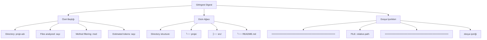
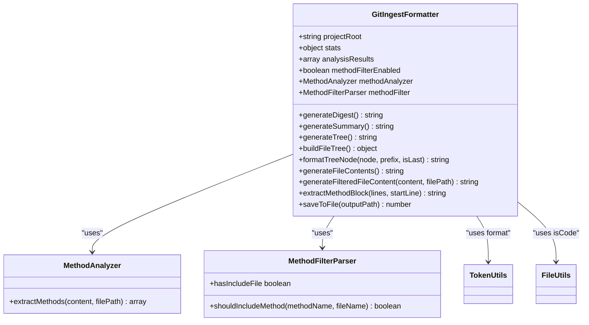
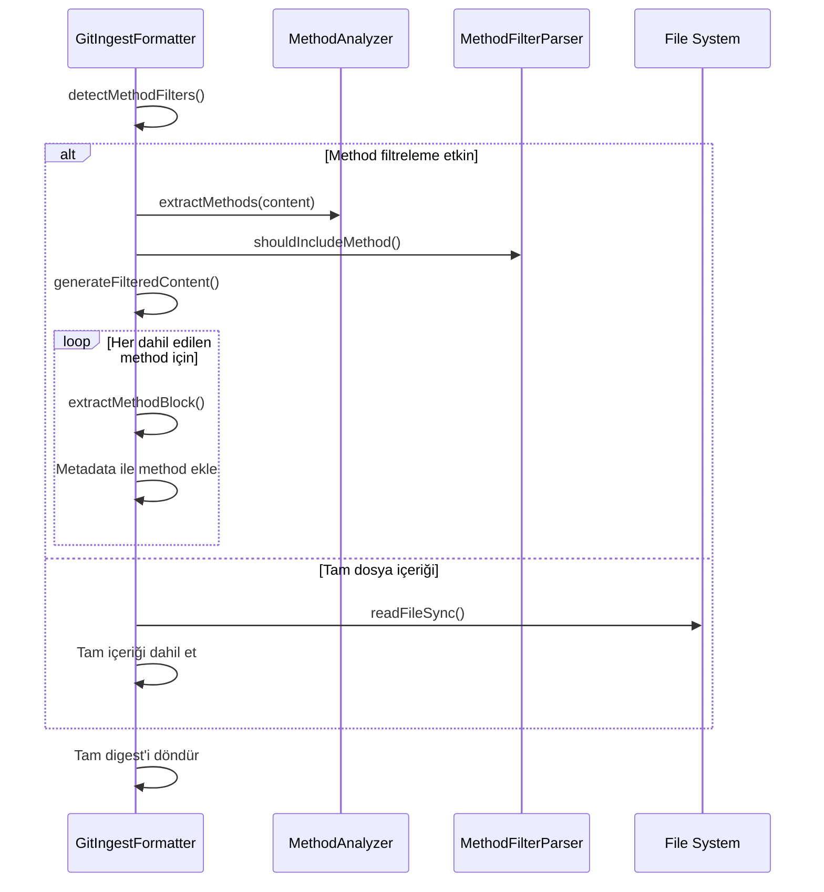
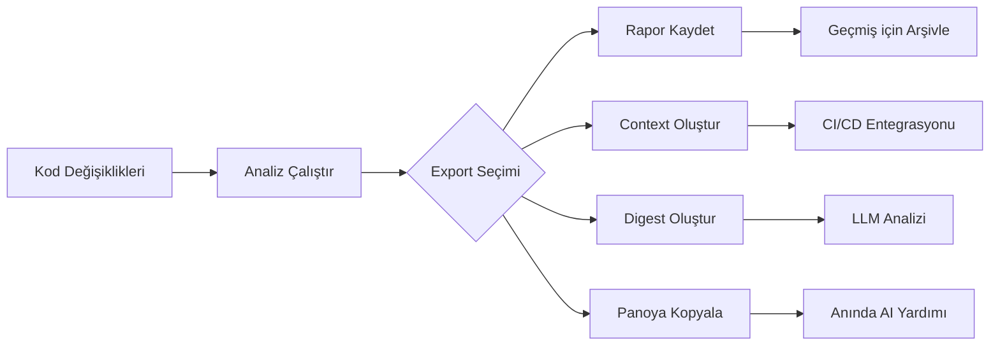

# GitIngest Format Spesifikasyonu

<cite>
**Bu Dokümanda Referans Verilen Dosyalar**   
- [GitIngestFormatter](file://lib/formatters/gitingest-formatter.js)
- [context-manager.js](file://context-manager.js)
- [GITINGEST_VERSION.md](file://docs/GITINGEST_VERSION.md)
- [README.md](file://README.md)
- [test-gitingest.js](file://test/test-gitingest.js)
- [test-gitingest-json.js](file://test/test-gitingest-json.js)
</cite>

## İçindekiler
1. [Giriş](#giriş)
2. [Amaç ve Kullanım Senaryoları](#amaç-ve-kullanım-senaryoları)
3. [Format Yapısı](#format-yapısı)
4. [Versiyon Sistemi](#versiyon-sistemi)
5. [Uygulama Detayları](#uygulama-detayları)
6. [Method Seviyesi Filtreleme](#method-seviyesi-filtreleme)
7. [Pratik Örnekler](#pratik-örnekler)
8. [LLM Tüketim Kılavuzu](#llm-tüketim-kılavuzu)
9. [Sorun Giderme](#sorun-giderme)
10. [Entegrasyon İş Akışları](#entegrasyon-iş-akışları)

## Giriş

GitIngest format spesifikasyonu, Large Language Model (LLM) tüketimi için optimize edilmiş kod tabanı temsili için standart bir metin tabanlı digest formatını tanımlar. Bu format, geliştiricilerin tüm proje context'lerini ChatGPT, Claude veya diğer LLM'ler gibi AI asistanları tarafından verimli bir şekilde işlenebilen tek, yapılandırılmış bir metin dosyasına birleştirmesini sağlar.

context-manager aracındaki uygulama, proje metadata'sı, dizin yapısı görselleştirmesi ve prompt-dostu bir formatta tam dosya içeriklerini içeren kod tabanlarından GitIngest-style digest'ler oluşturan JavaScript tabanlı bir çözüm sağlar.

**Bölüm kaynakları**
- [README.md](file://README.md#L150-L170)
- [GITINGEST_VERSION.md](file://docs/GITINGEST_VERSION.md#L1-L10)

## Amaç ve Kullanım Senaryoları

GitIngest formatı, karmaşık kod tabanları ile LLM context pencereleri arasında bir köprü görevi görür ve dil modellerindeki sonlu context boyutlarının temel sınırlamasını ele alır. Temel proje bilgilerini tek, iyi yapılandırılmış bir metin dosyasına birleştirerek, kapsamlı kod anlayışı ve analizini mümkün kılar.

Temel amaçlar:
- **LLM Context Sağlama**: Token limitleri içinde tam proje context'i sunma
- **Kod Tabanı Anlık Görüntüsü**: Proje durumlarının arşiv temsillerini oluşturma
- **İşbirliği Kolaylaştırma**: Ekip üyeleri veya AI asistanları ile tam proje context'i paylaşma
- **Analiz Etkinleştirme**: Derin kod analizi, refactoring önerileri ve dokümantasyon oluşturmayı destekleme

Başlıca kullanım senaryoları:
- **AI Destekli Geliştirme**: Kod oluşturma, debugging ve optimizasyon için tam context sağlama
- **Kod İncelemeleri**: Kapsamlı inceleme için tam proje anlık görüntüleri paylaşma
- **Onboarding**: Kapsamlı proje genel bakışları ile yeni geliştirici entegrasyonunu hızlandırma
- **Dokümantasyon Oluşturma**: Otomatik dokümantasyon sistemleri için girdi olarak hizmet etme
- **Mimari Analiz**: Kod yapısı ve desenlerinin bütünsel değerlendirmesini mümkün kılma

**Bölüm kaynakları**
- [README.md](file://README.md#L150-L200)
- [GITINGEST_VERSION.md](file://docs/GITINGEST_VERSION.md#L1-L10)

## Format Yapısı

GitIngest formatı, hem insanlar hem de LLM'ler tarafından maksimum okunabilirlik ve verimli ayrıştırma için tasarlanmış hiyerarşik bir yapıyı takip eder. Format üç ana bölümden oluşur: özet başlığı, dizin ağacı ve dosya içerikleri.

### Özet Başlığı
Başlık, temel proje metadata'sını sağlar:
- Dizin adı
- Analiz edilen dosya sayısı
- Method filtreleme durumu (uygulanabilir olduğunda)
- Tahmini token sayısı

### Dizin Ağacı
ASCII karakterler kullanarak proje yapısının görsel temsili, dosya ve dizinlerin hiyerarşik organizasyonunu gösterir. Ağaç, uygun bağlayıcılarla standart dizin listeleme konvansiyonlarını takip eder.

### Dosya İçerikleri
Digest'in özü, net sınırlayıcılarla ayrılmış tam dosya içeriklerini içerir. Dosyalar, LLM context pencereleri içinde önemli dosyalara öncelik vermek için token sayısına göre sıralanır (en büyük önce).



**Diagram kaynakları**
- [gitingest-formatter.js](file://lib/formatters/gitingest-formatter.js#L35-L50)
- [GITINGEST_VERSION.md](file://docs/GITINGEST_VERSION.md#L15-L30)

## Versiyon Sistemi

context-manager uygulaması, kendi uyumluluğunu ve özellik takibini sürdürürken referans GitIngest formatıyla uyumlu bir versiyon takip sistemi izler.

### Mevcut Uygulama
- **GitIngest Versiyon Referansı**: v0.3.1 (2025-07-31)
- **Uygulama Tarihi**: 13 Ekim 2025
- **Kaynak Depo**: https://github.com/coderamp-labs/gitingest

### Versiyon Geçmişi
| Tarih | GitIngest Versiyonu | Notlar |
|------|-------------------|-------|
| 2025-10-13 | v0.3.1 | GitIngest formatına dayalı ilk uygulama |

Versiyon sistemi, JavaScript'e özgü optimizasyonlar ve özellik eklemeleri için izin verirken, gelişen GitIngest spesifikasyonu ile uyumluluğu sağlar. Uygulama, denetim amaçları için dokümantasyon dizininde referans uygulamasının bir anlık görüntüsünü tutar.

**Bölüm kaynakları**
- [GITINGEST_VERSION.md](file://docs/GITINGEST_VERSION.md#L1-L79)

## Uygulama Detayları

GitIngest formatı, analiz edilmiş kod tabanı verisinden digest dosyasının oluşturulmasını düzenleyen `GitIngestFormatter` sınıfı aracılığıyla uygulanır. Uygulama, bağımlılıksız olacak ve çekirdek context-manager analiz hattı ile uyumlu olacak şekilde tasarlanmıştır.

### Çekirdek Bileşenler
- **GitIngestFormatter Sınıfı**: Digest oluşturan ana formatter
- **Token Sayım Formatlama**: Ham token sayılarını insan tarafından okunabilir formatlara dönüştürür (k/M)
- **Ağaç Yapısı Oluşturucu**: Görsel dizin temsillerini oluşturur
- **Dosya İçerik İşlemcisi**: Dosya okuma ve içerik dahil etmeyi yönetir

### İşleme Hattı
1. **Başlatma**: Proje kök dizinini, istatistikleri ve analiz sonuçlarını kabul eder
2. **Method Filtre Algılama**: Method seviyesi filtreleme yapılandırmasını otomatik olarak algılar
3. **Digest Oluşturma**: Özet, ağaç ve dosya içeriklerini birleştirir
4. **Çıktı**: Tam digest'i bir metin dosyasına kaydeder



**Diagram kaynakları**
- [gitingest-formatter.js](file://lib/formatters/gitingest-formatter.js#L13-L264)
- [context-manager.js](file://context-manager.js#L4-L5)

## Method Seviyesi Filtreleme

GitIngest uygulaması, digest'e dahil edilen içerik üzerinde daha ayrıntılı kontrol sağlayan isteğe bağlı method seviyesi filtrelemeyi destekler. Bu özellik, geliştiricilerin boilerplate veya utility fonksiyonlarını hariç tutarken ilgi alanındaki belirli methodlara odaklanmasını sağlar.

### Filtre Yapılandırması
- **.methodinclude**: INCLUDE modu - yalnızca belirtilen methodlar dahil edilir
- **.methodignore**: EXCLUDE modu - belirtilen methodlar hariç tutulur

### Filtre Sözdizimi
| Desen | Açıklama |
|---------|-------------|
| `methodName` | Tam method adı eşleşmesi |
| `*pattern*` | Wildcard eşleştirme (desen içerir) |
| `Class.*` | Belirli bir sınıftaki tüm methodlar |
| `file.method` | Belirli bir dosyadaki belirli method |
| `!pattern` | Negasyon (deseni hariç tut) |

Method filtreleme aktifken, digest her dosya içinde yalnızca filtrelenmiş methodları içerir ve hangi methodların dahil edildiğini gösteren metadata ile birlikte gelir. Bu seçici dahil etme, kritik işlevselliğe odaklanmayı korurken token kullanımını önemli ölçüde azaltır.



**Diagram kaynakları**
- [gitingest-formatter.js](file://lib/formatters/gitingest-formatter.js#L200-L225)
- [gitingest-formatter.js](file://lib/formatters/gitingest-formatter.js#L226-L257)

## Pratik Örnekler

GitIngest formatı, farklı kullanım senaryoları ve performans gereksinimleri için esneklik sağlayan birden fazla iş akışı aracılığıyla oluşturulabilir.

### Doğrudan Oluşturma
Doğrudan kod tabanı analizinden bir digest oluşturun:
```bash
context-manager --gitingest
context-manager -g
```

### JSON Tabanlı Oluşturma
Mevcut JSON raporlarından digest oluşturun (daha hızlı, yeniden tarama yok):
```bash
# Detaylı analiz raporundan
context-manager --gitingest-from-report token-analysis-report.json

# LLM context dosyasından
context-manager --gitingest-from-context llm-context.json

# Varsayılan dosya adlarını kullanarak
context-manager --gitingest-from-report
context-manager --gitingest-from-context
```

### Kombine İş Akışları
Digest oluşturmayı diğer çıktılarla birleştirin:
```bash
# Hem digest hem de detaylı rapor oluştur
context-manager -g -s

# Tekrarlanan digest oluşturma için iki adımlı iş akışı
context-manager --save-report
context-manager --gitingest-from-report
```

Çıktı `digest.txt` dosyası, LLM tüketimi veya arşivleme amaçları için hazır tam formatlanmış digest'i içerir.

**Bölüm kaynakları**
- [README.md](file://README.md#L170-L200)
- [test-gitingest-json.js](file://test/test-gitingest-json.js#L1-L225)

## LLM Tüketim Kılavuzu

LLM etkileşimleri için GitIngest formatının etkinliğini maksimize etmek için şu en iyi uygulamaları izleyin:

### Optimal Kullanım Desenleri
- **Context Sağlama**: Tüm digest'i LLM ile konuşmanızın başında yapıştırın
- **Odaklanmış Sorgular**: Context sağladıktan sonra, mimari, uygulama veya iyileştirmeler hakkında belirli sorular sorun
- **Artımlı Analiz**: Çok büyük kod tabanları için, belirli alt sistemlere odaklanan birden fazla digest oluşturmayı düşünün

### Önerilen Sorgu Türleri
- **Mimari Soruları**: "Dizin yapısına göre, ana mimari desen ne gibi görünüyor?"
- **Kod Anlama**: "[dosya]'nın amacını içeriğine ve projedeki pozisyonuna göre açıklayın"
- **İyileştirme Önerileri**: "Bu kod tabanındaki hata yönetimi deseninde potansiyel iyileştirmeleri belirleyin"
- **Dokümantasyon Oluşturma**: "Bu dosyalardaki export edilen methodlara dayalı API dokümantasyonu oluşturun"

### Performans Değerlendirmeleri
- **Token Verimliliği**: Digest formatı, token limitleri içinde maksimum context sağlamak için optimize edilmiştir
- **Dosya Sıralaması**: Dosyalar, context pencerelerinde önemli dosyalara öncelik vermek için boyuta göre sıralanır (en büyük önce)
- **Method Filtreleme**: Belirli işlevselliğe odaklanırken token kullanımını daha da azaltmak için method seviyesi filtreleme kullanın

**Bölüm kaynakları**
- [README.md](file://README.md#L190-L200)
- [GITINGEST_VERSION.md](file://docs/GITINGEST_VERSION.md#L1-L79)

## Sorun Giderme

GitIngest formatı ile çalışırken yaygın sorunlar ve çözümleri:

### Dosya Oluşturma Sorunları
- **Digest oluşturulmadı**: Çıktı dizininin yazılabilir olduğundan ve yeterli izinlere sahip olduğunuzdan emin olun
- **Eksik dosyalar**: Dosyaların `.gitignore`, `.calculatorignore` veya diğer filtre kuralları tarafından hariç tutulmadığını doğrulayın
- **Boş digest**: Analizin dahil etme kriterlerine uyan dosyaları bulduğunu kontrol edin

### Method Filtreleme Sorunları
- **Filtre uygulanmadı**: `.methodinclude` veya `.methodignore` dosyalarının proje kök dizininde var olduğundan emin olun
- **Beklenmeyen methodlar dahil edildi**: Desen sözdizimini gözden geçirin ve negasyon desenlerini kullanmayı düşünün
- **Hiçbir method gösterilmedi**: Method çıkarma desenlerinin kod stilinizle eşleştiğini doğrulayın (fonksiyon bildirimleri, arrow fonksiyonlar, vb.)

### İçerik Kalitesi Sorunları
- **Kırpılmış methodlar**: Uygulama, güvenlik için method çıkarmayı 100 satırla sınırlar; çok uzun methodlar kırpılır
- **Encoding sorunları**: Okuma hatalarını önlemek için dosyaların UTF-8 encoding'inde kaydedildiğinden emin olun
- **Büyük digest boyutu**: Çıktı boyutunu azaltmak için method seviyesi filtreleme kullanın veya include/exclude desenlerini ayarlayın

### JSON Kaynak Sorunları
- **Geçersiz JSON formatı**: Kaynak JSON dosyalarının rapor veya context dosyaları için beklenen yapıyı izlediğinden emin olun
- **Eksik alanlar**: Gerekli alanların (project, paths, files) kaynak JSON'da mevcut olduğunu doğrulayın
- **Yol çözümleme sorunları**: JSON dosyalarındaki göreli yolların doğru olduğundan ve dosyaların belirtilen konumlarda var olduğundan emin olun

**Bölüm kaynakları**
- [test-gitingest-json.js](file://test/test-gitingest-json.js#L150-L180)
- [context-manager.js](file://context-manager.js#L20-L50)

## Entegrasyon İş Akışları

GitIngest formatı, geliştirme verimliliğini ve AI destekli kodlamayı artıran çeşitli entegrasyon iş akışlarını destekler.

### Geliştirme İş Akışı Entegrasyonu


### CI/CD Pipeline Entegrasyonu
GitIngest oluşturmayı otomatik iş akışlarına entegre edin:
```bash
# CI/CD script'inde
npm run analyze -- --save-report
npm run gitingest -- --gitingest-from-report

# Digest'i artifact olarak yükle
aws s3 cp digest.txt s3://project-artifacts/${GIT_COMMIT}/digest.txt
```

### İnteraktif Geliştirme Döngüsü
1. Kod değişiklikleri yapın
2. `context-manager --gitingest` çalıştırın
3. Digest içeriğini kopyalayın
4. LLM arayüzüne sorgu ile yapıştırın
5. Önerileri uygulayın
6. Tekrarlayın

Bu sıkı geri bildirim döngüsü, AI yardımıyla hızlı iterasyon ve sürekli iyileştirmeyi mümkün kılar.

**Bölüm kaynakları**
- [README.md](file://README.md#L200-L220)
- [context-manager.js](file://context-manager.js#L100-L150)
