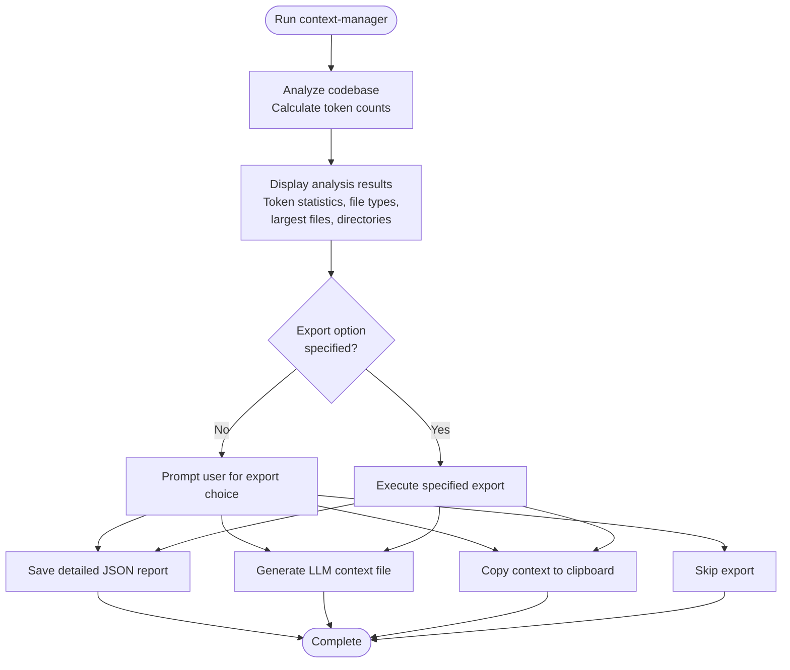
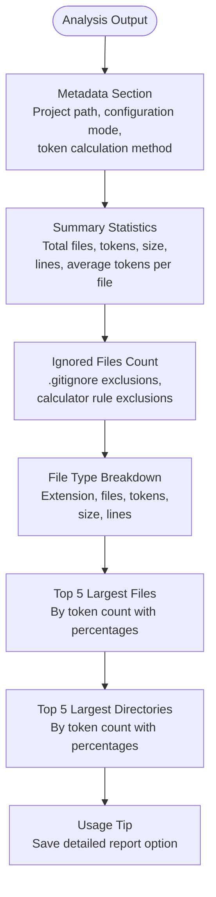
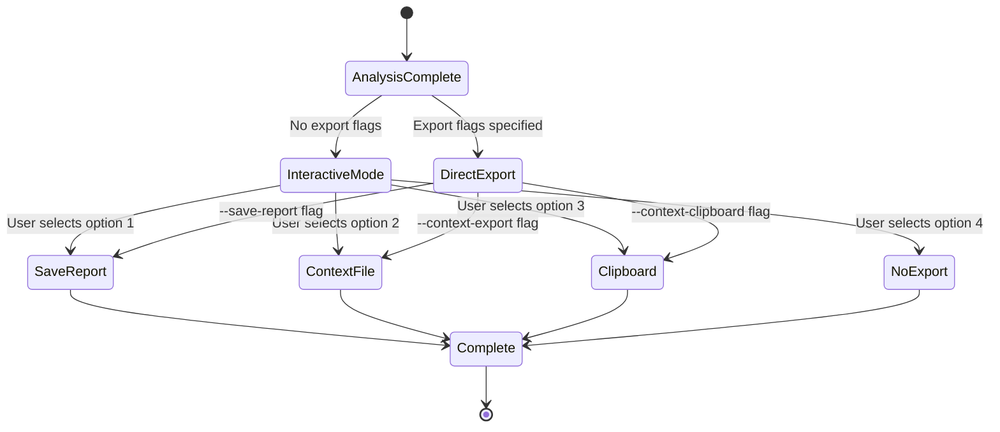
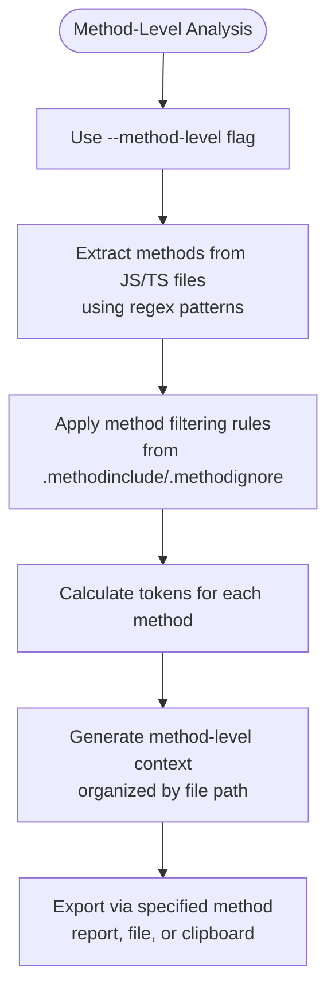
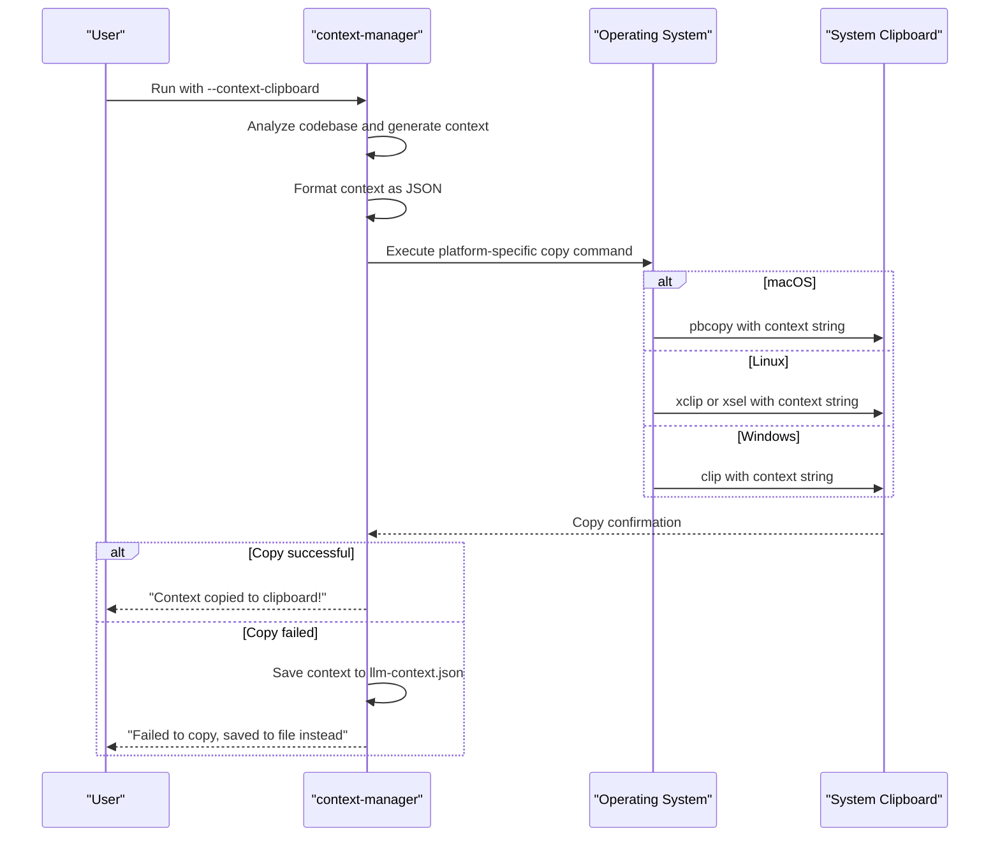
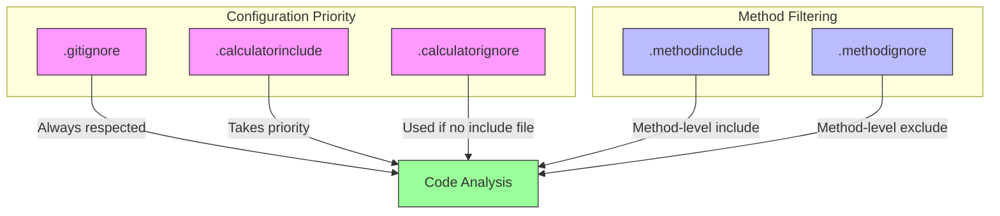

# Hızlı Başlangıç Rehberi

<cite>
**Bu Belgede Referans Verilen Dosyalar**
- [README.md](file://README.md)
- [context-manager.js](file://context-manager.js)
- [bin/cli.js](file://bin/cli.js)
</cite>

## İçindekiler
1. [Giriş](#giris)
2. [Temel İş Akışı](#temel-is-akisi)
3. [Aracı İnteraktif Olarak Çalıştırma](#araci-interaktif-olarak-calistirma)
4. [Analiz Çıktısını Anlama](#analiz-ciktisini-anlama)
5. [Export Seçenekleri ve Seçimi](#export-secenekleri-ve-secimi)
6. [Yaygın Kullanım Desenleri](#yaygin-kullanim-desenleri)
7. [Metod Seviyesi Analiz](#metod-seviyesi-analiz)
8. [Pano Entegrasyonu](#pano-entegrasyonu)
9. [Yapılandırma ve Desen Dosyaları](#yapilandirma-ve-desen-dosyalari)
10. [Yaygın Sorunları Giderme](#yaygin-sorunlari-giderme)

## Giriş

context-manager CLI aracı, kesin token sayımı, metod seviyesi filtreleme ve akıllı dosya seçimi sağlayarak LLM context'ini optimize etmek için tasarlanmıştır. Bu hızlı başlangıç rehberi, aracı çalışır hale getirmenize, temel işlevselliğini anlamanıza ve özelliklerini AI destekli geliştirme iş akışları için etkili bir şekilde kullanmanıza yardımcı olacaktır.

**Bölüm kaynakları**
- [README.md](file://README.md#L0-L891)

## Temel İş Akışı

context-manager aracı basit üç adımlı bir iş akışı izler: analiz, çıktı yorumlama ve export seçimi. Araç, kod tabanınızı analiz ederek kesin token sayılarını hesaplar, dosya kompozisyonu ve token dağılımı hakkında detaylı bilgiler sunar ve sonuçları LLM tüketimi için uygun formatlarda export etmek için birden fazla seçenek sağlar.

Varsayılan davranış interaktiftir, kullanıcılara süreç boyunca rehberlik eder ve komut satırı bayrakları aracılığıyla belirli bir export seçeneği belirtilmediğinde export tercihleri için sorgular. Bu, kullanıcıların mevcut ihtiyaçları için her zaman en uygun çıktı formatını seçebilmelerini sağlar.



**Diagram kaynakları**
- [context-manager.js](file://context-manager.js#L793-L813)
- [README.md](file://README.md#L0-L891)

**Bölüm kaynakları**
- [context-manager.js](file://context-manager.js#L793-L813)
- [README.md](file://README.md#L0-L891)

## Aracı İnteraktif Olarak Çalıştırma

context-manager aracını interaktif olarak çalıştırmak için komutu herhangi bir bayrak olmadan çalıştırın:

```bash
context-manager
```

Bu, analiz sürecini başlatır, .gitignore kurallarına ve calculator'a özgü ignore/include desenlerine uyarak proje dizininizi tarar, tüm ilgili dosyalar için token sayılarını hesaplar ve kapsamlı bir rapor görüntüler. Analiz tamamlandıktan sonra, bir export seçeneği belirtilmemişse, araç bir export yöntemi seçmenizi ister.

İnteraktif mod, ilk kez kullanıcılar ve analiz sonuçlarına göre farklı export seçeneklerini keşfetmek isteyenler için idealdir. Araç, süreç boyunca net rehberlik sağlar ve hangi dosyaların analiz edildiğini ve token sayılarının nasıl hesaplandığını anlamayı kolaylaştırır.

**Bölüm kaynakları**
- [README.md](file://README.md#L0-L891)
- [context-manager.js](file://context-manager.js#L793-L813)

## Analiz Çıktısını Anlama

context-manager aracını çalıştırdığınızda, çeşitli önemli bilgi parçalarını içeren detaylı bir analiz raporu üretir. Çıktı, proje kök dizini, yapılandırma modu (INCLUDE veya EXCLUDE) ve token hesaplama yöntemi (tiktoken kullanarak kesin veya tahmini) dahil olmak üzere analiz süreci hakkında metadata ile başlar.

Ana rapor şunları içerir:
- Analiz edilen toplam dosya sayısı ve toplam token sayısı
- MB cinsinden toplam boyut ve toplam kod satırı sayısı
- Dosya başına ortalama token sayısı
- .gitignore ve calculator kuralları tarafından göz ardı edilen dosya sayısı
- Dosya tipi (uzantı) bazında dökümü, dosyaları, token'ları, boyutu ve satırları gösterir
- Token sayısına göre en büyük 5 dosya
- Token sayısına göre en büyük 5 dizin

Token sayılarını anlamak, LLM context yönetimi için çok önemlidir. Araç, mevcut olduğunda GPT-4 uyumlu kesin sayım için tiktoken kullanır, tiktoken kurulu değilse yaklaşık %95 doğrulukla tahmini yönteme geri döner. Verbose çıktı (varsayılan olarak etkin) tüm dahil edilen dosyaları gösterir ve token sayınıza neyin katkıda bulunduğu konusunda şeffaflık sağlar.



**Diagram kaynakları**
- [context-manager.js](file://context-manager.js#L683-L703)
- [README.md](file://README.md#L0-L891)

**Bölüm kaynakları**
- [context-manager.js](file://context-manager.js#L683-L703)
- [README.md](file://README.md#L0-L891)

## Export Seçenekleri ve Seçimi

context-manager aracı, farklı kullanım durumlarına uyum sağlamak için birden fazla export seçeneği sunar. Komut satırı bayrakları aracılığıyla bir export seçeneği belirtilmediğinde, araç interaktif export moduna girer ve kullanıcıdan dört seçenekten birini seçmesini ister:

1. Detaylı JSON raporu kaydet (token-analysis-report.json)
2. LLM context dosyası oluştur (llm-context.json)
3. LLM context'ini panoya kopyala
4. Export'u atla

İnteraktif export seçimi, kullanıcıların analiz sonuçlarını ihtiyaç duydukları formatta export etme fırsatını asla kaçırmamasını sağlar. Bu özellik, tüm mevcut export seçeneklerine aşina olmayan yeni başlayanlar için özellikle yararlıdır.

Otomatik iş akışları için, interaktif istemi atlayarak export seçeneklerini doğrudan komut satırı bayrakları aracılığıyla belirtebilirsiniz. Mevcut bayraklar:
- `--save-report` veya `-s`: Detaylı bir JSON raporu kaydet
- `--context-export`: Bir LLM context dosyası oluştur
- `--context-clipboard`: Context'i doğrudan panoya kopyala



**Diagram kaynakları**
- [context-manager.js](file://context-manager.js#L575-L616)
- [bin/cli.js](file://bin/cli.js#L4-L25)

**Bölüm kaynakları**
- [context-manager.js](file://context-manager.js#L575-L616)
- [bin/cli.js](file://bin/cli.js#L4-L25)

## Yaygın Kullanım Desenleri

context-manager aracı, farklı geliştirme iş akışlarına hitap eden çeşitli yaygın kullanım desenlerini destekler. En temel desen, aracı hiçbir bayrak olmadan interaktif olarak çalıştırmaktır; bu, tam bir analiz sağlar ve export seçenekleri için sorgular:

```bash
context-manager
```

Hızlıca LLM context'i oluşturmak ve panoya kopyalamak isteyen kullanıcılar için, `--context-clipboard` bayrağı basitleştirilmiş bir iş akışı sağlar:

```bash
context-manager --context-clipboard
```

Bu komut kod tabanını analiz eder ve optimize edilmiş context'i JSON formatında doğrudan panoya kopyalar, bir LLM arayüzüne yapıştırmaya hazır hale getirir.

Bir diğer yaygın desen, tüm dosyalar yerine JavaScript/TypeScript dosyalarından belirli metodları çıkarma ve analiz etmeye odaklanan metod seviyesi analizdir:

```bash
context-manager --method-level
```

Daha karmaşık iş akışları oluşturmak için birden fazla bayrağı da birleştirebilirsiniz. Örneğin, metod seviyesi analiz yapmak ve hem detaylı bir rapor kaydetmek hem de context'i bir dosyaya export etmek için:

```bash
context-manager --method-level --save-report --context-export
```

Araç ayrıca, tüm dahil edilen dosyaları gösteren verbose çıktıyı (varsayılan olarak etkin) veya dosya listesini bastıran `--no-verbose` ile sessiz modu da destekler.

**Bölüm kaynakları**
- [README.md](file://README.md#L0-L891)
- [context-manager.js](file://context-manager.js#L793-L813)

## Metod Seviyesi Analiz

Metod seviyesi analiz, tüm dosyaları analiz etmek yerine kod tabanınızdaki belirli metodlara odaklanmanızı sağlayan güçlü bir özelliktir. Bu, özellikle LLM context optimizasyonu için kullanışlıdır, çünkü boilerplate ve yardımcı metodları hariç tutarken yalnızca en alakalı kod bölümlerini dahil etmenizi sağlar.

Metod seviyesi analizini etkinleştirmek için `--method-level` bayrağını kullanın:

```bash
context-manager --method-level
```

Metod seviyesi analiz etkinleştirildiğinde, araç fonksiyon bildirimleri, metod atamaları ve arrow fonksiyonlar için desen eşleştirme kullanarak JavaScript/TypeScript dosyalarından metodları çıkarır. Analiz, her metodun adı, satır numarası ve token sayısı hakkında bilgi içerir.

Araç, yapılandırma dosyaları aracılığıyla metod filtrelemeyi destekler:
- `.methodinclude`: Yalnızca belirtilen metodları dahil et (önceliklidir)
- `.methodignore`: Belirtilen metodları hariç tut

Bu dosyalar, tam metod adları, joker karakterlerle desenler (*), veya sınıf.metod notasyonu belirtebileceğiniz desen eşleştirme sözdizimini kullanır. Örneğin:

```
# .methodinclude - sadece bu metodları dahil et
calculateTokens
*Handler
*Validator
TokenCalculator.*
```

Metod seviyesi analiz, belirli işlevselliğe odaklanmanız gerektiğinde LLM context'ini yönetmeyi kolaylaştıran, dosyalar yerine metodlar tarafından organize edilmiş farklı bir çıktı formatı üretir.



**Diagram kaynakları**
- [context-manager.js](file://context-manager.js#L14-L67)
- [context-manager.js](file://context-manager.js#L118-L223)

**Bölüm kaynakları**
- [context-manager.js](file://context-manager.js#L14-L67)
- [context-manager.js](file://context-manager.js#L118-L223)

## Pano Entegrasyonu

context-manager aracı, `--context-clipboard` bayrağı ile oluşturulan LLM context'ini doğrudan sistem panonuza kopyalamanıza olanak tanıyan kusursuz pano entegrasyonu sağlar:

```bash
context-manager --context-clipboard
```

Bu özellik, uygun sistem komutlarını (pbcopy, xclip/xsel veya clip) kullanarak platformlar arası (macOS, Linux ve Windows) çalışır. Araç, llm-context.json dosyasına kaydedilecek olanla aynı olan JSON formatında context'i kopyalar ve pano ile dosya export'ları arasında tutarlılık sağlar.

Pano entegrasyonu, bir dosyaya kaydetmek ve manuel olarak kopyalamak zorunda kalmadan context'i LLM'lerle hızla paylaşmak için özellikle kullanışlıdır. Çıktı, temel bilgileri korurken karakter sayısını minimize eden varsayılan olarak compact bir format kullanarak LLM tüketimi için optimize edilmiştir.

Pano işlemi başarısız olursa (örneğin, eksik sistem yardımcı programları nedeniyle), araç otomatik olarak context'i llm-context.json dosyasına kaydetmeye geri döner ve oluşturulan context'i kaybetmemenizi sağlar.



**Diagram kaynakları**
- [context-manager.js](file://context-manager.js#L541-L567)
- [README.md](file://README.md#L0-L891)

**Bölüm kaynakları**
- [context-manager.js](file://context-manager.js#L541-L567)
- [README.md](file://README.md#L0-L891)

## Yapılandırma ve Desen Dosyaları

context-manager aracı, hangi dosya ve metodların analize dahil edileceğini kontrol etmek için birkaç yapılandırma dosyası kullanır. Bu dosyaları anlamak, aracı özel ihtiyaçlarınıza göre özelleştirmek için gereklidir.

Dosya seviyesi filtreleme için birincil yapılandırma dosyaları:
- `.calculatorinclude`: Yalnızca belirtilen desenlere uyan dosyaları dahil et (önceliklidir)
- `.calculatorignore`: Belirtilen desenlere uyan dosyaları hariç tut

Araç, yapılandırma dosyaları için bir öncelik sırası izler:
1. `.gitignore` (her zaman geçerlidir)
2. `.calculatorinclude` (dosyalar için en yüksek öncelik)
3. `.calculatorignore` (include dosyası yokken kullanılır)

`.calculatorinclude` mevcut olduğunda, araç INCLUDE modunda çalışır, yani yalnızca include desenlerine uyan dosyalar analiz edilir (.gitignore tarafından hariç tutulanlar hariç). Yalnızca `.calculatorignore` mevcut olduğunda, araç EXCLUDE modunda çalışır ve ignore desenlerine uyan dosyalar hariç tüm dosyaları analiz eder.

Metod seviyesi analiz için araç şunları kullanır:
- `.methodinclude`: Yalnızca belirtilen metodları dahil et
- `.methodignore`: Belirtilen metodları hariç tut

Bu dosyalar, joker karakterlerle (*) desen eşleştirmeyi destekler ve tam metod adları, desenler veya sınıf.metod notasyonu belirtebilir. Sözdizimi basittir; her satır bir deseni temsil eder ve # ile başlayan satırlar yorum olarak değerlendirilir.



**Diagram kaynakları**
- [context-manager.js](file://context-manager.js#L118-L223)
- [README.md](file://README.md#L0-L891)

**Bölüm kaynakları**
- [context-manager.js](file://context-manager.js#L118-L223)
- [README.md](file://README.md#L0-L891)

## Yaygın Sorunları Giderme

context-manager aracına başlarken birkaç yaygın sorunla karşılaşabilirsiniz. Bunları ve çözümlerini anlamak, aracı daha etkili kullanmanıza yardımcı olacaktır.

**Verbose çıktıyı anlama**: Aracın verbose çıktısı (varsayılan olarak etkin) yeni başlayanlar için bunaltıcı olabilir. Tüm dahil edilen dosyaları, token sayılarını ve detaylı istatistikleri gösterir. Çıktıyı azaltmak için `--no-verbose` bayrağını kullanın, ancak hangi dosyaların analiz edildiği konusunda şeffaflığı azalttığı için bu önerilmez.

**Token sayılarını yorumlama**: Araç, mevcut olduğunda kesin token sayımı için tiktoken kullanır. tiktoken'ı kurmadıysanız, araç tahmin moduna geri döner. Kesin sayımları sağlamak için tiktoken'ı kurun:
```bash
npm install tiktoken
```

**Yapılandırma dosyası sorunları**: Yaygın bir kafa karışıklığı kaynağı, `.calculatorinclude` ve `.calculatorignore` arasındaki etkileşimdir. Unutmayın ki `.calculatorinclude` önceliklidir - mevcutsa, araç INCLUDE modunda çalışır ve `.calculatorignore`'u göz ardı eder. Beklenen dosyaları görmüyorsanız, bir `.calculatorinclude` dosyasının var olup olmadığını kontrol edin.

**Desen eşleştirme sorunları**: Yapılandırma dosyalarında desenler oluştururken, satır içi yorumların olmadığından ve desenlerin doğru sözdizimini kullandığından emin olun. Özyinelemeli eşleştirme için `**`, tek seviyeli eşleştirme için `*` kullanın. Desenlerin beklendiği gibi çalıştığını doğrulamak için verbose çıktı ile test edin.

**Metod seviyesi analiz sorunları**: Metod seviyesi analiz kullanırken, `.methodinclude` veya `.methodignore` dosyalarınızın doğru konumda (proje kök dizini veya araç dizini) olduğundan ve doğru desen sözdizimini kullandığından emin olun. Araç, hangi modun etkin olduğunu çıktıda belirtir.

**Bölüm kaynakları**
- [README.md](file://README.md#L0-L891)
- [context-manager.js](file://context-manager.js#L793-L813)
