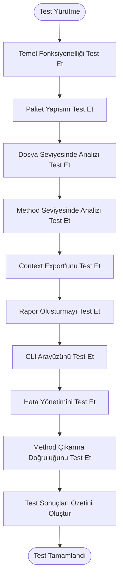

# Katkı Rehberi

<cite>
**Bu Dokümanda Referans Verilen Dosyalar**
- [README.md](file://README.md)
- [context-manager.js](file://context-manager.js)
- [index.js](file://index.js)
- [bin/cli.js](file://bin/cli.js)
- [test/test.js](file://test/test.js)
- [test/test-suite.js](file://test/test-suite.js)
- [package.json](file://package.json)
</cite>

## İçindekiler
1. [Giriş](#giriş)
2. [Geliştirme İş Akışı](#geliştirme-iş-akışı)
3. [Kod Yapısı ve Mimari](#kod-yapısı-ve-mimari)
4. [Test Stratejisi](#test-stratejisi)
5. [Katkı Rehberleri](#katkı-rehberleri)
6. [Kodlama Standartları](#kodlama-standartları)
7. [Aracı Genişletme](#aracı-genişletme)
8. [Sonuç](#sonuç)

## Giriş
context-manager projesi, method seviyesinde filtreleme ve token analiz yeteneklerine sahip bir LLM context optimizasyon aracıdır. Bu rehber, katkıda bulunanlara geliştirme iş akışını, kod yapısını, test stratejisini ve katkı rehberlerini anlamaları için kapsamlı bilgi sağlar. Araç, geliştiricilerin kod tabanlarını analiz etmelerine ve tiktoken (GPT-4 uyumlu) kullanarak kesin token sayıları hesaplayarak AI asistanları için optimize edilmiş context oluşturmalarına yardımcı olmak üzere tasarlanmıştır.

**Bölüm kaynakları**
- [README.md](file://README.md#L0-L891)

## Geliştirme İş Akışı

### Yerel Ortamı Kurma
context-manager için yerel geliştirme ortamını kurmak için şu adımları izleyin:

1. Repoyu GitHub'dan klonlayın
2. `npm install` kullanarak bağımlılıkları yükleyin
3. Kesin token sayımı için tiktoken'ı yükleyin: `npm install tiktoken`

Araç hem global CLI aracı hem de programatik olarak kullanılabilir. Paket, Node.js sürüm 14.0.0 veya üstü ile çalışacak şekilde yapılandırılmıştır.

### Testleri Çalıştırma
Proje, npm scriptleri kullanılarak çalıştırılabilen kapsamlı bir test paketi içerir:

```bash
npm test           # Temel testleri çalıştır
npm run test:all   # Kapsamlı test paketini çalıştır
```

Test paketi, dosya seviyesinde analiz, method seviyesinde analiz, dosya ve panoya context export'u, detaylı rapor oluşturma ve çeşitli CLI seçenekleri dahil olmak üzere core fonksiyonelliği doğrular.

### Pull Request Gönderme
Pull request gönderirken, şunlardan emin olun:
- Tüm testler başarıyla geçer
- Kod, belirlenen kodlama standartlarına uyar
- Yeni özellikler uygun testlerle birlikte gelir
- Dokümantasyon değişiklikleri yansıtacak şekilde güncellenir
- prepublishOnly scripti başarıyla çalışır, bu yayınlamadan önce testleri çalıştırır

**Bölüm kaynakları**
- [package.json](file://package.json#L0-L55)
- [test/test.js](file://test/test.js#L0-L61)
- [test/test-suite.js](file://test/test-suite.js#L0-L280)

## Kod Yapısı ve Mimari

### Modüler, Sınıf Tabanlı Tasarım
context-manager projesi, net sorumluluk ayrımı ile modüler, sınıf tabanlı bir tasarım desenini takip eder. Mimari, aracın fonksiyonelliğini sağlamak için birlikte çalışan birkaç core bileşenden oluşur.


**Diyagram kaynakları**
- [context-manager.js](file://context-manager.js#L231-L800)
- [context-manager.js](file://context-manager.js#L124-L229)
- [context-manager.js](file://context-manager.js#L14-L73)
- [context-manager.js](file://context-manager.js#L75-L115)

### Core Bileşenler
Sistemin ana bileşenleri şunlardır:

- **TokenCalculator**: Analiz sürecini yöneten, dosya taramayı, token sayımını ve rapor oluşturmayı koordine eden birincil orkestratör
- **GitIgnoreParser**: Analize hangi dosyaların dahil edileceğini veya hariç tutulacağını belirlemek için .gitignore, .calculatorignore ve .calculatorinclude dosyaları için desen eşleştirmesini yönetir
- **MethodAnalyzer**: Regex desenleri kullanarak JavaScript/TypeScript dosyalarından methodları çıkarır ve bireysel methodlar için token sayılarını hesaplar
- **MethodFilterParser**: .methodinclude ve .methodignore konfigürasyon dosyalarında tanımlanan kurallara göre methodları filtreler

Bu bileşenler, modül giriş noktası olarak hizmet eden ve programatik kullanım için tüm core sınıfları export eden index.js dosyası aracılığıyla açığa çıkarılır.

**Bölüm kaynakları**
- [context-manager.js](file://context-manager.js#L14-L864)
- [index.js](file://index.js#L0-L7)

## Test Stratejisi

### Test Dizin Yapısı
Test dizini iki birincil test dosyası içerir:

- **test.js**: Core bileşenlerin örneklenebileceğini ve temel işlemlerin doğru çalıştığını doğrulayan temel fonksiyonellik testleri
- **test-suite.js**: Entegrasyon testleri aracılığıyla aracın fonksiyonelliğinin çeşitli yönlerini doğrulayan kapsamlı test paketi

### Test Kapsamı
Test stratejisi birkaç temel alana odaklanır:

1. **Temel fonksiyonellik**: Core sınıfların örneklenebileceğini ve temel işlemlerin çalıştığını doğrular
2. **Paket yapısı**: Modül export'larının doğru yapılandırıldığından emin olur
3. **Dosya seviyesinde analiz**: Dosyaları analiz etme ve rapor oluşturma yeteneğini test eder
4. **Method seviyesinde analiz**: Method çıkarma ve analiz yeteneklerini doğrular
5. **Context export**: Hem dosya hem de pano export fonksiyonelliğini test eder
6. **Rapor oluşturma**: Detaylı JSON raporlarının doğru oluşturulduğunu doğrular
7. **CLI arayüzü**: Komut satırı arayüzü seçeneklerini ve davranışını doğrular
8. **Hata yönetimi**: Aracın geçersiz girdileri ve kenar durumlarını nasıl ele aldığını test eder
9. **Method çıkarma doğruluğu**: Methodların koddan doğru şekilde tanımlandığını ve çıkarıldığını sağlar

Test paketi CLI arayüzünü test etmek için child process yürütme kullanır ve fonksiyonelliği onaylamak için çıktının beklenen stringleri içerdiğini doğrular.



**Diyagram kaynakları**
- [test/test.js](file://test/test.js#L0-L61)
- [test/test-suite.js](file://test/test-suite.js#L0-L280)

**Bölüm kaynakları**
- [test/test.js](file://test/test.js#L0-L61)
- [test/test-suite.js](file://test/test-suite.js#L0-L280)

## Katkı Rehberleri

### Hata Raporları
Hata bildirirken lütfen şunları dahil edin:
- Sorunun net bir açıklaması
- Sorunu yeniden oluşturma adımları
- Beklenen davranış vs. gerçek davranış
- Ortam bilgisi (Node.js sürümü, işletim sistemi)
- İlgili hata mesajları veya stack trace'ler
- Uygulanabilirse ekran görüntüleri

### Özellik İstekleri
Özellik istekleri için şunları sağlayın:
- İstenen fonksiyonelliğin detaylı açıklaması
- Özelliğin faydalı olacağı kullanım senaryoları ve senaryolar
- İlgili örnekler veya referanslar
- Biliniyorsa potansiyel uygulama yaklaşımları
- Kullanıcılar için beklenen faydalar

### Kod Katkıları
Kod katkısında bulunurken:
1. Repoyu fork edin ve bir özellik branch'i oluşturun
2. Kodunuzun belirlenen kodlama standartlarına uyduğundan emin olun
3. Yeni fonksiyonellik için uygun testler yazın
4. Dokümantasyonu gerektiği gibi güncelleyin
5. Değişikliklerin net bir açıklamasıyla bir pull request gönderin
6. Pull request açıklamasında ilgili issue'lara referans verin

Proje, güvenilirliği sağlamak ve regresyonları önlemek için yüksek test kapsamını korur. Tüm katkılar bu kapsamı korumalı veya geliştirmelidir.

**Bölüm kaynakları**
- [README.md](file://README.md#L0-L891)
- [package.json](file://package.json#L0-L55)

## Kodlama Standartları

### Kod Stili
Proje şu kodlama standartlarını takip eder:
- Core bileşenler için ES6 sınıf sözdizimi
- Regex tabanlı parsing (AST bağımlılıkları yok)
- Zarif fallback'ler (tiktoken opsiyonel, pano için dosyaya fallback)
- Minimum bağımlılıklar (yalnızca tiktoken opsiyonel olarak)
- TypeScript yok, maksimum taşınabilirlik için saf JavaScript
- Tutarlı isimlendirme kuralları
- Karmaşık mantık için kapsamlı yorumlama
- Uygun fallback'ler ile hata yönetimi

### Commit Mesaj Kuralları
Proje geleneksel commit mesaj formatlamasını takip eder:
- Emir kipi kullanın ("fix", "add", "remove", "update")
- İlk satırı 72 karakterle sınırlayın
- Konu ile gövde arasına boş satır ekleyin
- Ne ve neden vs. nasıl açıklamak için gövdeyi kullanın
- Uygulanabilir olduğunda issue'lara ve pull request'lere referans verin

### Kod İnceleme Süreci
Kod inceleme süreci şunları içerir:
1. prepublishOnly scripti aracılığıyla otomatik test
2. Kod kalitesinin ve standartlara uygunluğun manuel incelemesi
3. Test kapsamının doğrulanması
4. Dokümantasyon güncellemelerinin değerlendirilmesi
5. Farklı ortamlarda fonksiyonelliğin test edilmesi
6. Potansiyel güvenlik açıkları için güvenlik incelemesi

**Bölüm kaynakları**
- [context-manager.js](file://context-manager.js#L14-L864)
- [package.json](file://package.json#L0-L55)

## Aracı Genişletme

### Yeni Özellikler Ekleme
Aracı yeni özelliklerle genişletmek için:
1. Yeni fonksiyonellik için uygun bileşeni belirleyin
2. Mevcut tasarım desenlerini ve kodlama standartlarını takip edin
3. Kapsamlı testlerle özelliği uygulayın
4. Yeni yetenekleri yansıtmak için dokümantasyonu güncelleyin
5. Mümkün olduğunda geriye dönük uyumluluğu sağlayın

### Yeni Çıktı Formatları Ekleme
Yeni çıktı formatları eklemek için:
1. TokenCalculator sınıfındaki generateLLMContext methodunu genişletin
2. Belirli format için yeni bir method oluşturun
3. Yeni formatı etkinleştirmek için uygun CLI seçenekleri ekleyin
4. Yeni çıktı formatı için testler uygulayın
5. Yeni formatın örnekleriyle dokümantasyonu güncelleyin

Araç şu anda detaylı JSON raporları, LLM context dosyaları ve pano entegrasyonu dahil olmak üzere birden fazla çıktı formatını desteklemektedir. Yeni formatlar, AI asistanları için yararlı olan yapılandırılmış, makine tarafından okunabilir çıktı sağlamanın aynı prensiplerini takip etmelidir.

**Bölüm kaynakları**
- [context-manager.js](file://context-manager.js#L231-L800)
- [bin/cli.js](file://bin/cli.js#L0-L66)

## Sonuç
context-manager projesi, kod tabanlarını analiz etmek ve AI asistanları için optimize edilmiş context oluşturmak için sağlam bir temel sağlar. Bu dokümanda özetlenen rehberleri takip ederek, katkıda bulunanlar aracın geliştirilmesine etkili bir şekilde katılabilir, projenin mimarisi ve hedefleriyle uyumlu yüksek kaliteli katkılar sağlayabilirler. Modüler, sınıf tabanlı tasarım, kod kalitesini ve test kapsamını korurken aracı yeni özellikler veya çıktı formatları ile genişletmeyi nispeten basit hale getirir.
