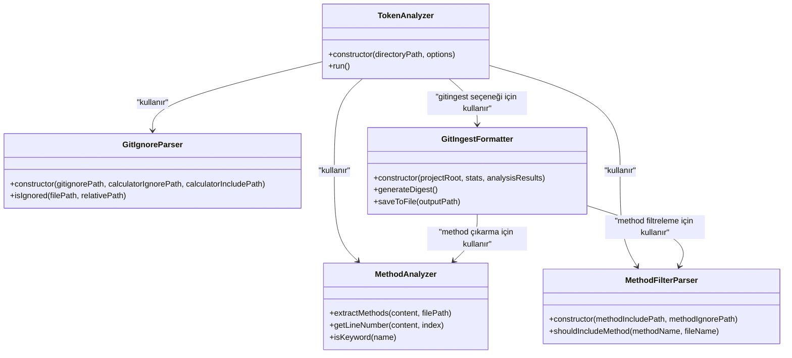
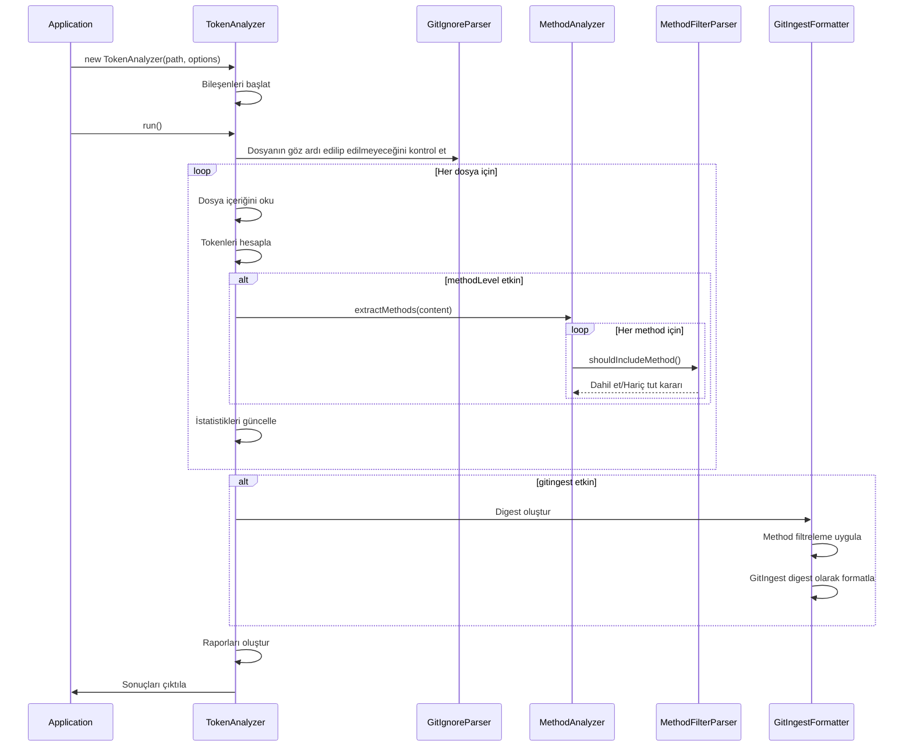

# Programatik API

<cite>
**Bu Dokümanda Referans Verilen Dosyalar**
- [context-manager.js](file://context-manager.js) - *Son commit'te güncellendi*
- [index.js](file://index.js) - *Son commit'te güncellendi*
- [README.md](file://README.md)
- [lib/analyzers/token-calculator.js](file://lib/analyzers/token-calculator.js) - *Core uygulama*
- [lib/formatters/gitingest-formatter.js](file://lib/formatters/gitingest-formatter.js) - *Son commit'te eklendi*
- [lib/parsers/method-filter-parser.js](file://lib/parsers/method-filter-parser.js) - *Son commit'te eklendi*
</cite>

## Güncelleme Özeti
**Yapılan Değişiklikler**
- TokenAnalyzer sınıfı dokümantasyonu TokenCalculator ile alias ilişkisini yansıtacak şekilde güncellendi
- GitIngestFormatter ve MethodFilterParser sınıfları için yeni bölümler eklendi
- Yapılandırma seçenekleri yeni gitingest seçeneğini içerecek şekilde güncellendi
- Yeni generateDigestFromReport ve generateDigestFromContext fonksiyonları için dokümantasyon eklendi
- Kullanım örnekleri yeni formatter ve parser sınıflarını içerecek şekilde güncellendi
- Core bileşenler diyagramı yeni ilişkileri gösterecek şekilde geliştirildi

## İçindekiler
1. [Giriş](#giriş)
2. [Core Bileşenler](#core-bileşenler)
3. [TokenAnalyzer Sınıfı](#tokenanalyzer-sınıfı)
4. [Konfigürasyon Seçenekleri](#konfigürasyon-seçenekleri)
5. [Veri Modelleri](#veri-modelleri)
6. [Kullanım Örnekleri](#kullanım-örnekleri)
7. [Hata Yönetimi](#hata-yönetimi)
8. [Performans Değerlendirmeleri](#performans-değerlendirmeleri)
9. [Migrasyon Rehberi](#migrasyon-rehberi)

## Giriş

context-manager aracı, kod tabanlarını analiz etmek ve LLM (Large Language Model) tüketimi için optimize edilmiş context oluşturmak üzere programatik bir arayüz sağlar. Birincil giriş noktası TokenAnalyzer sınıfıdır ve geliştiricilerin token analizi yeteneklerini doğrudan Node.js uygulamalarına entegre etmelerini sağlar. Bu API, proje dosyalarının otomatik analizine, method seviyesinde çıkarmaya ve AI destekli geliştirme iş akışları için context'e optimize edilmiş çıktıların oluşturulmasına izin verir.

Araç, geliştiricilerin kod tabanı karmaşıklığını anlamalarına, LLM context kullanımını optimize etmelerine ve geliştirme pipeline'larında analiz görevlerini otomatikleştirmelerine yardımcı olmak üzere tasarlanmıştır. Filtreleme ve çıktı formatları için esnek konfigürasyon seçenekleriyle hem dosya seviyesinde hem de method seviyesinde analizi destekler.

**Bölüm kaynakları**
- [README.md](file://README.md#L1-L100)

## Core Bileşenler

context-manager aracı, kapsamlı analiz yetenekleri sağlamak için kompozisyon yoluyla birlikte çalışan birkaç core bileşen etrafında inşa edilmiştir. TokenAnalyzer sınıfı, analiz sürecinin farklı yönleri için özel bileşenler arasındaki etkileşimleri düzenleyen birincil arayüz olarak hizmet eder.

Mimari, her bileşenin belirli bir sorumluluğa sahip olduğu modüler bir tasarımı takip eder:
- GitIgnoreParser, .gitignore ve özel ignore kurallarına dayalı dosya hariç tutmayı yönetir
- MethodAnalyzer, kod dosyalarından method tanımlarını çıkarır
- MethodFilterParser, methodlara dahil etme/hariç tutma kurallarını uygular
- TokenCalculator, core analizi ve token sayımını gerçekleştirir
- GitIngestFormatter, GitIngest-style digest dosyaları oluşturur

Bu bileşenler, tutarlı bir analiz deneyimi sağlamak için TokenAnalyzer (TokenCalculator olarak uygulanmıştır) içinde kompoze edilir. Bu tasarım, son kullanıcılar için basit bir arayüz korurken her bileşenin bağımsız geliştirilmesine ve test edilmesine izin verir.



**Diyagram kaynakları**
- [context-manager.js](file://context-manager.js#L14-L109)
- [context-manager.js](file://context-manager.js#L118-L223)
- [lib/formatters/gitingest-formatter.js](file://lib/formatters/gitingest-formatter.js#L13-L264)
- [lib/parsers/method-filter-parser.js](file://lib/parsers/method-filter-parser.js#L7-L47)

**Bölüm kaynakları**
- [context-manager.js](file://context-manager.js#L14-L223)
- [lib/formatters/gitingest-formatter.js](file://lib/formatters/gitingest-formatter.js#L13-L264)
- [lib/parsers/method-filter-parser.js](file://lib/parsers/method-filter-parser.js#L7-L47)

## TokenAnalyzer Sınıfı

TokenAnalyzer sınıfı, context-manager aracının programatik arayüzünün birincil giriş noktasıdır. Kod tabanlarını analiz etmek ve LLM tüketimi için optimize edilmiş context oluşturmak için basit ama güçlü bir API sağlar.

### Constructor Parametreleri

TokenAnalyzer constructor'ı iki parametre kabul eder:

```javascript
const analyzer = new TokenAnalyzer(directoryPath, options);
```

- `directoryPath` (string): Analiz edilmesi gereken dizinin yolu. Bu genellikle projenizin kök dizini veya analiz etmek istediğiniz belirli bir alt dizindir.
- `options` (object): Analizin davranışını kontrol eden konfigürasyon seçenekleri. Detaylar için Konfigürasyon Seçenekleri bölümüne bakın.

**Önemli Not**: TokenAnalyzer aslında TokenCalculator sınıfı için bir alias'tir. Kod tabanında, TokenAnalyzer geriye dönük uyumluluk için index.js dosyasında TokenCalculator'un bir alias'i olarak export edilir. Bu, TokenAnalyzer ve TokenCalculator'un iki farklı isimle aynı sınıf olduğu anlamına gelir.

### run() Methodu

`run()` methodu tam analiz sürecini yürütür ve sonuçları oluşturur. Çağrıldığında, aşağıdaki adımları gerçekleştirir:

1. Belirtilen dizini ve alt dizinlerini tarar
2. .gitignore ve özel konfigürasyon dosyalarından ignore kurallarını uygular
3. Token sayılarını hesaplamak için her dosyayı analiz eder
4. Etkinleştirildiğinde isteğe bağlı olarak method seviyesinde analiz yapar
5. Kapsamlı raporlar ve export'lar oluşturur
6. Konfigürasyona göre sonuçları konsola ve/veya dosyalara çıktılar

Method doğrudan bir Promise döndürmese de doğası gereği asenkrondur. Bunun yerine, özellikle dosya sistemi işlemleri ve pano entegrasyonu ile uğraşırken asenkron işlemleri dahili olarak ele alır.



**Diyagram kaynakları**
- [context-manager.js](file://context-manager.js#L225-L790)

**Bölüm kaynakları**
- [context-manager.js](file://context-manager.js#L225-L790)
- [index.js](file://index.js#L1-L8)

## Konfigürasyon Seçenekleri

TokenAnalyzer sınıfı, constructor'ındaki options object parametresi aracılığıyla çeşitli seçenekleri kabul eder. Bu seçenekler, analiz sürecinin davranışını kontrol eder ve belirli kullanım senaryolarına göre özelleştirmeye izin verir.

### Kullanılabilir Seçenekler

| Seçenek | Tip | Varsayılan | Açıklama |
|--------|------|---------|-------------|
| methodLevel | boolean | false | Method seviyesinde analizi etkinleştirir, kod dosyalarından bireysel methodları çıkarır |
| verbose | boolean | false | Analiz sırasında detaylı bilgilerin görüntülenip görüntülenmeyeceğini kontrol eder |
| saveReport | boolean | false | Analizin detaylı JSON raporunu token-analysis-report.json'a kaydeder |
| contextExport | boolean | false | Optimize edilmiş dosya listeleriyle bir LLM context dosyası (llm-context.json) oluşturur |
| contextClipboard | boolean | false | LLM context'ini doğrudan sistem panosuna kopyalar |

### Seçenek Etkileşimleri

Bu seçenekler farklı analiz iş akışları elde etmek için birleştirilebilir:

- `methodLevel: true` kullanmak JavaScript/TypeScript dosyalarından bireysel methodların çıkarılmasını sağlar, daha granüler analiz sağlar
- `saveReport: true`'yu diğer seçeneklerle birleştirmek hem anında geri bildirim hem de analiz sonuçlarının kalıcı depolanmasına izin verir
- `contextExport: true` veya `contextClipboard: true` kullanmak LLM tüketimi için optimize edilmiş context oluşturur, ya bir dosyaya kaydeder ya da panoya kopyalar
- `verbose` seçeneği analiz sırasında görüntülenen bilgi miktarını kontrol eder, etkinleştirildiğinde daha fazla detay gösterilir

Hiçbir export seçeneği belirtilmediğinde, araç analiz tamamlandıktan sonra kullanıcıdan bir export seçeneği seçmesini isteyecektir.

**Bölüm kaynakları**
- [README.md](file://README.md#L100-L300)
- [context-manager.js](file://context-manager.js#L225-L232)

## Veri Modelleri

context-manager aracı, analiz sırasında dosya ve methodları temsil etmek için özel veri modelleri kullanır. Bu modeller dahili olarak kullanılır ve oluşturulan raporların ve context export'larının yapısını oluşturur.

### FileInfo Modeli

FileInfo modeli, analiz edilmiş bir dosya hakkındaki bilgileri temsil eder:

```typescript
interface FileInfo {
    path: string;           // Dosyaya mutlak yol
    relativePath: string;   // Proje köküne göre göreceli yol
    sizeBytes: number;      // Byte cinsinden dosya boyutu
    tokens: number;         // Hesaplanan token sayısı
    lines: number;          // Dosyadaki satır sayısı
    extension: string;      // Dosya uzantısı
    methods?: MethodInfo[]; // Method dizisi (methodLevel etkinse)
}
```

### MethodInfo Modeli

MethodInfo modeli, çıkarılmış bir method hakkındaki bilgileri temsil eder:

```typescript
interface MethodInfo {
    name: string;           // Method adı
    line: number;           // Method'un tanımlandığı satır numarası
    tokens: number;         // Method içeriği için token sayısı
    file: string;           // Method'u içeren dosyaya göreceli yol
}
```

Bu modeller analiz sonuçlarını yapılandırmak için kullanılır ve oluşturulan JSON raporlarında serileştirilir. Method seviyesinde analiz etkinleştirildiğinde, araç dosyaların methodlarının dizilerini içerdiği hiyerarşik bir yapı oluşturur, hem dosya hem de method seviyelerinde kod karmaşıklığının detaylı analizine izin verir.

Veri modelleri hafif olacak ve token analizi ve LLM context optimizasyonu için gereken temel bilgilere odaklanacak şekilde tasarlanmıştır.

**Bölüm kaynakları**
- [context-manager.js](file://context-manager.js#L400-L420)
- [context-manager.js](file://context-manager.js#L480-L500)

## Kullanım Örnekleri

context-manager aracı, otomatik analiz için Node.js uygulamalarına entegre edilebilir. Aşağıdaki örnekler yaygın kullanım desenlerini gösterir.

### Temel Entegrasyon

```javascript
const { TokenAnalyzer } = require('@hakkisagdic/context-manager');

// Temel dosya seviyesinde analiz
const analyzer = new TokenAnalyzer('./src', {
    verbose: true,
    saveReport: true
});

analyzer.run();
```

### Method Seviyesinde Analiz

```javascript
// Tüm çıktılarla method seviyesinde analiz
const methodAnalyzer = new TokenAnalyzer('./src', {
    methodLevel: true,
    saveReport: true,
    contextExport: true,
    verbose: true
});

methodAnalyzer.run();
```

### LLM İçin Optimize Edilmiş Context Oluşturma

```javascript
// LLM tüketimi için optimize edilmiş context oluştur
const llmAnalyzer = new TokenAnalyzer('./src', {
    methodLevel: true,
    contextClipboard: true
});

llmAnalyzer.run();
```

### CI/CD Entegrasyonu

```javascript
// CI/CD pipeline'ında entegrasyon
const ciAnalyzer = new TokenAnalyzer('./src', {
    saveReport: true,
    contextExport: true
});

ciAnalyzer.run();
```

Bu örnekler TokenAnalyzer'ın temel analizden LLM'e optimize edilmiş context oluşturmaya kadar farklı kullanım senaryoları için nasıl yapılandırılabileceğini gösterir. Seçeneklerin esnekliği, geliştiricilerin analizi geliştirme, hata ayıklama veya otomatik iş akışları için olsun, kendi özel ihtiyaçlarına göre uyarlamalarına olanak tanır.

**Bölüm kaynakları**
- [README.md](file://README.md#L700-L800)

## Hata Yönetimi

context-manager aracı, çeşitli ortamlarda güçlü işlem sağlamak için kapsamlı hata yönetimi içerir. Analiz süreci, yürütme sırasında oluşabilecek dosya sistemi hatalarını ve diğer istisnaları zarif bir şekilde ele almak üzere tasarlanmıştır.

Bir dosya okunamadığında veya analiz edilemediğinde, araç hata mesajıyla sonuçlarda bir hata girişi oluşturur, analizin diğer dosyalarla devam etmesine izin verir. Bu, tek bir sorunlu dosyanın tüm analiz sürecini durdurmasını önler.

Araç ayrıca platforma özel sorunları, özellikle pano işlemlerini ele alır. Desteklenmeyen platformlarda, başarısız olacak pano işlemlerini denemek yerine context'i bir dosyaya kaydetmeye geri döner.

Konfigürasyon sorunları için, araç hangi konfigürasyon dosyalarının kullanıldığı ve hangi modda (INCLUDE veya EXCLUDE) olduğu hakkında net geri bildirim sağlar. Bu, kullanıcıların belirli dosyaların neden analize dahil edildiğini veya hariç tutulduğunu anlamalarına yardımcı olur.

Hata yönetim stratejisi, ilk hatada durmak yerine analizi tamamlamayı önceliklendirir, kullanıcıların sürecin bazı bölümleri sorunlarla karşılaşsa bile mümkün olduğunca fazla bilgi almasını sağlar.

**Bölüm kaynakları**
- [context-manager.js](file://context-manager.js#L400-L415)
- [context-manager.js](file://context-manager.js#L700-L730)

## Performans Değerlendirmeleri

context-manager API'sini programatik olarak kullanırken, birkaç performans değerlendirmesi dikkate alınmalıdır:

### Token Sayım Methodları

Araç, token sayımı için iki methodu destekler:
- tiktoken kütüphanesini kullanarak **Kesin sayım** (yükleme gerektirir)
- Karakter tabanlı sezgisel yöntemler kullanarak **Tahmin** (tiktoken mevcut olmadığında fallback)

Optimal doğruluk için tiktoken paketini yükleyin:
```bash
npm install tiktoken
```

### Analiz Kapsamı

Analizin performansı, analiz edilen kod tabanının boyutuyla doğrudan ilgilidir. Performansı optimize etmek için:
- Mümkün olduğunda analizi belirli dizinlerle sınırlayın
- İlgisiz dosyaları hariç tutmak için konfigürasyon dosyalarını (.contextignore, .contextinclude) kullanın
- Analiz derinliği ile yürütme süresi arasındaki dengeyi göz önünde bulundurun

### Method Seviyesinde Analiz

Method seviyesinde analizi etkinleştirmek, kodu bireysel methodları tanımlamak için parse etmeyi gerektirdiğinden işlem süresini önemli ölçüde artırır. Bu özellik method seviyesinde içgörüler gerektiğinde kullanılmalı, ancak basit dosya seviyesinde analiz için devre dışı bırakılmalıdır.

### Asenkron İşlemler

`run()` methodu bir Promise döndürmese de, özellikle dosya sistemi erişimi ve pano işlemleri için dahili olarak birkaç asenkron işlem gerçekleştirir. Otomatik iş akışlarında, büyük kod tabanları için gereken yürütme süresini göz önünde bulundurun.

Araç önbelleğe alma ve verimli dosya sistemi işlemleriyle performans için optimize edilmiştir, ancak çok büyük kod tabanları hala önemli işlem süresi gerektirebilir.

**Bölüm kaynakları**
- [context-manager.js](file://context-manager.js#L300-L350)
- [README.md](file://README.md#L500-L600)

## Migrasyon Rehberi

context-manager aracının daha yeni versiyonlarına yükseltme veya migrasyon yaparken, aşağıdaki rehberi göz önünde bulundurun:

### Versiyon Uyumluluğu

Araç, core API'si için geriye dönük uyumluluğu korur. TokenAnalyzer sınıfı arayüzü versiyonlar arasında istikrarlı kalmıştır, mevcut entegrasyonların çalışmaya devam etmesini sağlar.

### Konfigürasyon Değişiklikleri

Konfigürasyon dosyası formatlarında veya seçenek parametrelerinde herhangi bir değişiklik için sürüm notlarını kontrol edin. Core seçenekler tutarlı kalırken, daha yeni versiyonlarda yeni seçenekler eklenebilir.

### Bağımlılık Yönetimi

Gerekli bağımlılıkların, özellikle kesin token sayımı için tiktoken'ın düzgün şekilde yüklendiğinden emin olun. tiktoken mevcut değilse araç tahminine geri döner, ancak daha düşük doğrulukla.

### Test

Yükseltme yaptıktan sonra, beklenen davranışı sağlamak için analizi tipik kod tabanlarınızla test edin. Özellikle şunlara dikkat edin:
- Dosya dahil etme/hariç tutma desenleri
- Token sayısı doğruluğu
- Export fonksiyonelliği
- Method seviyesinde analiz (kullanılıyorsa)

Aracın JSON raporları ve context export'ları için çıktı formatı istikrarlı olacak şekilde tasarlanmıştır, bu çıktıları tüketen downstream süreçler üzerindeki yükseltmelerin etkisini en aza indirir.

**Bölüm kaynakları**
- [README.md](file://README.md#L800-L891)
