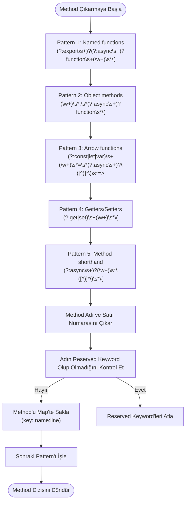
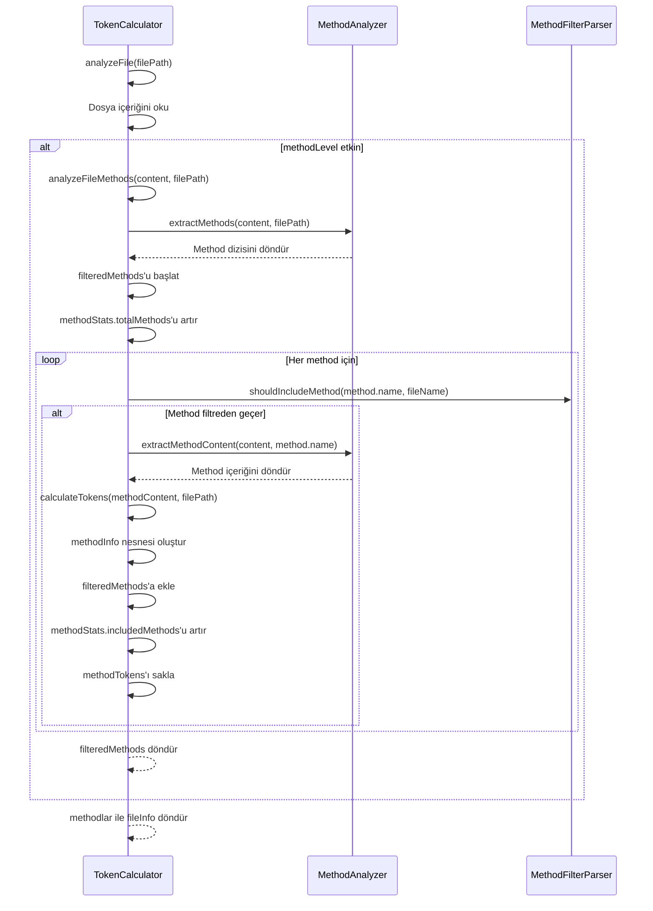
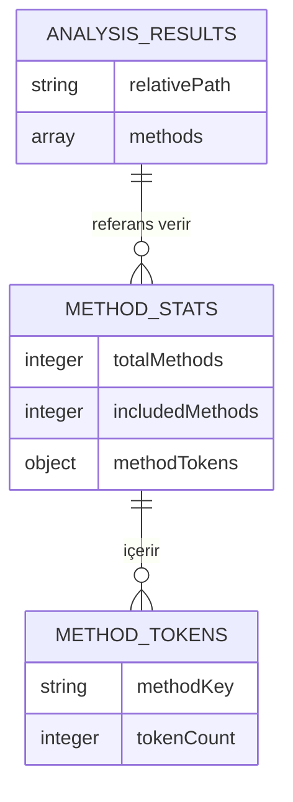
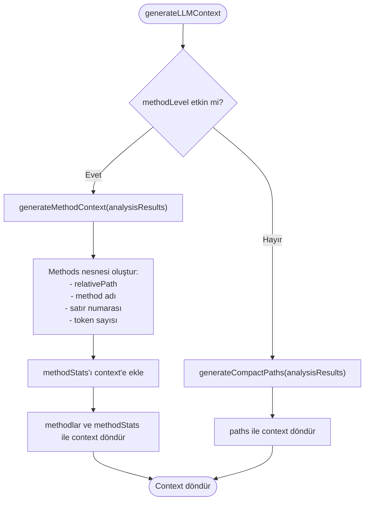

# Method Seviyesi Analiz

<cite>
**Bu Belgedeki Referans Dosyalar**
- [context-manager.js](file://context-manager.js) - *Son commit'te güncellendi*
- [README.md](file://README.md) - *Son commit'te güncellendi*
- [CLAUDE.md](file://CLAUDE.md)
- [index.js](file://index.js)
- [bin/cli.js](file://bin/cli.js) - *Son commit'te güncellendi*
- [lib/analyzers/method-analyzer.js](file://lib/analyzers/method-analyzer.js) - *Son commit'te eklendi*
- [lib/parsers/method-filter-parser.js](file://lib/parsers/method-filter-parser.js) - *Son commit'te eklendi*
</cite>

## İçindekiler
1. [Giriş](#giriş)
2. [Method Çıkarma Süreci](#method-çıkarma-süreci)
3. [Method Analiz Entegrasyonu](#method-analiz-entegrasyonu)
4. [Method Filtreleme Mekanizması](#method-filtreleme-mekanizması)
5. [Method İstatistikleri ve Raporlama](#method-i̇statistikleri-ve-raporlama)
6. [LLM Context Oluşturma](#llm-context-oluşturma)
7. [Yaygın Sorunlar ve En İyi Uygulamalar](#yaygın-sorunlar-ve-en-i̇yi-uygulamalar)

## Giriş

context-manager aracı, JavaScript ve TypeScript codebase'lerinin granüler incelemesini sağlayan method seviyesi analiz yetenekleri sunar. Bu özellik, geliştiricilerin kaynak dosyalardan bireysel methodları çıkarmasına, analiz etmesine ve filtrelemesine olanak tanıyarak LLM context oluşturma için optimize edilmiş temsiller oluşturur. Method seviyesi analiz, `methodLevel` seçeneği aracılığıyla kontrol edilir ve method içeriğini işlemek ve ayrıntılı istatistikler oluşturmak için TokenCalculator ile entegre olur.

**Bölüm kaynakları**
- [context-manager.js](file://context-manager.js#L234-L238)
- [bin/cli.js](file://bin/cli.js#L17-L18)

## Method Çıkarma Süreci

MethodAnalyzer sınıfı, regex kalıplarını kullanarak kaynak koddan JavaScript/TypeScript methodlarını çıkarmaktan sorumludur. Farklı function bildirimi stillerini eşleştiren birden fazla kalıp aracılığıyla methodları tanımlar:



Çıkarma işlemi, JavaScript/TypeScript kodundaki farklı method bildirimi stillerini tanımlamak için beş regex kalıbı uygulayan `extractMethods` fonksiyonuyla başlar. Her eşleşme için analyzer, method adını yakalar ve dosyanın başından eşleşme indeksine kadar yeni satırları sayarak satır numarasını hesaplar. Analyzer, yanlış pozitifleri önlemek için reserved JavaScript keywordlerini filtreler.

Bir methodun tam içeriğini almak için `extractMethodContent` fonksiyonu, iç içe süslü parantezler dahil olmak üzere tam method gövdesiyle eşleşen dinamik olarak oluşturulmuş regex kalıplarını kullanır. Bu, aracın yalnızca method imzasını değil, token hesaplaması için tüm implementasyonu çıkarmasına olanak tanır.

**Diyagram kaynakları**
- [context-manager.js](file://context-manager.js#L15-L45)
- [context-manager.js](file://context-manager.js#L61-L72)

**Bölüm kaynakları**
- [context-manager.js](file://context-manager.js#L14-L73)

## Method Analiz Entegrasyonu

analyzeFileMethods fonksiyonu, method içeriğini işlemek ve tokenleri hesaplamak için method çıkarımını TokenCalculator ile entegre eder. Bu entegrasyon, TokenCalculator constructor'ında `methodLevel` seçeneği etkinleştirildiğinde gerçekleşir.



Entegrasyon işlemi, method seviyesi analizin etkin olup olmadığını kontrol eden TokenCalculator'ın `analyzeFile` methodunda başlar. Etkinse, dosya içeriğini işlemek için `analyzeFileMethods`'u çağırır. Bu fonksiyon önce MethodAnalyzer'ı kullanarak tüm methodları çıkarır, ardından filtreleme kurallarına göre dahil edilip edilmeyeceğini belirlemek için her method üzerinde iterasyon yapar.

Dahil edilen her method için sistem, method içeriğini çıkarır ve tüm dosyalar için kullanılan mekanizmanın aynısını kullanarak tokenleri hesaplar. Token hesaplaması, mevcut olduğunda GPT-4 uyumlu tam sayımlar için tiktoken kütüphanesini kullanır, tiktoken yüklü olmadığında dosya türü başına karakter sayısına dayalı tahmini hesaplamaya geçer.

**Diyagram kaynakları**
- [context-manager.js](file://context-manager.js#L323-L383)
- [context-manager.js](file://context-manager.js#L234-L238)

**Bölüm kaynakları**
- [context-manager.js](file://context-manager.js#L323-L383)

## Method Filtreleme Mekanizması

Method filtreleme mekanizması, `.methodinclude` ve `.methodignore` dosyalarında tanımlanan kurallara göre hangi methodların analize dahil edilmesi gerektiğini belirlemek için MethodFilterParser sınıfını kullanır. Bu filtreleme sistemi, method seçimi üzerinde ince ayarlı kontrol sağlar.

```mermaid
classDiagram
class MethodFilterParser {
+includePatterns : Array
+ignorePatterns : Array
+hasIncludeFile : boolean
-methodIncludePath : string
-methodIgnorePath : string
+constructor(methodIncludePath, methodIgnorePath)
+parseMethodFile(filePath) Array
+shouldIncludeMethod(methodName, fileName) boolean
}
class MethodAnalyzer {
+extractMethods(content, filePath) Array
+extractMethodContent(content, methodName) string
+getLineNumber(content, index) number
+isKeyword(name) boolean
}
class TokenCalculator {
+methodFilter : MethodFilterParser
+methodStats : Object
+analyzeFileMethods(content, filePath) Array
+generateMethodContext(analysisResults) Object
}
TokenCalculator --> MethodFilterParser : "filtreleme için kullanır"
TokenCalculator --> MethodAnalyzer : "çıkarma için kullanır"
MethodFilterParser --> "methodinclude file" : "okur"
MethodFilterParser --> "methodignore file" : "okur"
```

MethodFilterParser, `.methodinclude` ve `.methodignore` dosyalarından kalıpları okur ve her satırı büyük/küçük harf duyarsız bir regex kalıbına dönüştürür. Filtreleme davranışı, bir include dosyasının var olup olmamasına bağlıdır:

- `.methodinclude` mevcut olduğunda: Yalnızca include kalıplarıyla eşleşen methodlar dahil edilir (INCLUDE modu)
- Yalnızca `.methodignore` mevcut olduğunda: Ignore kalıplarıyla eşleşen methodlar hariç tutulur (EXCLUDE modu)

`shouldIncludeMethod` fonksiyonu, hem method adını hem de tam nitelikli adı (filename.method) kalıplara karşı değerlendirir. Bu, hem genel pattern matching (örneğin, "Handler" ile biten tüm methodları eşleştirmek için `*Handler`) hem de spesifik method hedeflemeye (örneğin, `server.handleRequest`) izin verir.

Sistem, bu yapılandırma dosyalarını iki konumda arar: script dizini ve proje kökü, proje kökü öncelik alır. Bu, hem global hem de projeye özgü yapılandırmaya izin verir.

**Diyagram kaynakları**
- [context-manager.js](file://context-manager.js#L75-L115)
- [context-manager.js](file://context-manager.js#L14-L73)
- [context-manager.js](file://context-manager.js#L231-L800)

**Bölüm kaynakları**
- [context-manager.js](file://context-manager.js#L75-L115)
- [README.md](file://README.md#L481-L500)

## Method İstatistikleri ve Raporlama

Method analiz özelliği, analiz sırasında işlenen methodlar hakkında temel metrikleri izleyen methodStats nesnesinde istatistikleri toplar. Bu istatistikler, codebase yapısı hakkında bilgi sağlamak için nihai rapora dahil edilir.



methodStats nesnesi üç özellik içerir:
- `totalMethods`: Tüm analiz edilen dosyalarda bulunan toplam method sayısı
- `includedMethods`: Filtreleme kriterlerinden geçen method sayısı
- `methodTokens`: Method tanımlayıcılarını (filename.methodname) token sayılarına eşleyen bir nesne

Bu istatistikler, method analiz süreci sırasında güncellenir. `totalMethods` sayacı, her dosyadan çıkarılan method sayısıyla artırılırken, `includedMethods` filtreyi geçen her method için artırılır. `methodTokens` nesnesi, her dahil edilen method için token sayısını saklar ve method karmaşıklığının ayrıntılı analizini sağlar.

İstatistikler, method seviyesi analiz etkinleştirildiğinde nihai LLM context'ine dahil edilir ve ayrıntılı method bilgilerinin yanı sıra method analiz sonuçlarının bir özetini sağlar.

**Diyagram kaynakları**
- [context-manager.js](file://context-manager.js#L239-L239)
- [context-manager.js](file://context-manager.js#L491-L519)

**Bölüm kaynakları**
- [context-manager.js](file://context-manager.js#L239-L239)
- [context-manager.js](file://context-manager.js#L491-L519)

## LLM Context Oluşturma

Method seviyesi analiz, dil modelleri tarafından verimli bir şekilde tüketilebilecek methodların kompakt temsillerini oluşturarak LLM context oluşturmayı doğrudan destekler. Method seviyesi analiz etkinleştirildiğinde, generateLLMContext fonksiyonu farklı bir çıktı yapısı üretir.



Method seviyesi analiz etkinleştirildiğinde, oluşturulan context methodları göreli dosya yollarına göre düzenleyen bir `methods` özelliği içerir. Her method, adı, satır numarası ve token sayısı ile temsil edilir ve tam method içeriğini içermeden temel bilgileri sağlar. Bu, codebase'in yapısını ve göreli karmaşıklığını koruyan kompakt bir temsil oluşturur.

Context ayrıca, bulunan toplam methodlar, dahil edilen methodlar ve toplam method tokenleri hakkında toplu bilgiler içeren `methodStats`'ı içerir. Bu özet, kullanıcıların analizin kapsamını ve nihai context'e dahil edilen methodların oranını anlamalarına yardımcı olur.

Kompakt temsil, önemli yapısal bilgileri korurken context'in token sayısını önemli ölçüde azaltır ve context window boyutunun sınırlı olduğu LLM tüketimi için ideal hale getirir.

**Diyagram kaynakları**
- [context-manager.js](file://context-manager.js#L491-L519)
- [context-manager.js](file://context-manager.js#L614-L643)

**Bölüm kaynakları**
- [context-manager.js](file://context-manager.js#L491-L519)

## Yaygın Sorunlar ve En İyi Uygulamalar

### Yaygın Sorunlar

**Yanlış Method Çıkarımı**: Regex tabanlı çıkarım, aşağıdaki gibi karmaşık sözdiziminde başarısız olabilir:
- Parametrelerde template literalleri olan methodlar
- Karmaşık destructuring kalıpları olan methodlar
- Minified veya obfuscated kod
- Pattern matching'i bozan alışılmadık formatlama

**Pattern Matching Sorunları**: Kullanıcılar, aşağıdaki nedenlerle filter kalıplarıyla ilgili sorunlarla karşılaşabilir:
- Büyük/küçük harf duyarlılığı (kalıplar büyük/küçük harf duyarsızdır ancak tam eşleşme gerekli olabilir)
- Method adlarındaki özel karakterler
- Çakışan include/exclude kuralları
- Tam nitelikli method adlarında yanlış dosya yolları

### Method Filter Kalıpları için En İyi Uygulamalar

**Etkili Include Kalıpları**:
- Kritik business logic için spesifik method adları kullanın: `calculateTokens`, `handleRequest`
- Method kategorileri için wildcardlar kullanın: `*Handler`, `*Validator`, `*Manager`
- Class tabanlı kalıplar kullanın: Bir class'taki tüm methodları dahil etmek için `TokenCalculator.*`
- İlgili işlevselliği yakalamak için `.methodinclude`'da birden fazla kalıbı birleştirin

**Etkili Ignore Kalıpları**:
- Test methodlarını hariç tutun: `*test*`, `*spec*`
- Debug methodlarını hariç tutun: `*debug*`, `console`, `logger`
- Utility methodlarını hariç tutun: `*helper*`, `*util*`
- Gerekli değilse lifecycle methodlarını hariç tutun: `componentDidMount`, `ngOnInit`

**Yapılandırma Yönetimi**:
- Projeye özgü kurallar için `.methodinclude` ve `.methodignore`'ı proje kökünde yerleştirin
- Pattern amaçlarını belgelemek için yorumları (# ile başlayan satırlar) kullanın
- Büyük projelere uygulamadan önce küçük bir codebase ile kalıpları test edin
- Hangi methodların dahil edildiğini/hariç tutulduğunu doğrulamak için verbose modunu kullanın

Method seviyesi analiz özelliği, LLM context oluşturmayı optimize etmek için güçlü yetenekler sağlar, ancak doğru ve yararlı sonuçlar elde etmek için dikkatli yapılandırma gerektirir. Bu en iyi uygulamaları izleyerek kullanıcılar, gürültü ve boilerplate kodu hariç tutarken en önemli methodları yakalayan etkili filter kalıpları oluşturabilir.

**Bölüm kaynakları**
- [README.md](file://README.md#L481-L500)
- [CLAUDE.md](file://CLAUDE.md#L101-L127)
