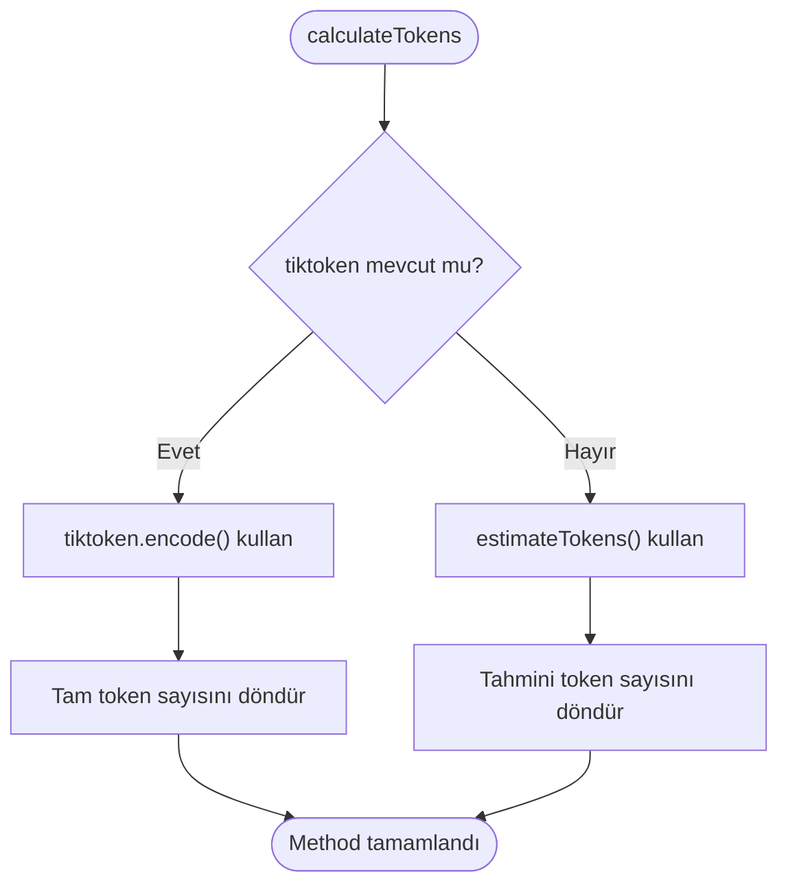
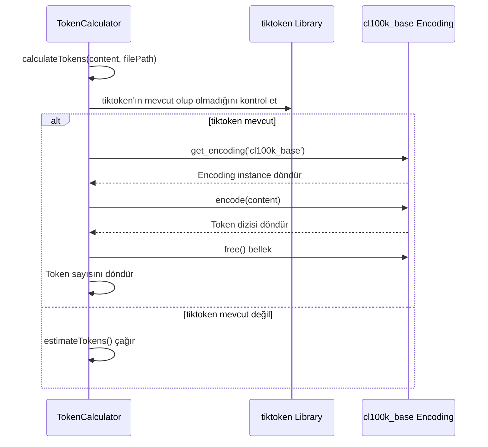
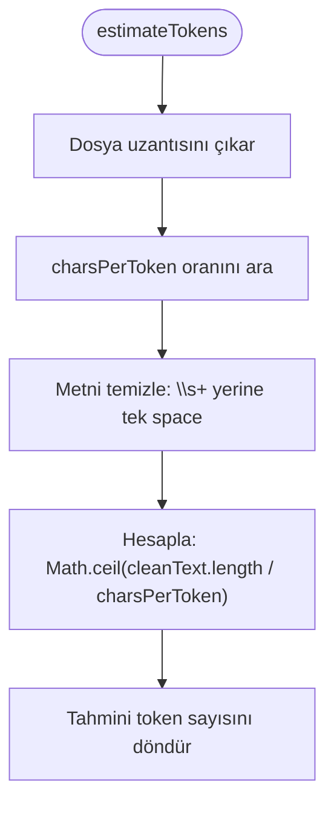
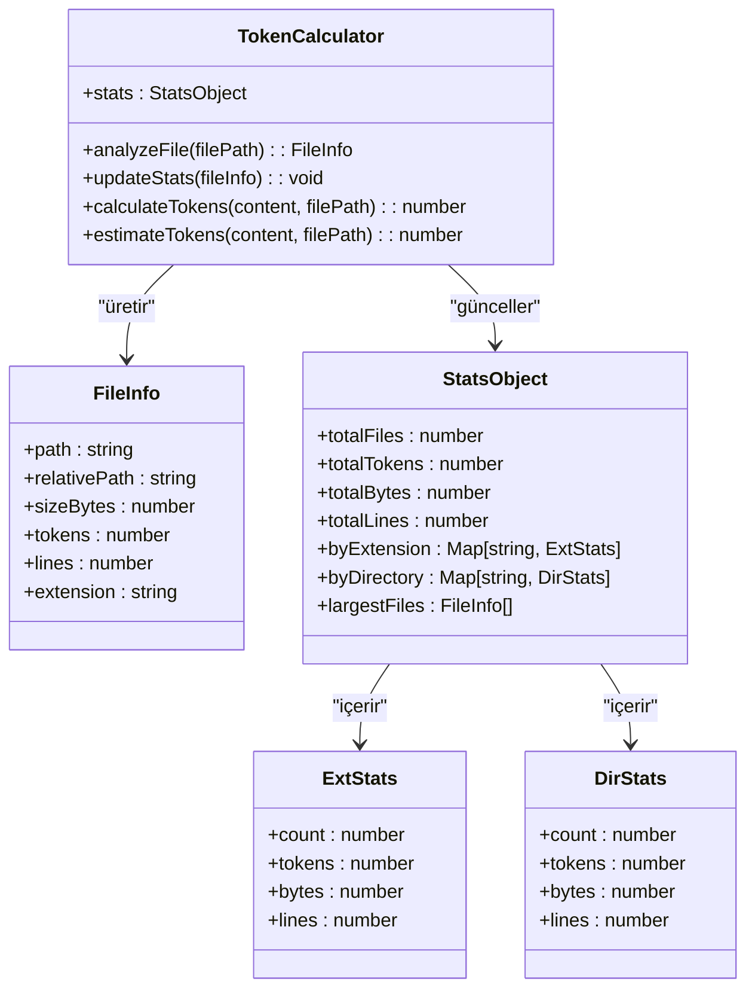

# Token Sayma

<cite>
**Bu Belgedeki Referans Dosyalar**
- [context-manager.js](file://context-manager.js)
- [package.json](file://package.json)
- [README.md](file://README.md)
</cite>

## İçindekiler
1. [Giriş](#giriş)
2. [Token Hesaplama Yöntemleri](#token-hesaplama-yöntemleri)
3. [tiktoken ile Tam Token Sayımı](#tiktoken-ile-tam-token-sayımı)
4. [Tahmini Token Sayımı Implementasyonu](#tahmini-token-sayımı-implementasyonu)
5. [Dosya Türüne Özgü Örnekler](#dosya-türüne-özgü-örnekler)
6. [Dosya ve Proje İstatistikleriyle Entegrasyon](#dosya-ve-proje-i̇statistikleriyle-entegrasyon)
7. [LLM Context Oluşturma](#llm-context-oluşturma)
8. [Performans Etkileri](#performans-etkileri)
9. [Yaygın Sorunlar ve Sorun Giderme](#yaygın-sorunlar-ve-sorun-giderme)
10. [Kurulum ve Yapılandırma](#kurulum-ve-yapılandırma)

## Giriş

context-manager aracı, LLM context yönetimi ve kod analizini desteklemek için sofistike token sayma işlevselliği sağlar. Sistem, tam GPT-4 uyumlu hesaplamaları akıllı tahmin yöntemleriyle birleştirerek token sayımına ikili bir yaklaşım uygular. Bu dokümantasyon, context-manager aracı içindeki token sayma sisteminin implementasyonunu, kullanımını ve entegrasyonunu detaylandırır.

**Bölüm kaynakları**
- [context-manager.js](file://context-manager.js#L7-L8)
- [README.md](file://README.md#L294-L356)

## Token Hesaplama Yöntemleri

context-manager'daki token sayma sistemi, token sayılarını belirlemek için iki tamamlayıcı method uygular: tiktoken kütüphanesini kullanarak tam sayım ve karakter-başına-token oranlarını kullanarak tahmini sayım. Sistem, kütüphane kullanılabilirliğine ve performans gereksinimlerine göre uygun methodu otomatik olarak seçer.

Token hesaplaması için birincil giriş noktası, tam ve tahmini sayım methodları arasında dağıtıcı olarak hizmet eden `TokenCalculator` sınıfındaki `calculateTokens` methodudur. tiktoken mevcut olduğunda, sistem tam sayım kullanır; aksi takdirde, tahmini hesaplamaya geçer.



**Diyagram kaynakları**
- [context-manager.js](file://context-manager.js#L280-L292)

**Bölüm kaynakları**
- [context-manager.js](file://context-manager.js#L280-L292)

## tiktoken ile Tam Token Sayımı

context-manager aracı, mevcut olduğunda tam GPT-4 uyumlu token sayımları sağlamak için tiktoken kütüphanesini kullanır. Implementasyon, başlatma sırasında tiktoken'ı yüklemeye çalışan ve kütüphane mevcut değilse tahmini hesaplamaya geçen zarif bir bozulma modeli izler.

Tam token sayma işlemi, GPT-4, GPT-3.5-Turbo ve diğer modeller tarafından kullanılan tokenizer olan cl100k_base encoding'ini kullanır. Bu, token sayılarının bu modellerin metni nasıl işleyeceğinin doğru temsilleri olmasını sağlar.



**Diyagram kaynakları**
- [context-manager.js](file://context-manager.js#L280-L292)
- [package.json](file://package.json#L35-L38)

**Bölüm kaynakları**
- [context-manager.js](file://context-manager.js#L280-L292)
- [package.json](file://package.json#L35-L38)

## Tahmini Token Sayımı Implementasyonu

tiktoken kütüphanesi mevcut olmadığında, context-manager aracı uzantıya özgü karakter-başına-token oranları kullanan bir tahmin methoduna geri döner. Bu yaklaşım, performansı korurken ve bağımlılıkları azaltırken makul derecede doğru tahminler (~%95 doğruluk) sağlar.

Tahmin algoritması şu adımları izler:
1. filePath parametresinden dosya uzantısını belirle
2. Uzantıya dayalı uygun karakter-başına-token oranını ara
3. Whitespace'i normalize ederek metni temizle
4. Karakter oranını kullanarak tahmini token sayısını hesapla



Implementasyon, yaygın dosya türleri için spesifik karakter-başına-token oranlarını içerir:
- JavaScript/TypeScript: Token başına 3.2 karakter
- JSON: Token başına 2.5 karakter
- Markdown/Text: Token başına 4.0 karakter
- YAML: Token başına 3.5 karakter
- HTML/XML: Token başına 2.8 karakter

**Diyagram kaynakları**
- [context-manager.js](file://context-manager.js#L294-L304)

**Bölüm kaynakları**
- [context-manager.js](file://context-manager.js#L294-L304)

## Dosya Türüne Özgü Örnekler

Token sayma sistemi, tahmin methodundaki uzantıya özgü karakter-başına-token oranları aracılığıyla farklı dosya türlerini uygun şekilde işler. tiktoken aracılığıyla tam sayım mevcut olduğunda, sistem dosya türünden bağımsız olarak doğru sayımlar sağlar.

JavaScript dosyaları (.js, .ts, .jsx, .tsx) için sistem, bu dillerdeki kodun tipik yoğunluğunu yansıtan token başına 3.2 karakter oranı kullanır. Markdown ve düz metin dosyaları, dokümantasyondaki daha yüksek boşluk ve formatlama oranını hesaba katarak daha cömert token başına 4.0 karakter kullanır.

JSON, YAML ve XML gibi yapılandırma dosyaları, yapısal özelliklerini yansıtan kendilerine özgü oranlara sahiptir. JSON, süslü parantezler, köşeli parantezler ve tırnak işaretleriyle kompakt sözdizimi nedeniyle token başına 2.5 karakter kullanırken, XML ve HTML tag ayrıntılılığını hesaba katmak için token başına 2.8 karakter kullanır.

Sistem, bir dosyanın metin dosyası olarak analiz edilip edilmeyeceğini, hem dosya uzantılarını hem de "readme", "license" ve "changelog" gibi yaygın metin dosyası adlarını kontrol eden `isTextFile` methodu aracılığıyla belirler.

**Bölüm kaynakları**
- [context-manager.js](file://context-manager.js#L294-L304)
- [context-manager.js](file://context-manager.js#L306-L321)

## Dosya ve Proje İstatistikleriyle Entegrasyon

Token sayıları, codebase boyutu ve karmaşıklığının kapsamlı analizini sağlayan dosya ve proje istatistik sistemi boyunca entegre edilir. `analyzeFile` methodu, her dosya için `calculateTokens`'ı çağırır ve sonuçları ayrıntılı istatistiklere dahil eder.

Sistem, birden fazla istatistiksel toplama seviyesini tutar:
- Token sayısı, byte cinsinden boyut ve satır sayısı dahil dosya başına istatistikler
- Aynı türdeki tüm dosyalarda sayıları toplayan uzantı seviyesi istatistikler
- Üst düzey dizine göre token dağılımını gösteren dizin seviyesi istatistikler
- Proje seviyesi özet istatistikler

Bu istatistikler, dosya bilgilerini işleyen ve tüm proje için toplamları biriktiren `updateStats` methodunda güncellenir. İstatistikler, hem ham sayıları hem de dosya başına ortalama tokenler gibi türetilmiş metrikleri içerir.



**Diyagram kaynakları**
- [context-manager.js](file://context-manager.js#L323-L351)
- [context-manager.js](file://context-manager.js#L455-L480)

**Bölüm kaynakları**
- [context-manager.js](file://context-manager.js#L323-L351)
- [context-manager.js](file://context-manager.js#L455-L480)

## LLM Context Oluşturma

Token sayıları, AI tüketimi için optimize edilmiş dosya listeleri oluşturan `generateLLMContext` methodu aracılığıyla LLM context oluşturmayı doğrudan etkiler. Context oluşturma süreci, LLM işleme için en alakalı dosyaları ve methodları önceliklendirmek için token istatistiklerini kullanır.

Method seviyesi analiz etkinleştirildiğinde, sistem bireysel methodlar için token sayıları dahil olmak üzere ayrıntılı method context'i oluşturur. Bu, hangi kod öğelerinin LLM context'ine dahil edileceği üzerinde ince ayarlı kontrol sağlar.

Context oluşturma iki formatı destekler:
- Kompakt format: Token sayıları olmadan düzenlenmiş dosya yolları (~2.3k karakter)
- Detaylı format: Token sayılarıyla tam method seviyesi bilgisi (~8.6k karakter)

Format seçimi, kompakt format dosya organizasyonuna odaklanırken ve detaylı format her method için kapsamlı token bilgisi sağlarken, token sayılarının çıktıda nasıl sunulduğunu etkiler.

**Bölüm kaynakları**
- [context-manager.js](file://context-manager.js#L482-L503)

## Performans Etkileri

Token sayma sistemi, ikili method yaklaşımı aracılığıyla doğruluk ve performansı dengeler. tiktoken ile tam sayım, kesin GPT-4 uyumlu sonuçlar sağlar ancak kütüphane yükleme ve encoding işlemlerinden ek yük getirir. Tahmini sayım daha hızlıdır ve harici bağımlılığı yoktur ancak yaklaşık sonuçlar sağlar.

Her methodun performans etkileri şunlardır:
- **Tam sayım**: Daha yüksek doğruluk (%100), daha yavaş performans, tiktoken bağımlılığı gerektirir
- **Tahmini sayım**: Daha düşük doğruluk (~%95), daha hızlı performans, harici bağımlılık gerektirmez

Sistem, mevcut olduğunda tam sayımı tercih edecek şekilde tasarlanmıştır; bu, kütüphane başarıyla yüklendiğinde "✅ Exact (using tiktoken)" gösteren başlangıç mesajıyla belirtilir. tiktoken mevcut olmadığında, sistem "⚠️ Estimated" göstergesiyle tahmini hesaplamaya geçer.

Büyük codebase'ler için performans farkı daha önemli hale gelir ve mutlak hassasiyet gerekli olmadığında tahmini sayımı tercih edilir kılar. Tahmin methodunun metin temizleme ve basit bölme için O(n) karmaşıklığı, büyük dosyalar için bile oldukça verimli olmasını sağlar.

**Bölüm kaynakları**
- [context-manager.js](file://context-manager.js#L659-L659)
- [README.md](file://README.md#L294-L356)

## Yaygın Sorunlar ve Sorun Giderme

context-manager aracındaki token sayımıyla ilgili yaygın sorunlar genellikle standart olmayan dosya türleri için yanlış tahminler veya tiktoken kurulum sorunlarıyla ilgilidir. En sık karşılaşılan sorunlar şunlardır:

1. **Standart olmayan dosya türleri için yanlış tahminler**: Bir dosya, önceden tanımlanmış eşlemede yer almayan alışılmadık bir uzantıya sahip olduğunda, sistem varsayılan olarak token başına 3.5 karakter oranı kullanır. Bu, özel dosya formatları için yanlış tahminlere yol açabilir.

2. **tiktoken yüklü değil**: tiktoken kütüphanesi düzgün şekilde yüklenmemişse, sistem tahmini moduna geri döner. Bu, yürütme sırasında "⚠️ Estimated" mesajıyla tanımlanabilir.

3. **İzin sorunları**: Bazı sistemlerde, tiktoken gibi native bağımlılıkları yüklemek yükseltilmiş izinler veya belirli build araçları gerektirebilir.

4. **Versiyon uyumluluğu**: package.json, tiktoken version ^1.0.0 belirtir ve versiyon uyumsuzlukları yükleme hatalarına neden olabilir.

Token sayma sorunlarını gidermek için kullanıcılar önce tiktoken kurulumunu doğrulamalı ve tam veya tahmini sayımın kullanılıp kullanılmadığını onaylamak için başlangıç mesajını kontrol etmelidir.

**Bölüm kaynakları**
- [package.json](file://package.json#L35-L38)
- [README.md](file://README.md#L294-L356)

## Kurulum ve Yapılandırma

Tam token sayımını sağlamak için tiktoken kütüphanesinin düzgün şekilde yüklenmesi gerekir. context-manager aracı, tiktoken'ı package.json'da hem dependency hem de optionalDependency olarak listeler; bu, tam sayım için kurulumu teşvik ederken aracın onsuz çalışmasına izin verir.

Kurulum npm aracılığıyla gerçekleştirilir:
```bash
npm install tiktoken
```

Implementasyon, tiktoken'ı yüklemek için bir try-catch bloğu kullanır ve kütüphane mevcut olmadığında zarif bir bozulmaya izin verir:

```javascript
let tiktoken = null;
try { tiktoken = require('tiktoken'); } catch {}
```

Bu kalıp, aracın tiktoken kurulumu başarısız olsa veya gerçekleştirilmese bile işlevsel kalmasını sağlarken, istendiğinde tam sayım seçeneğini hala sağlar. Başlangıç dizisi, kullanılan token hesaplama methodunu görüntüleyerek kullanıcıların kurulum durumlarını doğrulamalarına yardımcı olur.

**Bölüm kaynakları**
- [context-manager.js](file://context-manager.js#L7-L9)
- [package.json](file://package.json#L35-L38)
- [README.md](file://README.md#L294-L356)
