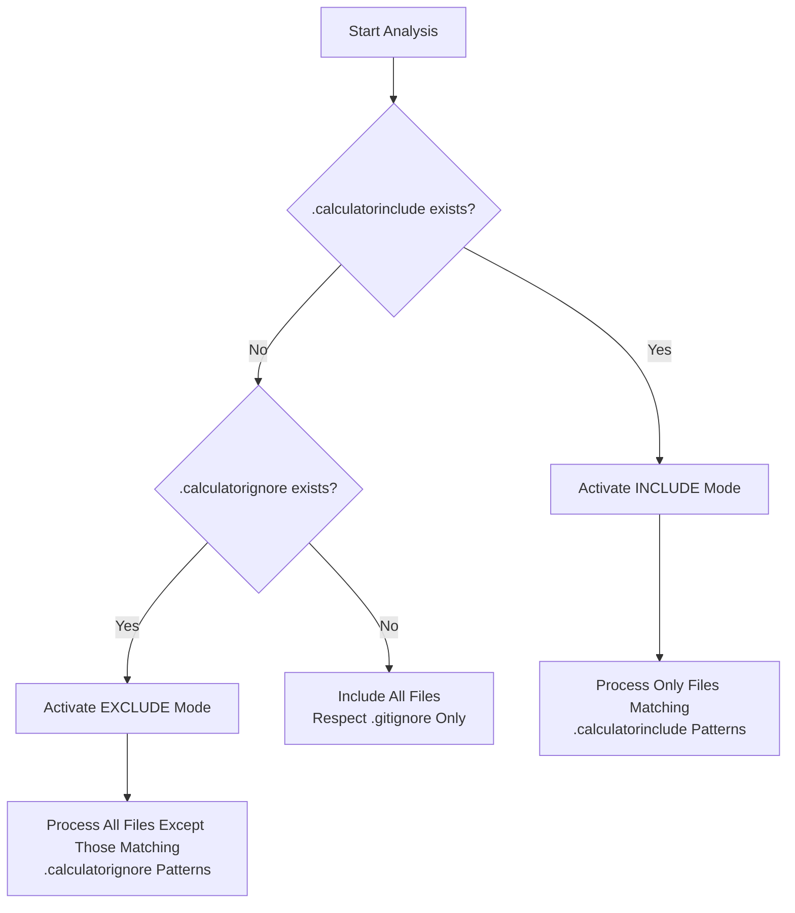
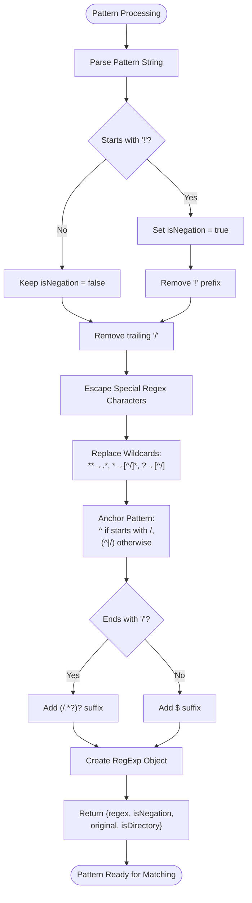
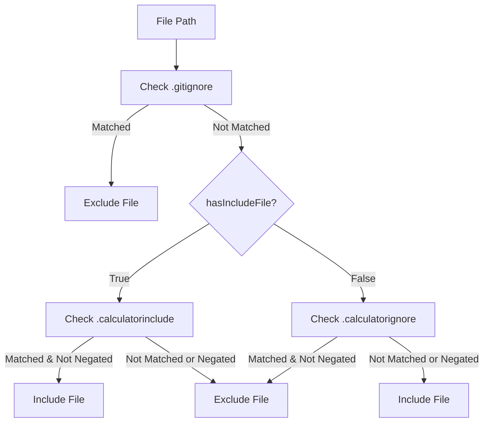
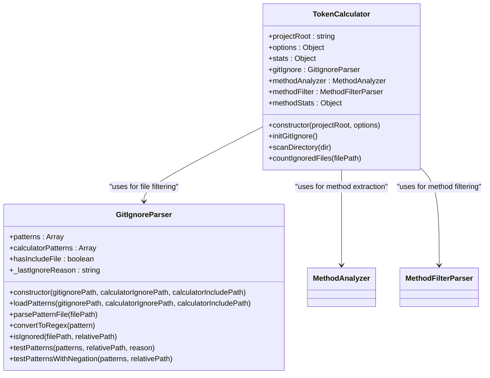

# Dosya Filtreleme

<cite>
**Bu Dokümanda Referans Verilen Dosyalar**
- [context-manager.js](file://context-manager.js)
- [README.md](file://README.md)
</cite>

## İçindekiler
1. [Giriş](#giriş)
2. [Çift Modlu Filtreleme Sistemi](#çift-modlu-filtreleme-sistemi)
3. [Pattern Sözdizimi ve Örnekler](#pattern-sözdizimi-ve-örnekler)
4. [Öncelik Kuralları ve Yapilandirma Önceliği](#öncelik-kuralları-ve-yapilandirma-önceliği)
5. [Implementasyon Detayları](#implementasyon-detayları)
6. [Yaygın Sorunlar ve Sorun Giderme](#yaygın-sorunlar-ve-sorun-giderme)
7. [En İyi Uygulamalar](#en-iyi-uygulamalar)

## Giriş

context-manager aracı, LLM (Large Language Model) context oluşturma için kod analizini optimize etmek üzere tasarlanmış gelişmiş bir dosya filtreleme mekanizması uygular. Bu sistem, `.calculatorignore` ve `.calculatorinclude` yapilandirma dosyalarını kullanan çift modlu bir yaklaşım aracılığıyla hangi dosyaların analize dahil edildiği veya hariç tutulduğu üzerinde hassas kontrol sağlar. Filtreleme sistemi, mevcut `.gitignore` kurallarına saygı gösterirken, belirli kod bileşenlerinin odaklanmış analizi için ek kontrol katmanları sağlar. Bu dokümantasyon, kod analizi ve token hesaplamasında optimal sonuçlar elde etmek için dosya filtreleme sistemini yapılandırmanın implementasyonunu, kullanımını ve en iyi uygulamalarını detaylandırır.

**Bölüm kaynakları**
- [README.md](file://README.md#L544-L610)
- [context-manager.js](file://context-manager.js#L124-L270)

## Çift Modlu Filtreleme Sistemi

context-manager aracı, iki tamamlayıcı yapilandirma dosyası aracılığıyla çalışan çift modlu bir filtreleme sistemi kullanır: EXCLUDE modu için `.calculatorignore` ve INCLUDE modu için `.calculatorinclude`. Bu modlar, proje gereksinimlerine göre dosya seçimi için esnek yaklaşımlar sağlar.

### EXCLUDE Modu (.calculatorignore)

EXCLUDE modu, geleneksel bir ignore sistemi olarak çalışır; burada tüm dosyalar varsayılan olarak dahil edilir, `.calculatorignore` dosyasında belirtilen pattern'lerle eşleşenler hariç. Bu mod, çoğu dosyanın analiz edilmesi gereken ancak belirli türlerin veya dizinlerin hariç tutulması gereken projeler için idealdir. Yapilandirma, gitignore tarzı sözdizimi takip eder ve kullanıcıların analizden filtrelenmesi gereken dosyalarla eşleşen pattern'leri belirtmesine olanak tanır.

### INCLUDE Modu (.calculatorinclude)

INCLUDE modu, belirtim yoluyla dahil etme prensibi üzerine çalışır; burada yalnızca `.calculatorinclude` dosyasındaki pattern'lerle eşleşen dosyalar işlenir. Bu mod, analiz kapsamı üzerinde hassas kontrol sağlar ve yalnızca açıkça tanımlanan dosyaların dahil edilmesini garanti eder. Dokümantasyon, testler veya yapilandirma dosyaları gibi çevresel dosyaları hariç tutarken core uygulama bileşenlerine analizi odaklamak için özellikle yararlıdır.

Sistem, yapilandirma dosyalarının varlığına göre hangi modun kullanılacağını otomatik olarak belirler. Hem `.calculatorinclude` hem de `.calculatorignore` mevcut olduğunda, INCLUDE modu önceliğe sahiptir ve daha kısıtlayıcı dahil etme kurallarının uygulanmasını sağlar.



**Diagram kaynakları**
- [context-manager.js](file://context-manager.js#L134-L149)
- [README.md](file://README.md#L544-L610)

**Bölüm kaynakları**
- [context-manager.js](file://context-manager.js#L134-L149)
- [README.md](file://README.md#L544-L610)

## Pattern Sözdizimi ve Örnekler

Filtreleme sistemi, esnek ve hassas dosya seçimini sağlayan kapsamlı bir pattern sözdizimini destekler. Pattern'ler, negasyon ve dizin geçişi için ek özelliklerle glob tarzı eşleştirme kullanılarak işlenir.

### Desteklenen Pattern Sözdizimi

Sistem, birkaç temel pattern öğesini tanır:

- `**` - Herhangi bir sayıda dizin ve alt dizini eşleştirir (recursive)
- `*` - Tek bir dizin seviyesi içindeki herhangi bir karakter dizisini eşleştirir
- `?` - Herhangi bir tek karakteri eşleştirir
- `!` - Sonraki pattern ile eşleşen dosyaları hariç tutan negasyon operatörü
- `/` - Pattern'leri belirli dizin seviyelerine sabitleyen dizin ayırıcı

Pattern'ler, proje kökünden göreceli yollar olarak veya tüm kod tabanında eşleşecek dosya uzantıları olarak belirtilebilir.

### Pratik Yapilandirma Örnekleri

README, etkili yapilandirma pattern'lerinin somut örneklerini sağlar:

Test ve workflow bileşenlerini hariç tutarken core JavaScript dosyalarına odaklanan INCLUDE modu için:
```bash
# Yalnızca core JavaScript dosyalarını dahil et
utility-mcp/src/**/*.js
!utility-mcp/src/testing/**
!utility-mcp/src/workflows/**
```

Dokümantasyon, yapilandirma ve test dosyalarını filtrelemek için EXCLUDE modu:
```bash
# Dokümantasyon ve config'i hariç tut
**/*.md
**/*.json
node_modules/**
test/
**/*.test.js
**/*.spec.js
```

Bu örnekler, seçimi iyileştirmek için dahil etme pattern'lerini negasyon kuralları ile birleştirerek nasıl odaklanmış analiz kapsamları oluşturulacağını gösterir.



**Diagram kaynakları**
- [context-manager.js](file://context-manager.js#L159-L179)
- [README.md](file://README.md#L544-L610)

**Bölüm kaynakları**
- [context-manager.js](file://context-manager.js#L159-L179)
- [README.md](file://README.md#L544-L610)

## Öncelik Kuralları ve Yapilandirma Önceliği

Dosya filtreleme sistemi, farklı yapilandirma kaynakları arasındaki potansiyel çakışmaları çözmek için net bir öncelik hiyerarşisi uygular. Bu, birden fazla filtreleme kuralı tanımlandığında öngörülebilir davranış sağlar.

### Öncelik Sırası

Sistem, dosya dahil edilmesini değerlendirirken katı bir öncelik sırası takip eder:

1. **`.gitignore`** - Standart git hariç tutmaları her zaman saygı gösterilir ve dosya filtreleme için temel oluşturur
2. **`.calculatorinclude`** - INCLUDE modu kuralları dosya seçimi için en yüksek önceliğe sahiptir
3. **`.calculatorignore`** - EXCLUDE modu kuralları, INCLUDE modu yapılandırması olmadığında uygulanır

Bu hiyerarşi, git tarafından ignore edilen dosyaların analize asla dahil edilmemesini sağlarken, yalnızca belirli dosyaları dahil etme (`.calculatorinclude` ile) veya belirli dosyaları hariç tutma (`.calculatorignore` ile) esnekliği sağlar.

### Öncelik Mantığının Implementasyonu

Öncelik kuralları, `GitIgnoreParser` class'ının `loadPatterns` methodunda uygulanır. Hem `.calculatorinclude` hem de `.calculatorignore` dosyaları mevcut olduğunda, sistem INCLUDE modu yapılandırmasını önceliklendirir. `hasIncludeFile` flag'i, bir `.calculatorinclude` dosyası tespit edildiğinde true olarak ayarlanır ve bu, `isIgnored` methodunda filtreleme davranışını etkiler.

Implementasyon, INCLUDE modu kurallarının EXCLUDE modu kurallarını tamamen geçersiz kılmasını sağlayarak dosya seçiminde herhangi bir belirsizliği önler. Bu tasarım seçimi, genişlik üzerinde hassasiyeti vurgular ve kullanıcıların gerektiğinde sıkı odaklanmış analiz kapsamları oluşturmasına olanak tanır.



**Diagram kaynakları**
- [context-manager.js](file://context-manager.js#L181-L206)
- [context-manager.js](file://context-manager.js#L134-L149)

**Bölüm kaynakları**
- [context-manager.js](file://context-manager.js#L134-L149)
- [context-manager.js](file://context-manager.js#L181-L206)

## Implementasyon Detayları

Dosya filtreleme mekanizması, pattern yükleme, ayrıştırma ve dosya hariç tutma mantığını yöneten `GitIgnoreParser` class'ı aracılığıyla uygulanır. Sistem, kod analizi sırasında sorunsuz filtreleme sağlamak için ana `TokenCalculator` class'ı ile entegre olur.

### Pattern Yükleme ve Başlatma

Filtreleme sistemi, uygun yapilandirma dosyalarını bulan ve yükleyen `TokenCalculator` class'ındaki `initGitIgnore` methodu aracılığıyla başlatılır. Sistem, esnek yapilandirma yerleşimine olanak tanıyarak hem araç dizininde hem de proje kökünde `.calculatorignore` ve `.calculatorinclude` dosyalarını arar.

Yapilandirma dosyaları bulunduğunda, pattern'leri verimli eşleştirme için regular expression'lara ayrıştırılır. `parsePatternFile` methodu, yapilandirma dosyasının her satırını işler, yorumları ve boş satırları ignore eder, ardından her pattern'i `convertToRegex` methodunu kullanarak bir regex nesnesine dönüştürür.

### Dosya Hariç Tutma Mantığı

Core filtreleme mantığı, belirli bir dosyanın analizden hariç tutulup tutulmayacağını belirleyen `isIgnored` methodunda bulunur. INCLUDE modu için, method önce dosyanın `.calculatorinclude` dosyasındaki herhangi bir pattern ile eşleşip eşleşmediğini kontrol eder. Eşleşen pattern bulunamazsa (veya bir negasyon pattern'i eşleşirse), dosya hariç tutulur. EXCLUDE modu için, dosyalar `.calculatorignore` dosyasındaki herhangi bir pattern ile eşleşirlerse hariç tutulur.

Sistem ayrıca, INCLUDE modu pattern'lerine göre dizinlerin geçilip geçilmemesi gerektiğini kontrol ederek dizin geçişini verimli bir şekilde yönetir ve gereksiz dosya sistemi keşfini önler.



**Diagram kaynakları**
- [context-manager.js](file://context-manager.js#L124-L270)

**Bölüm kaynakları**
- [context-manager.js](file://context-manager.js#L124-L270)

## Yaygın Sorunlar ve Sorun Giderme

Kullanıcılar, dosya filtreleme sistemini yapılandırırken birkaç yaygın sorunla karşılaşabilir. Bu sorunları ve çözümlerini anlamak, etkili yapilandirma sağlamaya yardımcı olur.

### Yanlış Pattern Sözdizimi

Sık karşılaşılan bir sorun, özellikle wildcard'lar ve negasyon ile ilgili yanlış pattern sözdizimitir. Kullanıcılar, pattern'lerin doğru glob sözdizimini kullandığından ve negasyon pattern'lerinin ünlem işareti (`!`) ile başladığından emin olmalıdır. Pattern dosyaları içindeki satır içi yorumlar da sorunlara neden olabilir, çünkü yalnızca satır yorumları (bir satırın başında başlayan) düzgün şekilde ignore edilir.

### Beklenmeyen Dosya Dahil Edilmeleri

Beklenmeyen dosya dahil edilmeleri genellikle öncelik kuralı yanlış anlamalarından kaynaklanır. Hem `.calculatorinclude` hem de `.calculatorignore` dosyaları mevcut olduğunda, yalnızca INCLUDE modu kuralları uygulanır. EXCLUDE modu davranışı bekleyen kullanıcılar, dosyaların `.calculatorignore` kurallarının aksine dahil edildiğini veya hariç tutulduğunu görünce şaşırabilir. Konsol çıktısının etkin mod için kontrol edilmesi bu sorunu teşhis etmeye yardımcı olabilir.

### Performans Etkileri

Geniş pattern'ler, özellikle recursive wildcard'lar (`**`), kapsamlı dosya sistemi geçişi gerektirerek performansı etkileyebilir. Kullanıcılar pattern'leri ile özel olmalı ve sistemin kod tabanının büyük bölümlerini gereksiz yere incelemesini zorlayan aşırı geniş kurallardan kaçınmalıdır.

## En İyi Uygulamalar

Verimli ve sürdürülebilir filtre yapılandırmaları oluşturmak için şu en iyi uygulamaları takip edin:

### Özel Pattern'ler Kullanın

Mümkün olduğunda geniş wildcard'lar yerine özel pattern'leri tercih edin. Tüm JavaScript dosyalarını dahil etmek için `**/*.js` kullanmak yerine, `src/**/*.js` veya `lib/**/*.js` gibi ilgili kodu içeren tam dizinleri belirtin. Bu, işleme süresini azaltır ve analizi ilgili bileşenlere odaklar.

### Negasyonu Etkili Kullanın

Geniş dahil etme kurallarını iyileştirmek için negasyon pattern'lerini kullanın. Örneğin, bir kaynak dizindeki tüm JavaScript dosyalarını dahil edin ancak test dosyalarını hariç tutun:
```bash
src/**/*.js
!src/**/*.test.js
!src/**/*.spec.js
```

### Yapilandirma Amacını Belgelendirin

Yapilandirma dosyalarına her pattern'in amacını açıklayan yorumlar ekleyin. Bu, ekip üyelerinin filtreleme stratejisini anlamasına ve proje genelinde tutarlılığı sürdürmesine yardımcı olur.

### Yapılandırmaları Test Edin

Hangi dosyaların dahil edildiğini veya hariç tutulduğunu görmek için aracı verbose modda çalıştırarak yapılandırmaları doğrulayın. Bu anında geri bildirim, pattern eşleştirme ile ilgili sorunları belirlemeye yardımcı olur ve amaçlanan dosyaların işlendiğinden emin olur.

### Dahil Etme ve Hariç Tutma Arasında Denge Kurun

Proje ihtiyaçlarına göre INCLUDE ve EXCLUDE modları arasında seçim yapın. Core bileşenlerin odaklanmış analizi için INCLUDE modunu ve seçici hariç tutmalarla kapsamlı analiz için EXCLUDE modunu kullanın.
