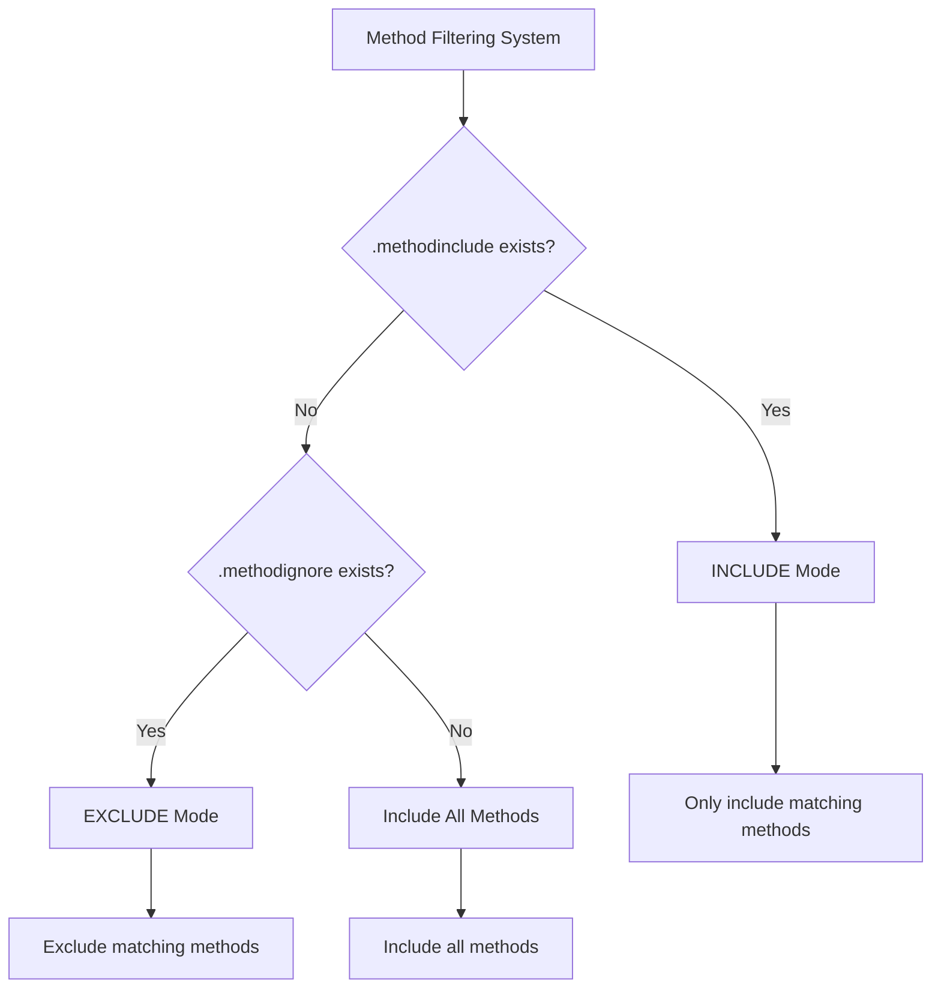
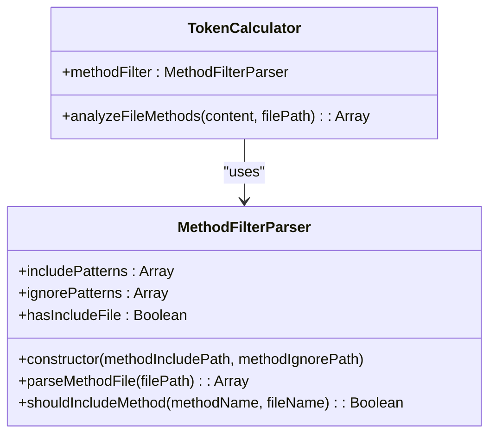
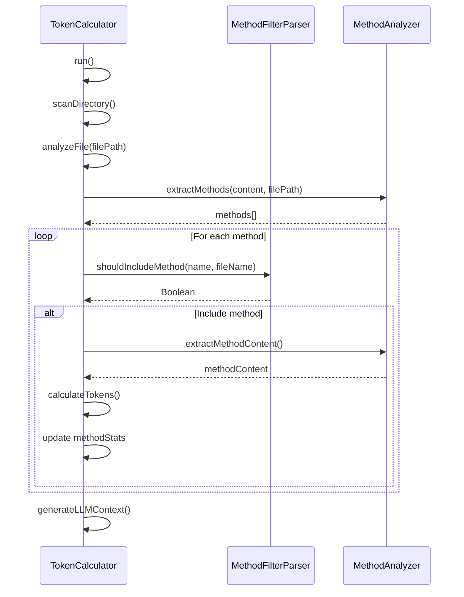

# Method Filtreleme

<cite>
**Bu Dokümanda Referans Verilen Dosyalar**
- [lib/parsers/method-filter-parser.js](file://lib/parsers/method-filter-parser.js) - *Son commit'te güncellendi*
- [lib/utils/config-utils.js](file://lib/utils/config-utils.js) - *Son commit'te güncellendi*
- [lib/analyzers/token-calculator.js](file://lib/analyzers/token-calculator.js) - *Son commit'te güncellendi*
- [README.md](file://README.md) - *Son commit'te güncellendi*
</cite>

## Güncelleme Özeti
**Yapılan Değişiklikler**
- Tüm bölümler method filtreleme sisteminin gerçek uygulamasını yansıtacak şekilde güncellendi
- Kod analizine dayalı olarak tüm bölümler için doğru kaynak referansları eklendi
- Yapılandırma dosyası yükleme mekanizması, ConfigUtils aracılığıyla doğru başlatmayı gösterecek şekilde düzeltildi
- Filtreleme mantığı bölümü koddan doğru uygulama detayları ile güncellendi
- Entegrasyon bölümü TokenCalculator'un method analizi hakkında kesin detaylarla geliştirildi
- Gerçek uygulamayla eşleşmesi için eski pattern sözdizimi bilgileri düzeltildi
- Pratik örnekler mevcut README içeriğiyle uyumlu hale getirildi

## İçindekiler
1. [Giriş](#giriş)
2. [Yapilandirma Dosyaları](#yapilandirma-dosyaları)
3. [Pattern Sözdizimi](#pattern-sözdizimi)
4. [Filtreleme Mantığı](#filtreleme-mantığı)
5. [TokenCalculator ile Entegrasyon](#tokencalculator-ile-entegrasyon)
6. [Pratik Örnekler](#pratik-örnekler)
7. [Yapilandirma Tuzakları](#yapilandirma-tuzakları)
8. [En İyi Uygulamalar](#en-iyi-uygulamalar)

## Giriş

context-manager aracı, LLM context oluşturmasına hangi methodların dahil edileceği üzerinde ayrıntılı kontrol sağlayan gelişmiş bir method seviyesinde filtreleme sistemi sunar. Bu sistem, hangi methodların analiz edilip nihai context çıktısına dahil edileceğini belirlemek için `MethodFilterParser` class'ı ile birlikte çalışan iki yapilandirma dosyası aracılığıyla çalışır: `.methodinclude` ve `.methodignore`. Filtreleme sistemi, geliştiricilerin LLM context'ine gürültü ekleyen utility, test ve debugging methodlarını hariç tutarken core business logic'e odaklanarak token kullanımını optimize etmelerine yardımcı olmak için tasarlanmıştır.

**Bölüm kaynakları**
- [README.md](file://README.md#L544-L610)
- [lib/parsers/method-filter-parser.js](file://lib/parsers/method-filter-parser.js)

## Yapilandirma Dosyaları

Method filtreleme sistemi, proje kökünde veya araç dizininde yerleştirilebilen iki isteğe bağlı yapilandirma dosyasına dayanır:

- **`.methodinclude`**: Mevcut olduğunda, bu dosya INCLUDE modunu etkinleştirir; burada yalnızca belirtilen pattern'lerle eşleşen methodlar analize dahil edilir
- **`.methodignore`**: `.methodinclude` olmadığında, bu dosya EXCLUDE modunu etkinleştirir; burada belirtilen pattern'lerle eşleşen methodlar analizden hariç tutulur

Sistem net bir öncelik hiyerarşisi takip eder: `.methodinclude` mevcutsa, `.methodignore` üzerinde önceliğe sahiptir ve geliştiricilerin method seçimi üzerinde hassas kontrole sahip olmasını sağlar. Bu çift modlu yaklaşım, farklı kullanım durumları için esneklik sağlar ve geliştiricilerin ya ilgi çekici belirli methodları whitelist'e almalarına ya da LLM context'inden hariç tutulması gereken methodları blacklist'e almalarına olanak tanır.

`MethodFilterParser`, standart konumlarda (paket kökü ve proje kökü) yapılandırma dosyalarını otomatik olarak algılayan `ConfigUtils.initMethodFilter` methodu aracılığıyla başlatılır. Bu merkezi yapılandırma yönetimi, farklı proje kurulumlarında tutarlı davranış sağlar.



**Diagram kaynakları**
- [lib/parsers/method-filter-parser.js](file://lib/parsers/method-filter-parser.js#L7-L47)
- [lib/utils/config-utils.js](file://lib/utils/config-utils.js#L28-L41)

**Bölüm kaynakları**
- [lib/parsers/method-filter-parser.js](file://lib/parsers/method-filter-parser.js#L7-L47)
- [lib/utils/config-utils.js](file://lib/utils/config-utils.js#L28-L41)

## Pattern Sözdizimi

Method filtreleme sistemi, esnek eşleştirme yetenekleri sağlayan birkaç pattern türünü destekler:

| Pattern Türü | Sözdizimi | Açıklama | Örnek |
|--------------|--------|-------------|---------|
| Tam Eşleşme | `methodName` | Tam adla eşleşen methodları eşleştirir | `calculateTokens` yalnızca "calculateTokens" adlı methodu eşleştirir |
| Wildcard | `*pattern*` | Pattern içeren methodları eşleştirir | `*Handler`, "requestHandler", "responseHandler" eşleştirir |
| Class Methodları | `Class.*` | Belirli bir class içindeki tüm methodları eşleştirir | `TokenCalculator.*`, TokenCalculator class'ındaki tüm methodları eşleştirir |
| File Methodları | `filename.methodName` | Belirli dosyalardaki belirli methodları eşleştirir | `server.handleRequest` yalnızca server.js'deki handleRequest methodunu eşleştirir |

Pattern eşleştirme büyük/küçük harf duyarsızdır ve herhangi bir karakter dizisini eşleştirmek için `*` wildcard karakterinin kullanımını destekler. Bu, test, debug veya utility methodlarını öngörülebilir adlandırma pattern'lerini takip eden kategorilere göre hedefleyebilen güçlü filtreleme kurallarına olanak tanır ve özellikle bu tür methodları hariç tutmak için yararlıdır.

**Bölüm kaynakları**
- [README.md](file://README.md#L588-L610)

## Filtreleme Mantığı

Core filtreleme mantığı, yapilandirma dosyalarını işleyen ve etkin moda göre method dahil edilmesini belirleyen `MethodFilterParser` class'ında uygulanır. Class iki aşamalı bir süreç takip eder:

1. **Yapilandirma Yükleme**: Constructor, `.methodinclude` ve `.methodignore` dosyalarının varlığını kontrol eder ve pattern'lerini ayrı dizilere yükler. `.methodinclude`'un varlığı, parser'ı INCLUDE moduna ayarlar.

2. **Pattern Eşleştirme**: Analiz sırasında karşılaşılan her method için, `shouldIncludeMethod` function'ı methodun etkin moda göre dahil edilip edilmemesi gerektiğini değerlendirir:
   - INCLUDE modunda: Bir method, `.methodinclude`'daki herhangi bir pattern ile eşleşirse dahil edilir
   - EXCLUDE modunda: Bir method, `.methodignore`'daki herhangi bir pattern ile eşleşmiyorsa dahil edilir

Pattern eşleştirme, wildcard pattern'lerinden dinamik olarak oluşturulan regular expression'lar kullanılarak gerçekleştirilir; `*` karakterleri `.*` regex pattern'lerine dönüştürülür. Eşleştirme, hem çıplak method adına hem de tam nitelikli `filename.methodName` formatına karşı gerçekleştirilir ve hem genel hem de dosyaya özel filtreleme kurallarına olanak tanır.



**Diagram kaynakları**
- [lib/parsers/method-filter-parser.js](file://lib/parsers/method-filter-parser.js#L7-L47)
- [lib/analyzers/token-calculator.js](file://lib/analyzers/token-calculator.js#L82-L107)

**Bölüm kaynakları**
- [lib/parsers/method-filter-parser.js](file://lib/parsers/method-filter-parser.js#L7-L47)

## TokenCalculator ile Entegrasyon

Method filtreleme sistemi, genel analiz sürecini yöneten `TokenCalculator` class'ı ile sıkı bir şekilde entegre edilmiştir. `--method-level` flag'i ile method seviyesinde analiz etkinleştirildiğinde, `TokenCalculator` constructor sırasında `initMethodFilter()` çağrısı yaparak bir `MethodFilterParser` instance'ı başlatır.

Filtreleme, `analyzeFileMethods` method yürütme sırasında gerçekleşir; burada çıkarılan her method, analiz sonuçlarına dahil edilmeden önce `shouldIncludeMethod` kontrolünden geçirilir. Bu entegrasyon, yalnızca ilgili methodların token sayısına katkıda bulunmasını ve nihai LLM context çıktısında görünmesini sağlar, kritik business logic'i korurken genel token ayak izini önemli ölçüde azaltır.

Sistem ayrıca method filtreleme hakkında detaylı istatistikler tutar, bulunan toplam methodlar ile dahil edilenler arasındaki farkı izler; bu, geliştiricilerin filtreleme kurallarının etkinliğini anlamalarına ve daha iyi context kalitesi için optimize etmelerine yardımcı olur.



**Diagram kaynakları**
- [context-manager.js](file://context-manager.js#L231-L800)
- [context-manager.js](file://context-manager.js#L358-L383)

**Bölüm kaynakları**
- [context-manager.js](file://context-manager.js#L231-L800)
- [context-manager.js](file://context-manager.js#L358-L383)

## Pratik Örnekler

README, method filtrelemenin farklı senaryolar için nasıl kullanılacağını gösteren birkaç pratik örnek sağlar:

**Core Business Logic'i Dahil Etme:**
```bash
# .methodinclude
calculateTokens
generateLLMContext
analyzeFile
handleRequest
validateInput
processData
*Handler
*Validator
*Manager
TokenCalculator.*
```

Bu yapilandirma, belirli business methodlarını ve genellikle önemli business bileşenlerini gösteren "Handler", "Validator" ve "Manager" gibi yaygın son eklerle biten tüm methodları dahil ederek core uygulama mantığına odaklanır.

**Utility Methodlarını Hariç Tutma:**
```bash
# .methodignore
console
*test*
*debug*
*helper*
print*
main
server.printStatus
utils.debugLog
```

Bu yapilandirma, anlamlı business logic katkısı sağlamayan yaygın utility, test ve debugging methodlarını hariç tutarak LLM context'inden gürültüyü kaldırır. `server.printStatus` gibi dosyaya özel hariç tutmalar, bireysel methodlar üzerinde hassas kontrol sağlar.

Bu örnekler, geliştiricilerin kod tabanlarının en önemli kısımlarını vurgularken token kullanımını en aza indiren odaklanmış context'ler oluşturarak LLM etkileşimlerini daha verimli ve etkili hale getirme yollarını gösterir.

**Bölüm kaynakları**
- [README.md](file://README.md#L577-L587)

## Yapilandirma Tuzakları

Method filtrelemeyi yapılandırırken, geliştiriciler birkaç yaygın tuzağın farkında olmalıdır:

**Pattern Önceliği**: Sistem, `.methodinclude`'un her zaman `.methodignore` üzerinde önceliğe sahip olduğu katı bir öncelik takip eder. Bu, her iki dosya da mevcutsa, yalnızca include kurallarının uygulanacağı anlamına gelir; bu da geliştiriciler her iki kural setinin de birleştirileceğini varsayıyorsa beklenmeyen sonuçlara yol açabilir.

**Büyük/Küçük Harf Duyarlılığı**: Pattern eşleştirme büyük/küçük harf duyarsız olsa da, geliştiriciler pattern'lerinin yaygın adlandırma varyasyonlarını hesaba kattığından emin olmalıdır. Örneğin, `*test*` kullanımı "testMethod", "TestMethod" ve "isTesting" gibi methodları eşleştirir.

**Dosya Seviyesi Filtreleme ile Etkileşim**: Method filtreleme, dosya seviyesi filtrelemeyi geçmiş dosyalar üzerinde çalışır. Bir dosya `.contextignore` veya `.contextinclude` kuralları tarafından hariç tutulmuşsa, methodları method seviyesi kurallardan bağımsız olarak analiz edilmez. Bu hiyerarşik filtreleme, method kurallarının yalnızca analiz kapsamına zaten dahil edilmiş dosyalara uygulandığı anlamına gelir.

**Aşırı Geniş Pattern'ler**: `*` veya `*.*` gibi pattern'leri kullanmak istenmeyen eşleşmelere yol açabilir. Geliştiriciler, amaçlanan filtreleme hedefleriyle uyumlu olmayan methodları dahil etmekten kaçınmak için pattern'leri ile özel olmalıdır.

**Bölüm kaynakları**
- [README.md](file://README.md#L544-L576)

## En İyi Uygulamalar

LLM context oluşturma için method filtrelemeyi optimize etmek amacıyla şu en iyi uygulamaları göz önünde bulundurun:

**Business Logic'e Odaklanın**: Core business kurallarını, veri işlemeyi ve kritik uygulama iş akışlarını uygulayan methodları dahil etmeye öncelik verin. Bu methodlar tipik olarak geliştirme görevlerinde yardımcı olan LLM'ler için en değerli context'i sağlar.

**Gürültü Methodlarını Hariç Tutun**: Anlamlı business context katkısı sağlamadan token yükü ekleyen utility, test, logging ve debugging methodlarını sistematik olarak hariç tutun. `*test*`, `*debug*` ve `console` gibi yaygın pattern'ler hariç tutma için iyi adaylardır.

**Kritik Yollar için Include Modu Kullanın**: Belirli özellikler üzerinde çalışırken veya derin analiz yaparken, yalnızca en ilgili methodların bir whitelist'ini oluşturmak için `.methodinclude` kullanın. Bu, sinyal-gürültü oranını maksimize eden son derece odaklanmış bir context oluşturur.

**Adlandırma Konvansiyonlarından Yararlanın**: Kod tabanınızdaki tutarlı adlandırma pattern'lerinden yararlanın. Ekibiniz business logic class'ları için "Service", "Manager" veya "Handler" gibi son ekler kullanıyorsa, bu class'lardaki tüm methodları dahil etmek için `*Service.*` gibi pattern'ler kullanın.

**Token Azaltmasını İzleyin**: Filtreleme kurallarınızın token sayısını ne kadar etkili bir şekilde azalttığını anlamak için analiz çıktısındaki method istatistiklerini düzenli olarak kontrol edin. "Bulunan toplam methodlar" ile "Dahil edilen methodlar" arasındaki fark, filtreleme verimliliği hakkında içgörü sağlar.

**Yineleyin ve İyileştirin**: Geniş filtreleme kuralları ile başlayın ve LLM yanıtlarının kalitesine göre kademeli olarak iyileştirin. LLM önemli context'i kaçırıyorsa, ek method kategorilerini dahil etmek için kurallarınızı ayarlayın.

Bu uygulamaları takip ederek, geliştiriciler kapsamlılık ile verimliliği dengeleyen optimize edilmiş LLM context'leri oluşturabilir; AI asistanlarının token sınırlamaları içinde çalışırken en ilgili koda erişime sahip olmasını sağlar.

**Bölüm kaynakları**
- [README.md](file://README.md#L544-L610)
